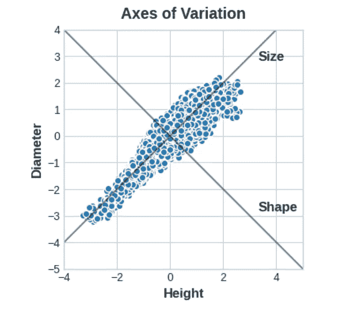
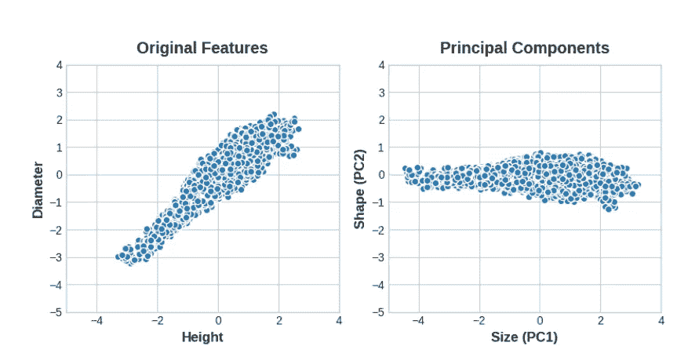

# 特征工程中的主成分分析

> 原文：<https://medium.com/geekculture/principal-component-analysis-pca-in-feature-engineering-472afa39c27d?source=collection_archive---------8----------------------->


Photo by [Giorgio Tomassetti](https://unsplash.com/@gtomassetti?utm_source=medium&utm_medium=referral) on [Unsplash](https://unsplash.com?utm_source=medium&utm_medium=referral)

文章将解释**主成分分析(PCA)** 和代码实现的概念和用途。

**主成分分析(PCA)** 是一种**统计程序**，使用一种技术将一组相关变量转换为一组不相关变量。在 [**鲍鱼**](https://www.kaggle.com/datasets/rodolfomendes/abalone-dataset) 数据集中，有**高度**和**直径等特征。鲍鱼是一种类似牡蛎的生物。这里的概念是将上述变量转换成一组称为**变化轴的其他变量。****

**长轴**可称为**【尺寸】**部件:小高度小直径(左下)与大高度大直径(右上)相对。**短轴**可称为**【形状】**部件:小高度大直径(扁平形状)与大高度小直径(圆形)形成对比。



Axes of variation defined (Image from Kaggle course)

因此，与其用鲍鱼的**高度**和**直径**来描述它们，不如用它们的**大小**和**形状**来描述它们。事实上，这就是 PCA 的全部思想:我们用它的**变化轴**来描述它，而不是用**原始特征**来描述数据。变化轴成为新的特征。



New axes after rotation of dataset in feature space (image from Kaggle)

**PCA** 也告诉**每个成分的变化量**。它显示了与**形状**组件相比，**尺寸**特征对变化的影响程度。PCA 通过每个组成部分的**解释方差的百分比使这一点变得精确。**

## **特征工程的 PCA**

有两种方法可以将 **PCA** 用于**特征工程**。

第一种方法是把它作为一种描述技巧。由于组件告诉了变化，您可以**计算组件的** [**【互信息】**](/p/360ec43353a0) **分数**，并查看哪种变化是**对目标变量**最有预测性的。这可以为要创建的各种特征提供思路——比如说，如果尺寸**重要，则是高度和直径的乘积**;如果尺寸**重要，则是高度和直径的比值****。甚至可以在一个或多个高分组件上尝试 [**集群**](/p/112c61d55231) 。******

**第二种方式**是**使用部件本身**作为特征。因为组件直接公开了数据的变化结构，所以它们通常比原始特征更能提供信息。以下是一些使用案例:

*   **降维**:当**特征高度冗余**(特别是*多重共线*)时，PCA 会**将冗余**分割成一个或多个**接近零方差**分量，然后您可以丢弃这些分量，因为它们包含很少或没有信息。
*   **异常检测**:在**低方差分量**中经常会出现与原始特征不一致的异常变化。在异常或异常值检测任务中，这些组件可能是**高信息量的**。
*   **降噪**:传感器读数的集合将总是具有共同的背景噪声。PCA 有时可以将(信息)信号收集到**更少数量的特征**中，而**不处理噪声**，从而**提高信噪比****。**
*   ****去相关**:一些 ML 算法与**高度相关的特征**斗争。PCA **将相关的特征转换成不相关的成分**，这对于算法来说更容易处理。**

**PCA 基本上直接访问数据的**相关结构。****

**PCA **最佳实践**:**

**使用 PCA 时，需要记住一些事情**

*   **PCA **仅适用于数字特征**，**
*   **PCA**对比例**敏感。在应用 PCA 之前对数据进行标准化是一个很好的做法，**
*   **最好**移除或限制异常值**，因为它们会在结果中产生偏差。**

****PCA 的代码实现****

**现在让我们看看 PCA 的一些代码实现，以及它如何解决一些现实生活中的问题。[**Ames**](https://www.kaggle.com/c/house-prices-advanced-regression-techniques/data)**房价数据集用作用例，我们也可以将代码用于其他问题陈述。****

```
**#List of installed libraries

import matplotlib.pyplot as plt
import numpy as np
import pandas as pd
import seaborn as sns
from sklearn.decomposition import PCA
from sklearn.feature_selection import mutual_info_regression
from sklearn.model_selection import cross_val_score
from xgboost import XGBRegressor

# Set Matplotlib defaults
plt.style.use("seaborn-whitegrid")
plt.rc("figure", autolayout=True)
plt.rc(
    "axes",
    labelweight="bold",
    labelsize="large",
    titleweight="bold",
    titlesize=14,
    titlepad=10,
)

#Standardization and applying PCA to create principal components

def apply_pca(X, standardize=True):
    # Standardize
    if standardize:
        X = (X - X.mean(axis=0)) / X.std(axis=0)
    # Create principal components
    pca = PCA()
    X_pca = pca.fit_transform(X)
    # Convert to dataframe
    component_names = [f"PC{i+1}" for i in range(X_pca.shape[1])]
    X_pca = pd.DataFrame(X_pca, columns=component_names)
    # Create loadings
    loadings = pd.DataFrame(
        pca.components_.T,  # transpose the matrix of loadings
        columns=component_names,  # so the columns are the principal components
        index=X.columns,  # and the rows are the original features
    )
    return pca, X_pca, loadings

def plot_variance(pca, width=8, dpi=100):
    # Create figure
    fig, axs = plt.subplots(1, 2)
    n = pca.n_components_
    grid = np.arange(1, n + 1)
    # Explained variance
    evr = pca.explained_variance_ratio_
    axs[0].bar(grid, evr)
    axs[0].set(
        xlabel="Component", title="% Explained Variance", ylim=(0.0, 1.0)
    )
    # Cumulative Variance
    cv = np.cumsum(evr)
    axs[1].plot(np.r_[0, grid], np.r_[0, cv], "o-")
    axs[1].set(
        xlabel="Component", title="% Cumulative Variance", ylim=(0.0, 1.0)
    )
    # Set up figure
    fig.set(figwidth=8, dpi=100)
    return axs

#Calculate Mutual Information scores

def make_mi_scores(X, y):
    X = X.copy()
    for colname in X.select_dtypes(["object", "category"]):
        X[colname], _ = X[colname].factorize()
    # All discrete features should now have integer dtypes
    discrete_features = [pd.api.types.is_integer_dtype(t) for t in X.dtypes]
    mi_scores = mutual_info_regression(X, y, discrete_features=discrete_features, random_state=0)
    mi_scores = pd.Series(mi_scores, name="MI Scores", index=X.columns)
    mi_scores = mi_scores.sort_values(ascending=False)
    return mi_scores

# Create model scores

def score_dataset(X, y, model=XGBRegressor()):
    # Label encoding for categoricals
    for colname in X.select_dtypes(["category", "object"]):
        X[colname], _ = X[colname].factorize()
    # Metric for Housing competition is RMSLE (Root Mean Squared Log Error)
    score = cross_val_score(
        model, X, y, cv=5, scoring="neg_mean_squared_log_error",
    )
    score = -1 * score.mean()
    score = np.sqrt(score)
    return score

df = pd.read_csv("ames.csv")**
```

****在上面的代码中，我们计算了数据集的 **PCA 成分、互信息分数和模型分数**。在下一段代码中，我们从数据集中提取了 **4 个特征**，并找到了**与**目标(销售价格)**的关联**。****

```
features = [
    "GarageArea",
    "YearRemodAdd",
    "TotalBsmtSF",
    "GrLivArea",
]

print("Correlation with SalePrice:\n")
print(df[features].corrwith(df.SalePrice))

Correlation with SalePrice:

GarageArea      0.640138
YearRemodAdd    0.532974
TotalBsmtSF     0.632529
GrLivArea       0.706780
dtype: float64
```

**我们将使用主成分分析来观察特征之间的**相关性，并建议可以用新特征**有效建模的**关系。****

```
X = df.copy()
y = X.pop("SalePrice")
X = X.loc[:, features]

# `apply_pca`, defined above, reproduces the code from the tutorial
pca, X_pca, loadings = apply_pca(X)
print(loadings)

                   PC1       PC2       PC3       PC4
GarageArea    0.541229  0.102375 -0.038470  0.833733
YearRemodAdd  0.427077 -0.886612 -0.049062 -0.170639
TotalBsmtSF   0.510076  0.360778 -0.666836 -0.406192
GrLivArea     0.514294  0.270700  0.742592 -0.332837
```

## ****解释组件载荷****

**第一个组件 **PC1** 看起来像是本文前一部分中的“大小”组件:所有的特征**都具有相同的符号(正)**，这表明该组件正在描述这些特征的值大的**房屋和值小的**房屋之间的对比。**

**对第三个组件 **PC3** 的解释有点棘手。特性`GarageArea`和`YearRemodAdd`都有接近零的负载，所以让我们忽略它们。这个组件主要是关于`TotalBsmtSF`和`GrLivArea`的。它描述了居住面积很大但地下室很小(或不存在)的房子和相反情况的对比:地下室很大的小房子。**

## ****创建新特征****

**在这一部分，我们将尝试创建新的特性来测试现有的特性，以确定是否能找到更好的[**【RMSLE】**](https://www.quora.com/What-is-the-difference-between-an-RMSE-and-RMSLE-logarithmic-error-and-does-a-high-RMSE-imply-low-RMSLE)**【均方根对数误差】**。它是使用 **score_dataset()** 函数计算的。代码如下。**

```
# Solution 1: Inspired by loadings
X = df.copy()
y = X.pop("SalePrice")

X["Feature1"] = X.GrLivArea + X.TotalBsmtSF
X["Feature2"] = X.YearRemodAdd - X.TotalBsmtSF

score = score_dataset(X, y)
print(f"Your score: {score:.5f} RMSLE")

# Solution 2: Uses components
X = df.copy()
y = X.pop("SalePrice")

X = X.join(X_pca)
score = score_dataset(X, y)
print(f"Your score: {score:.5f} RMSLE")

Your score: 0.13478 RMSLE
Your score: 0.13707 RMSLE
```

**代码的第一部分有**创建的特征(特征 1 和特征 2)** 并计算得分。在下一部分中， **PCA 成分**用于计算分数。以上两种情况下的 RMSLE 值分别为 **0.134 和 0.137** 。当然，人们可以尝试现有特征的不同组合，并检查 **RMSLE 值是否可以降低到 0.140** 以下，因为这是没有 PCA 或新创建特征的数据集的分数。**

**这篇关于 PCA 的文章到此结束，我希望我写得很清楚，这里是[](https://www.kaggle.com/code/ryanholbrook/principal-component-analysis/tutorial)**。创造一个投入生产的好模型需要大量的实践，所有这些**特征工程的步骤对于实现目标**是必不可少的。****

****到那时，请查看我的其他 [**文章**](/@abhi2652254) ，说 [**嗨**](https://www.linkedin.com/in/obhinaba17/) **。**还有，看看我的 [**GitHub**](https://github.com/abhigyan631) **。如果你喜欢我的作品，你可以给我捐赠几杯咖啡，这样我就可以在写作的道路上不断提高内容的质量。******