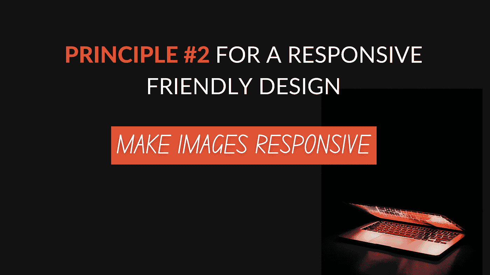

# 响应友好设计的原则 2

> 原文：<https://medium.com/geekculture/principle-2-for-a-responsive-friendly-design-b71abb74cad1?source=collection_archive---------28----------------------->

## 使图像具有响应性



这比[第一原理](https://link.medium.com/Myw1EzlIXhb)简单。

其实很简单。主要有两个属性完成这项工作:`max-width`和`height`。

```
**img** {
  max-width: 100%;
  height: auto;
}
```

*   `100%`的`max-width`确保图像永远不会比容器宽…