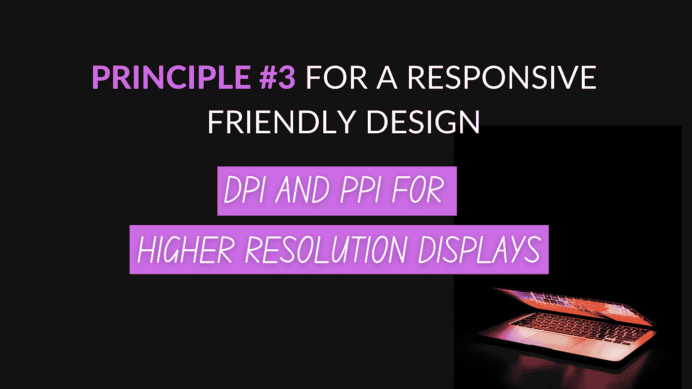

# 响应友好设计的原则#3

> 原文：<https://medium.com/geekculture/principle-3-for-a-responsive-friendly-design-bb4aaf289fa3?source=collection_archive---------43----------------------->

## 更高分辨率显示器的 DPI 和 PPI

这个原理解决了一个关于图像的著名问题。谈到高分辨率，主要有两个显示器，称为`Retina display`或`None-retina display`。

例如，最近的 iMac 电脑以其高分辨率而闻名(*视网膜*显示屏)。因此，显示器可以是…