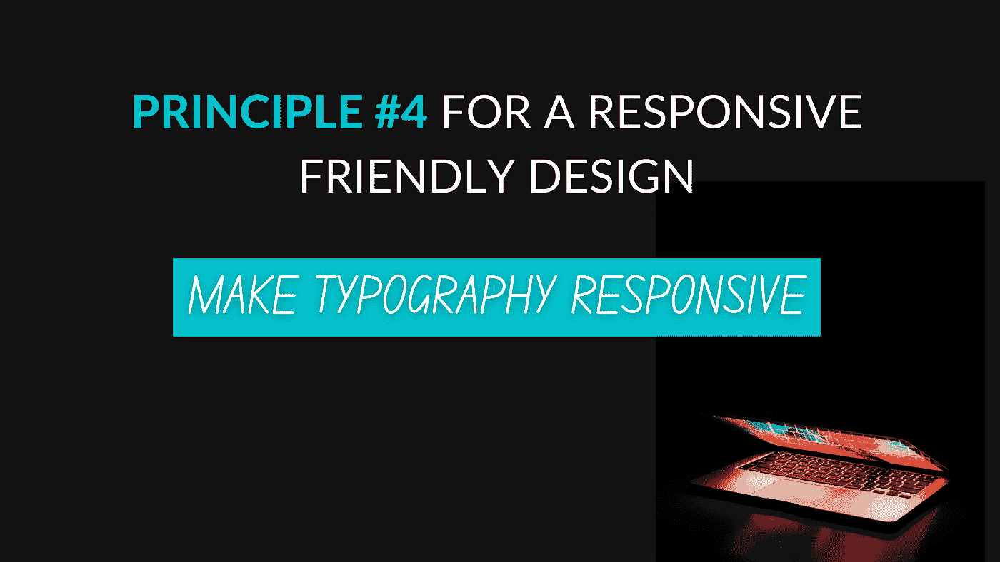

# 响应友好设计的原则#4

> 原文：<https://medium.com/geekculture/principle-4-for-a-responsive-friendly-design-10fc9821952c?source=collection_archive---------42----------------------->

## 让排版更具响应性

我们经常使用`px`和`em`来调整文本的大小。嗯，这种做法是不友好的。更明智的做法是将视口单元用于响应性排版。

视窗单位(如百分比)是相对于设备视窗尺寸(宽度或高度)的单位，而百分比是相对于…的大小