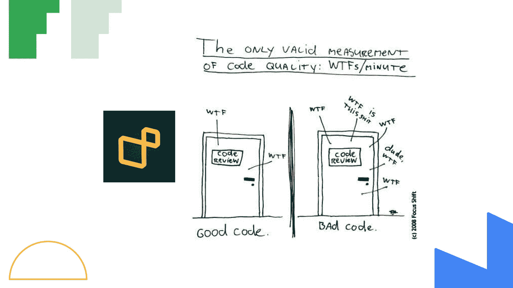

# 原则:干净代码的思想——成为更好的程序员

> 原文：<https://medium.com/geekculture/principles-mindset-of-clean-code-be-a-better-programmer-a700d64abee1?source=collection_archive---------12----------------------->

“聪明的程序员和专业的程序员之间的一个区别是，专业的程序员明白清晰才是王道。专业人士善用他们的能力，编写他人能够理解的代码。”― **罗伯特·c·马丁，干净的代码:敏捷软件工艺手册**

# ⚡️Overview

*   代码是干净的，当它很容易…