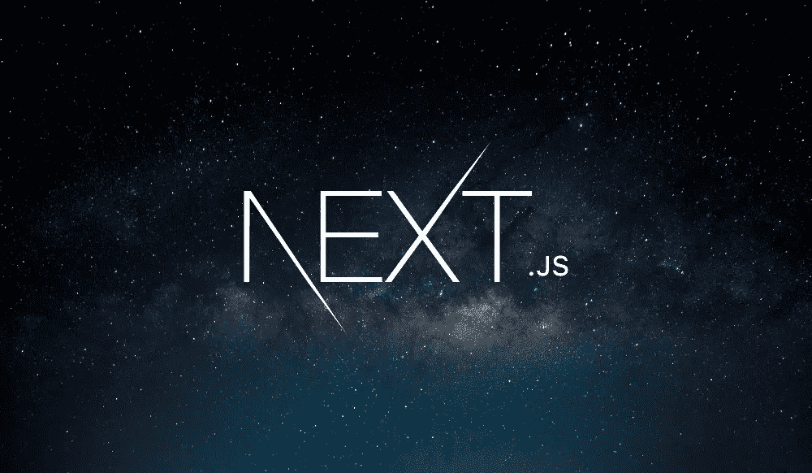

# Prismic.io 带 Next.js 和 GraphQL。入门指南

> 原文：<https://medium.com/geekculture/prismic-io-with-next-js-and-graphql-getting-started-f9e7986b39e2?source=collection_archive---------0----------------------->

> Prismic 是一个**内容管理系统**，一个编辑在线内容的工具(你不需要重新构建/部署你的应用)。也称为 headless CMS、API CMS、内容平台、颠覆性的内容即服务数字体验…基本上，我们已经构建了一个工具，让您可以选择自己的技术、框架和语言，然后轻松管理您的内容。