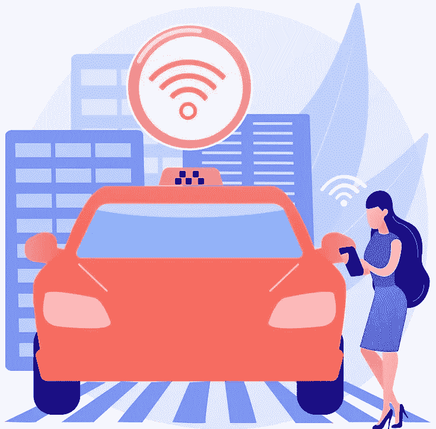

# 自动驾驶汽车中的隐私问题

> 原文：<https://medium.com/geekculture/privacy-concerns-in-autonomous-vehicles-e7bc38aca9f2?source=collection_archive---------13----------------------->

[https://www.freepik.com/vectors/car](https://www.freepik.com/vectors/car)

自动驾驶汽车有很多好处。请过岗' [**自动驾驶汽车的好处**](https://suryagutta.medium.com/benefits-of-autonomous-vehicles-e90ebfd324e) **。**’然而，由于 AVs 收集相机图像、视频剪辑、生物特征数据、用户联系人、位置、速度、日期和时间、所有者或乘客信息、导航历史等。，存在隐私风险。

# **车主和乘客信息**

AVs 收集大量数据，包括车主&乘客信息、机舱内及其周围的音频和视频内容、生物特征数据、地图数据、个人偏好信息(如座椅倾斜度、温度设置等)。该信息可以高度确定地识别驾驶员、乘客和他们的活动。

# **位置数据**

AV 存储的数据涉及目的地、速度、路线、日期和时间等。提供关于用户在一段时间内何时、何地以及如何旅行的信息。这些数据可以披露所有者或乘客的信息，包括他们在哪里居住、工作、经常光顾的商店、医疗保健专业人员的拜访、餐馆等。

# **传感器数据**

关于反病毒用户的位置和路上行为的个人信息对于各种政府和私营部门实体可能是有价值的，包括执法部门、新闻媒体、私人调查员和保险公司。

AV 传感器收集与车辆运行及其周围环境相关的数据。AVs 在人们不知情或不同意的情况下收集他们遇到的人的视频和语音数据。如果为反病毒操作收集了最少的数据并将其丢弃，可能不会产生隐私问题。但是，AV 可能会在用户不知情的情况下收集额外的信息，这发生在谷歌在街景项目期间收集 Wi-Fi 网络和有效载荷数据(密码、电子邮件和开放网络的搜索历史)的情况下。

# **未加密数据**

AVs 包含大量个人信息，这些信息需要加密。否则，当未经授权的用户访问该信息时，PII 将被泄露。人们发现，在垃圾场和拍卖会上出售的撞坏的特斯拉汽车(Model S、Model X 和 Model-3)包含大量个人和未加密的数据。他们从司机配对的移动设备、电话簿、日历项目和视频中获取信息，显示事故发生前发生的事情。

# **网络安全问题**

车辆正在变成连接互联网的大型移动机器。汽车边缘计算联盟(创始成员包括 AT&T、爱立信、英特尔、微软、谷歌、思科、甲骨文和其他公司)估计，2025⁴.的 AV 每月数据流量可能超过 10 艾字节

可能存在许多网络安全问题，因为黑客可以利用车载单元漏洞、软件漏洞、社会工程攻击、中间人攻击等来窃取 AV 数据。任何数据都没有 100%的充分证明；只有通过适当的安全措施才能管理风险。大学研究人员演示了反病毒黑客攻击，他们在大约两个 minutes⁵.时间内侵入并偷走了一辆特斯拉 Model X 他们使用了一个钥匙链，一个树莓皮，和一个替换的引擎控制单元，价格约为 200 美元。

**参考文献**

*[*https://www . the guardian . com/technology/2010/may/15/Google-admits-storing-private-data*](https://www.theguardian.com/technology/2010/may/15/google-admits-storing-private-data)*

**【2】*[*https://www . CNBC . com/2019/03/29/Tesla-model-3-keeps-data-like-crash-videos-location-phone-contacts . html*](https://www.cnbc.com/2019/03/29/tesla-model-3-keeps-data-like-crash-videos-location-phone-contacts.html)*

**【3】*[*https://aecc.org/*](https://aecc.org/)*

**【4】*[*https://aecc . org/WP-content/uploads/2019/04/AECC _ White _ Paper _ v 2.1 _ 003 . pdf*](https://aecc.org/wp-content/uploads/2019/04/AECC_White_Paper_v2.1_003.pdf)*

**【5】*[*https://www . Forbes . com/sites/leemathews/2020/11/23/researchers-hacked-and-leave-a-Tesla-model-x-in-just-minutes/*](https://www.forbes.com/sites/leemathews/2020/11/23/researchers-hacked-and-stole-a-tesla-model-x-in-just-minutes/)*

***感谢**的阅读！请👏如果你喜欢这篇文章，请跟我来，因为它**鼓励我**写更多！*