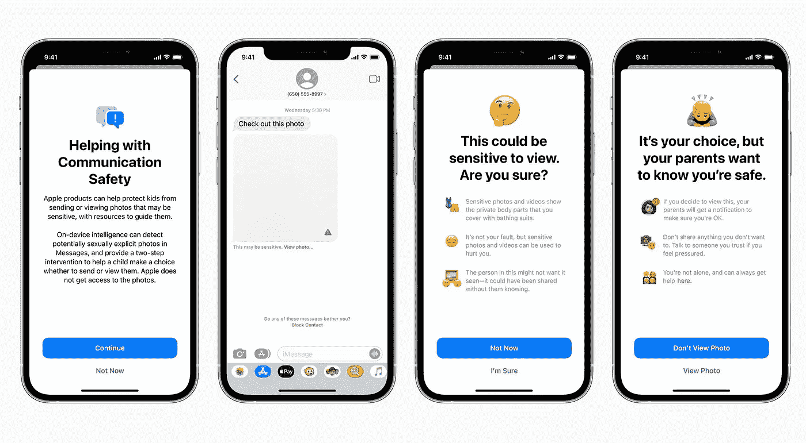
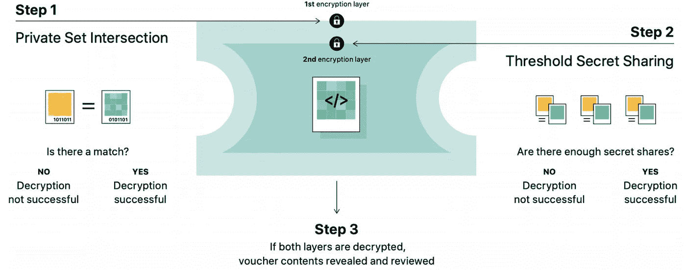
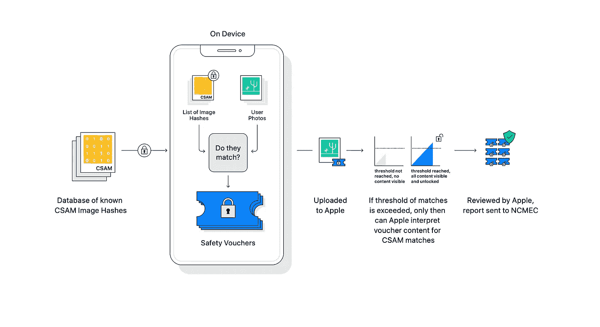
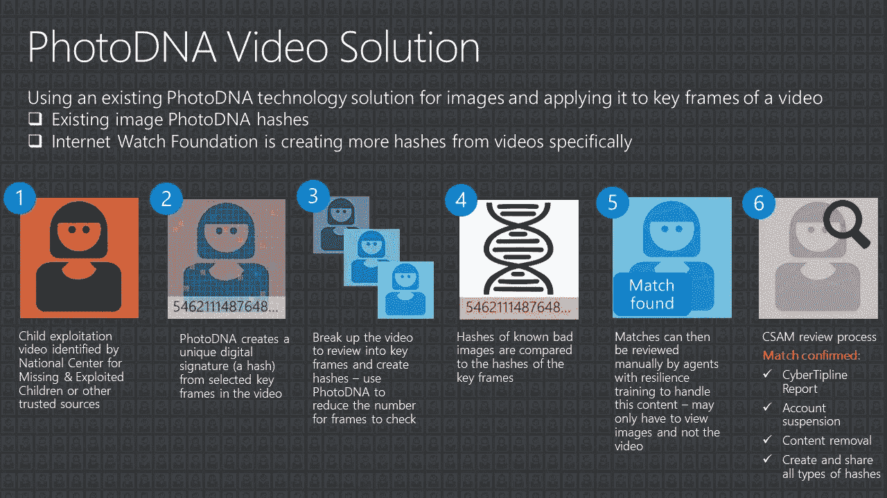

# 隐私辩论:苹果扫描 iCloud 设备上的儿童色情照片

> 原文：<https://medium.com/geekculture/privacy-debate-apple-scans-icloud-photos-on-device-for-child-pornography-d544c87a559f?source=collection_archive---------47----------------------->

 [## 科技捕手

### 关于技术、隐私、人工智能伦理及其政策含义的简短片段和内容监管

techcatcher.io](https://techcatcher.io) 

2021 年 8 月，[苹果宣布](https://www.apple.com/child-safety/)从 iOS 15 开始扫描用户 iCloud 照片中的儿童性虐待素材(CSAM)。与谷歌和微软不同，[从他们的云服务器为 CSAM](https://www.microsoft.com/en-us/photodna) 扫描用户照片，苹果的扫描将发生在用户的设备上，就在照片被同步到 iCloud 之前。苹果声称他们的方式增强了隐私，因为[它不会暴露任何关于其他用户照片的信息](https://www.theverge.com/2021/8/10/22613225/apple-csam-scanning-messages-child-safety-features-privacy-controversy-explained)，如果它扫描它的服务器，这可能不是真的。然而，批评者警告说，这可能会给执法部门获取设备上的用户数据带来危险。

[Source](https://www.apple.com/child-safety/): Apple Child Safety

如下图所示，[如果两个条件都满足，苹果的算法只会解密用户的照片以供人工检查](https://www.apple.com/child-safety/pdf/CSAM_Detection_Technical_Summary.pdf)。首先，照片必须与国家失踪和被剥削儿童中心策划的已知 CSAM 内容相匹配。其次，用户必须在 iCloud 上存储足够多的超过给定阈值的匹配照片。

[Source](https://www.apple.com/child-safety/pdf/CSAM_Detection_Technical_Summary.pdf): Apple CSAM Detection — Technical Summary

计算机科学家之间的意见有分歧:[一些人称赞它是对抗 CSAM 和保护用户隐私的一种方式](https://9to5mac.com/2021/08/05/apple-announces-new-protections-for-child-safety-imessage-safety-icloud-photo-scanning-more/)，利用加密技术来最大限度地减少对私人数据的入侵。然而其他人警告说，苹果现在可能[拥有绕过端到端加密的技术能力](https://www.theverge.com/2021/8/10/22613225/apple-csam-scanning-messages-child-safety-features-privacy-controversy-explained)，它将无法无视执法部门对用户数据的要求，就像它在 2016 年圣贝纳迪诺枪击案争议中所做的那样[。](https://www.theverge.com/2016/2/17/11036306/apple-fbi-iphone-encryption-backdoor-tim-cook)

[Source](https://www.apple.com/child-safety/pdf/Expanded_Protections_for_Children_Technology_Summary.pdf): Apple Expanded Protections for Children

# 相关报道->法院支持谷歌:利用哈希值检测儿童色情

2015 年 7 月，威廉·米勒在他的 Gmail 中附上了两份儿童色情文件。谷歌的散列值算法发现并向当局报告了它们。[米勒辩称](https://www.courtlistener.com/opinion/4835528/united-states-v-william-miller/?q=algorithm&type=o&order_by=score%20desc&stat_Precedential=on&filed_after=12%2F01%2F2020)当执法部门查看他在谷歌上分享的文件时，他受到了[不合理的搜查](https://www.dbllaw.com/artificial-intelligence-and-the-impact-it-has-in-criminal-investigations-today/)。[但是第六巡回法庭认为](https://www.courtlistener.com/opinion/4835528/united-states-v-william-miller/?q=algorithm&type=o&order_by=score%20desc&stat_Precedential=on&filed_after=12%2F01%2F2020)政府在这个案件中没有进行第四修正案搜索:谷歌的散列值搜索创造了一个“虚拟的确定性”,即米勒的图像是非法的，使得政府的搜索只披露了谷歌已经披露的内容。那么哈希值是如何虚拟确定地检测色情内容的呢？

[(Microsoft uses hash value based techniques to detect child pornography in video)](https://news.microsoft.com/on-the-issues/2018/09/12/how-photodna-for-video-is-being-used-to-fight-online-child-exploitation/)

在这种情况下，哈希是图像文件的唯一数字指纹，可以抵抗像调整大小这样的更改。对于上传到 Gmail 的每个文件，谷歌都会计算其哈希值，并将其与国家失踪和受剥削儿童中心管理的经确认的色情内容进行比较。如果两个哈希值匹配，谷歌将向适当的监管机构报告照片，而不查看电子邮件的内容。[谷歌后来宣布，它正在使用深度神经网络来检测以前没有记录的新的儿童性虐待材料。](https://www.blog.google/around-the-globe/google-europe/using-ai-help-organizations-detect-and-report-child-sexual-abuse-material-online/)

 [## 科技捕手

### 关于技术、隐私、人工智能伦理及其政策含义的简短片段和内容监管

techcatcher.io](https://techcatcher.io)