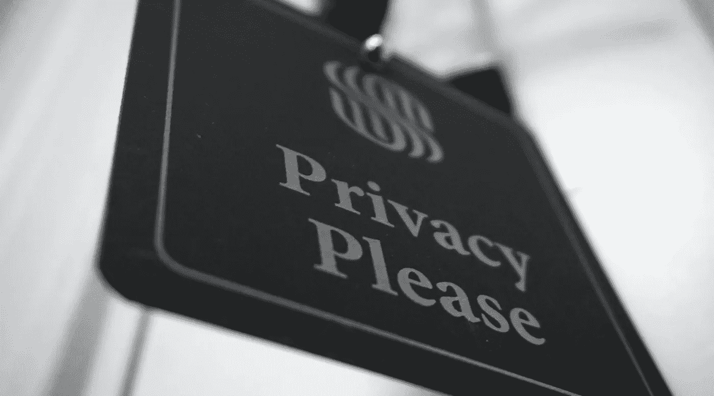

# 盖茨比中的隐私友好分析

> 原文：<https://medium.com/geekculture/privacy-friendly-analytics-in-gatsbyjs-daaa2935518f?source=collection_archive---------7----------------------->

## 我建立了我的 Gatsby 站点，只跟踪希望被跟踪的用户，使用 cookie 同意横幅请求他们的许可…



“Photo by [Jason Dent](https://unsplash.com/@jdent?utm_source=unsplash&utm_medium=referral&utm_content=creditCopyText) on [Unsplash](https://unsplash.com/s/photos/privacy?utm_source=unsplash&utm_medium=referral&utm_content=creditCopyText)”

🔔这篇文章最初发布在我的网站上，【MihaiBojin.com 。🔔

对于我的网站，我想获取用户分析，而不跟踪那些不想被跟踪的用户。在欧洲，通用数据保护条例(GDPR)保护消费者的隐私。特别是， [ePrivacy 指令](https://gdpr.eu/cookies/)在设置任何跟踪 cookies 之前会请求用户的同意。

快速搜索显示[Gatsby-plugin-gdpr-cookies](https://github.com/andrezimpel/gatsby-plugin-gdpr-cookies)，一个支持[谷歌分析](https://analytics.google.com/analytics/web/)、[谷歌标签管理器](https://marketingplatform.google.com/about/tag-manager/)和[脸书像素](https://www.facebook.com/business/help/742478679120153?id=1205376682832142&helpref=faq_content)的插件。

简而言之，它提供了一种要求用户明确同意设置任何 cookies 的机制；正是我所需要的！

## 安装插件

我用`npm install gatsby-plugin-gdpr-cookies`安装了插件，然后把它添加到我的`gatsby-config.js`文件中:

```
module.exports = {
  plugins: [
    {
      resolve: `gatsby-plugin-gdpr-cookies`,
      options: {
        googleAnalytics: {
          trackingId: /*GA_TRACKING_ID*/,
          cookieName: "gatsby-gdpr-google-analytics",
          anonymize: true, // https://github.com/andrezimpel/gatsby-plugin-gdpr-cookies#anonymize
          allowAdFeatures: false,
        },
      },
    },
  ],
};
```

然后，什么都没有…

事实证明，配置这个插件比文档显示的[要麻烦一点。](https://github.com/andrezimpel/gatsby-plugin-gdpr-cookies#initialize-and-track)

插件**要求您设置名为** `**cookieName**`的 cookie，例如:`gatsby-gdpr-google-analytics=true`，以启用跟踪。

这一点并不明显，我最终花费了不必要的时间去弄清楚为什么它不起作用。

## 与同意横幅整合

这样一来，我需要一个开关来跟踪用户是否已经接受了横幅。通常，我会使用另一种 cookie——但那会违背我的初衷。

**本地存储来救援！**我找到了 [Josh Comeau 关于粘性状态的优秀教程](https://www.joshwcomeau.com/snippets/react-hooks/use-sticky-state/)并实现了它。

一个简单的 React 组件之后，和一些用于横幅的 [TailwindUI 代码，它就准备好了！](https://tailwindui.com/components/marketing/elements/banners#component-39dd57897ef8e6d37aa07fbbafc188b1)

下面是生成的代码(简化):

```
import * as React from 'react';
import { useLocation } from '@reach/router';
import { initializeAndTrack } from 'gatsby-plugin-gdpr-cookies';

function isBrowser() {
  return typeof window !== 'undefined';
}

function getValue(key, defaultValue) {
  return isBrowser() && window.localStorage.getItem(key)
    ? JSON.parse(window.localStorage.getItem(key))
    : defaultValue;
}

function setValue(key, value) {
  window.localStorage.setItem(key, JSON.stringify(value));
}

function useStickyState(defaultValue, key) {
  const [value, setter] = React.useState(() => {
    return getValue(key, defaultValue);
  });

  React.useEffect(() => {
    setValue(key, value);
  }, [key, value]);

  return [value, setter];
}

const CookieConsent = () => {
  const location = useLocation();
  if (isBrowser()) {
    initializeAndTrack(location);
  }

  const [bannerHidden, setBannerHidden] = useStickyState(
    false,
    'consentCookieHidden',
  );

  const EnableAnalytics = () => {
    document.cookie = 'gatsby-gdpr-google-analytics=true';
    setBannerHidden(true);
  };

  return (
    <>
      {!bannerHidden && (
        <div>
          <span>
            We use cookies to personalize content and analyze our
            traffic.
          </span>
          <button onClick={EnableAnalytics}>OK</button>
        </div>
      )}
    </>
  );
};

export default CookieConsent;
```

剩下的最后一件事是在站点的页脚调用这个组件。

```
import CookieConsent from 'cookie-consent';
...
<CookieConsent/>
```

这确保了在用户单击 OK 之前，不会运行任何分析代码，也不会设置任何 cookies。

就是这样！这是您在启用分析和跟踪 cookies 之前获得用户同意的方式！

如果你喜欢这篇文章并想阅读更多类似的文章，[请订阅我的简讯](https://motivated-founder-807.ck.page/db1cf284bf)；我每隔几周就发一封！