# 反应堆上的专用路由

> 原文：<https://medium.com/geekculture/private-routing-on-reactjs-30c006637188?source=collection_archive---------11----------------------->

对于那些开始创建 web 应用程序的人来说，最大的挑战之一总是在于:“**我如何管理路由许可？”**

当我们在 ReactJS 上工作时，我们可以看到有许多方法来平衡我们的路由结构，因此，许多开发人员会花一些时间考虑:**“我应该使用哪种路由结构？”**。

对我来说，一个开发人员可以应用到他们项目中的最好的结构是这样一种结构，它让**感到在**上工作很舒服，并且便于**扩展**以及**添加或删除路由许可**。

符合所有这些考虑的一个是**嵌套路由**的概念，它基本上由 de routes 文件夹中的**三个核心文件**组成。

不要再说了，我们开始吧！

首先，让我们使用*yarn create react-app nested-routes 创建我们的项目。*创建后，我们可以清理我们的文件夹结构，以便只保留我们将在此应用程序中使用的文件。

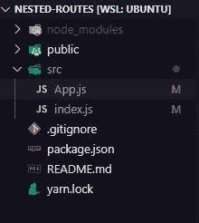

Image 1: Main folder structure.

之后，我们可以开始下载将要使用的库: **react-router-dom** —我们的路由库、 **styled-components** —我们的样式库和 react-toastify —我们的警报库。

```
yarn add react-router-dom styled-components react-toastify
```

现在，让我们创建项目的文件夹结构。为此，我们需要在 *src* 中创建一个*组件*、*视图*和*路线*文件夹。

*   视图:我们的页面将被存储在哪里
*   *组件*:我们可重复使用的组件将存放在那里
*   *路由*:我们的路由结构将被存储的地方

首先，让我们开始在视图中创建一个 Home，在组件中创建一个 Navbar 和一个 Footer。

对于我们的家，我们将呈现一个简单的屏幕，上面有一些文本和我们的 Navbar 组件。

*   **导航条**

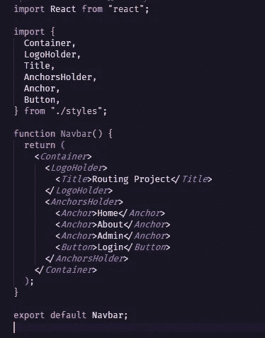

Image 3: Navbar/index.jsx

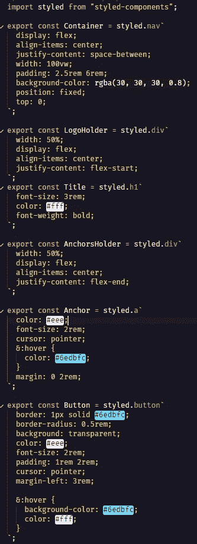

Image 4: Navbar/styles.js

*   页脚

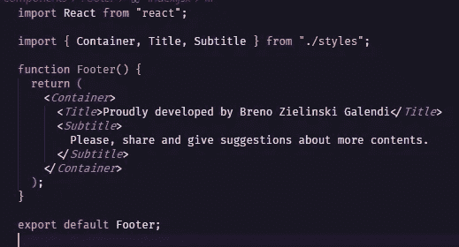

Image 5: Footer/index.jsx

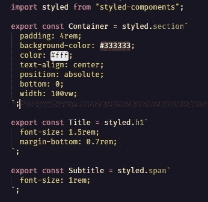

Image 6: Footer/styles.js

*   主页

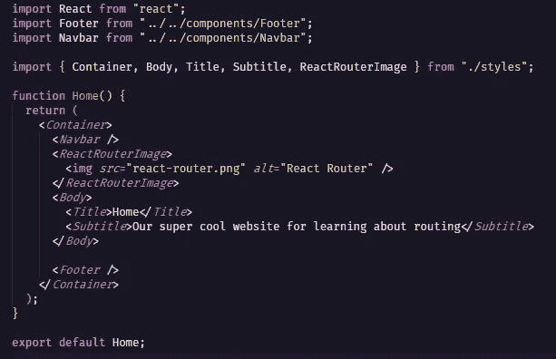

Image 7: Home/index.jsx

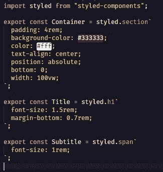

Image 8: Home/styles.js

> 所有这些文件在这个[项目的回购](https://github.com/Galendii/nested-routes-guide)上都有，放心使用吧！

让我们开始规划我们的项目吧！在我们的 *routes* 文件夹中，我们将创建三个不同的文件:index.jsx、paths.js 和 types.js

*   index.jsx:这是路由的主要文件，在这里我们将使用我们的路径并验证它是否是一个私有路由。
*   paths.js:这个文件将定义所有的路径名和/或参数。
*   types.js:这是所有路由验证都将在其中工作的文件。在这里，您可以定义应用程序中的所有访问级别。

让我们创造我们的道路！这里我们将需要创建一个对象，它包含我们希望它拥有的尽可能多的数组和访问级别。在这种情况下，我们将只使用两个级别: **admin** 和 **public** 访问。当我们创建第一个屏幕时，让我们将此路由设置为公共路由，这样每个人都可以访问它。

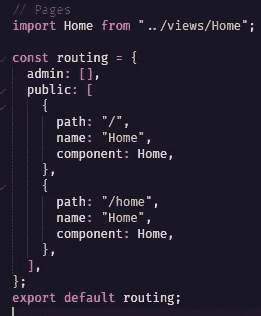

Image 9: routes/paths.js

在我们的 index.jsx 中，我们将创建一个带有交换机的路由器，以便我们能够基于绝对路径定义路径。然后，我们需要绘制`paths.public`的地图，以便返回它的路线。

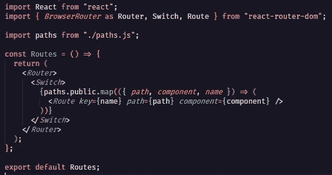

Image 10: routes/index.jsx

在我们创建管理员级别之前，让我们测试一下，看看是否一切都如我们所愿。为此，我们将需要编辑 App.js(它在我们的 *src* 文件夹之外)并返回我们的路线和全局样式(以便覆盖 html 默认配置)

*   全局样式

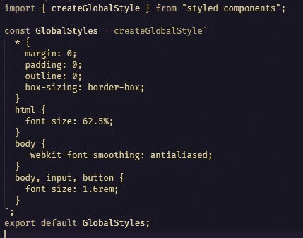

Image 11: styles/global.js

*   App.js

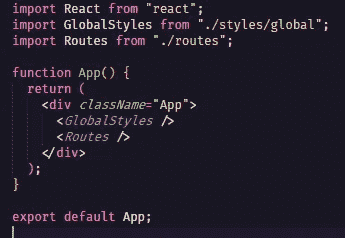

Image 12: App.js

如果准确地遵循了过去的所有步骤，您将会看到以下内容:

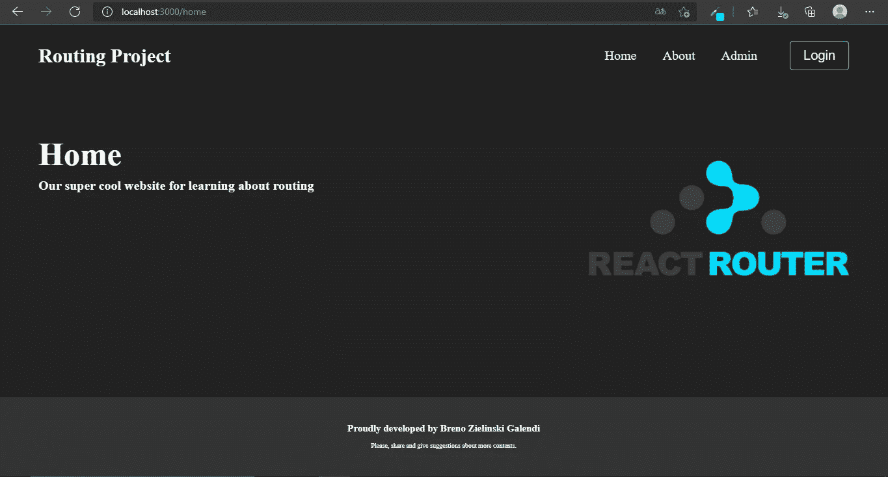

Image 13: Website preview

好吧！现在，我们已经完成了仅使用公共路由的嵌套路由概念。让我们来创建我们的管理员路线吧！为此，我们需要在 routes 文件夹中创建一个 *types.js* 文件。在这个文件中，我们将创建一个特定类型的路由，它将首先验证用户是否有访问权限，如果没有，则重定向到主页(并显示一条消息以获得更好的体验)

我们的 types.js 将存在于单个受保护的路由中(您可以根据需要创建多个路由)。这将是一个正常路由的扩展，但有一个验证器，它将决定是否呈现页面或重定向到主页。

> 本文的重点是展示一种创建路线的方法。使用本地存储来存储用户**的访问级别是不安全的！**

*   管理路线

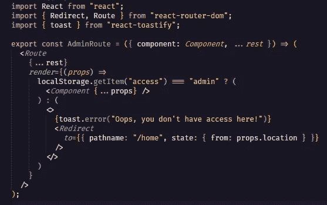

Image 14: routes/types.js

注意，我们现在使用的是由`react-toastify`库带来的`toast.error()`方法。为了使用它，我们必须改变我们的 *App.js* 中的最后一件事，那就是包含`<ToastContainer/>`和使用它所必需的 CSS`import "react-toastify/dist/ReactToastify.css*”*`

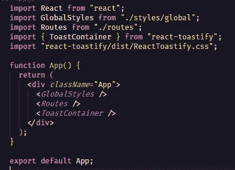

Image 15: App.js

现在我们可以填充我们的管理员路径。创建另一个视图，与主页非常相似，但是让我们将标题从“主页”改为“管理页面”。

在 path.js 中填充管理员的路径:

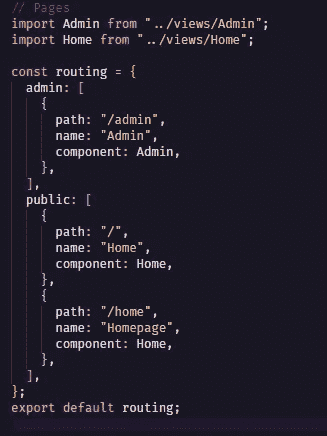

Image 16: routes/paths.js

如果一切正常，当您试图访问`/admin`路径时，您将立即被重定向到`/home`路径。

最后，让我们通过在 Navbar 上添加登录/注销功能来模拟一次登录，并在那里更改我们的路线。

登录/注销功能将尝试检索存储在名为“access”的 localStorage 上的项目，如果它存在，它将经历一个注销过程，如果不存在，它将向它添加一个“admin”值。

*   导航条

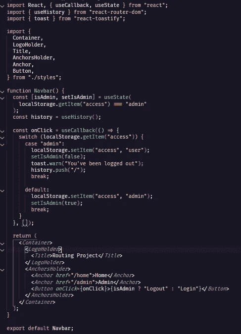

Image 17: Navbar/index.js

现在，您的项目结构应该看起来像下面的图像

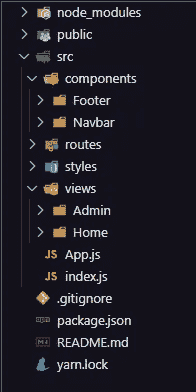

Image 18: Final project structure

这就是了！您已经开发了一个完全可行的解决方案来保护您的路由(不依赖于访问级别的数量),并学习了嵌套路由结构的基础知识！

如果你对这个项目有更多的疑问，可以在这里访问[项目的回购，或者通过 LinkedIn](https://github.com/Galendii/nested-routes-guide) 联系我[！](https://www.linkedin.com/in/breno-zielinski-galendi-b6385b179/)

#永不停止学习