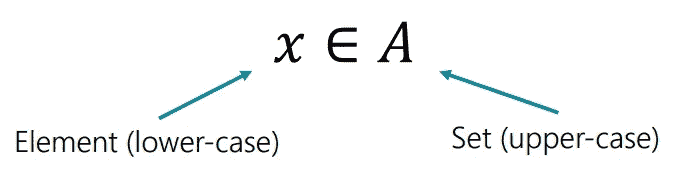
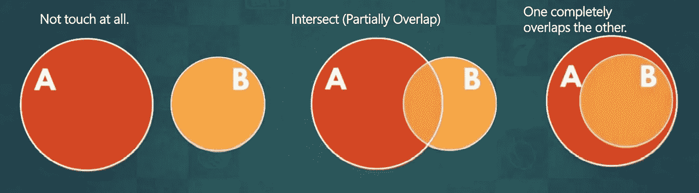
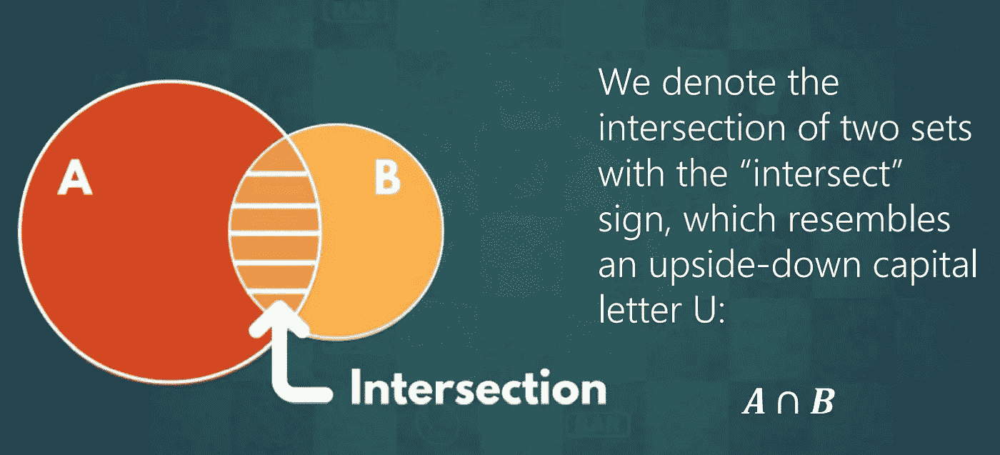
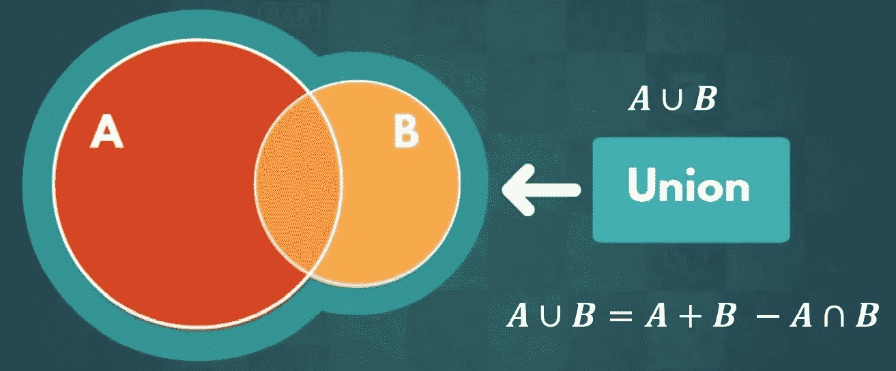
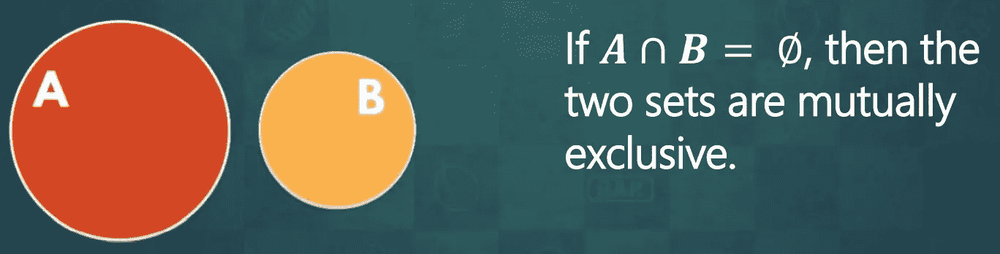
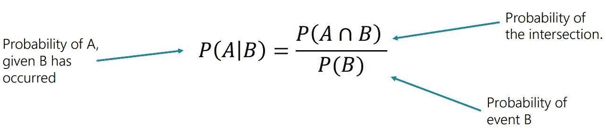
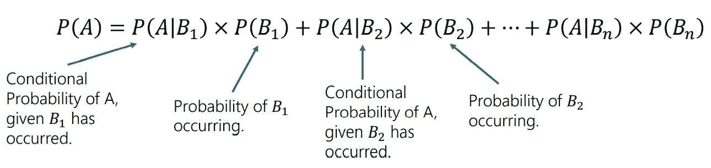
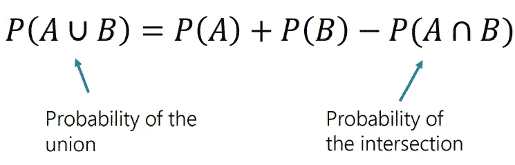
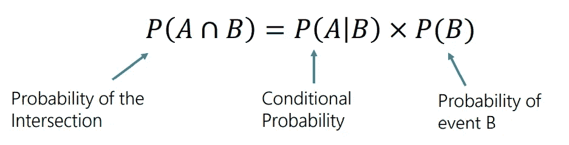

# 概率——贝叶斯推理

> 原文：<https://medium.com/geekculture/probability-bayesian-inference-bd274d1026c1?source=collection_archive---------22----------------------->

# 贝叶斯符号

一个**集合**是一个元素的集合，它包含某些值。此外，每个事件都有一组满足它的结果。

标为φ的**空集**(或**空集**)是一个不含值的集合。

*符号及其解释:——*

1.  x ∈ A —“元素 x 是集合 A 的一部分”.【2 ∈全偶数】。
2.  一个∋x——“集合 a 包含元素 x”.【所有偶数∋ 2】。
3.  x ∉ A —"元素 x 是集合 a 的一部分. "[1 ∉所有偶数]。
4.  ∀x:——“对于所有/任何 x，使得……”[∀x: x∈所有偶数]。
5.  ⊆b—“a 是 b 的子集”.[偶数⊆整数]。

***记住！*** *每个集合至少有 2 个子集。*

1.  ⊆
2.  φ⊆a

# 多个事件

满足两个事件 A 和 B 的结果集可以以下列方式之一相互作用:—

1.  *完全不接触* —例如，事件 A 得到一颗钻石，事件 B 得到一颗心。
2.  *相交* —例如，事件 A 得到一颗钻石，事件 B 得到一个皇后。
3.  *重叠* —例如，事件 A 得到一张红牌，事件 B 得到一颗钻石。

# **路口**

两个或更多事件的**交集**表示同时满足所有事件的结果集合。从图形上看，这是集合相交的区域。

# 联盟

两个或更多事件的**并集**表示满足至少一个事件的一组结果。从图形上看，这是包含两个集合的区域。

# 互斥集合

没有重叠元素的集合称为**互斥。**从图形上看，他们的圈子从未接触过。

**记住—** 所有的补集都是互斥的，但不是所有互斥的集合都是补集。

*示例:——*

狗和猫是互斥的，因为没有物种同时是猫和狗，但这两者不是互补的，因为也存在其他类型的动物。

# **独立和非独立事件**

如果事件 A 发生的可能性(P(A))受到事件 B 发生的影响，那么我们说 A 和 B 是**依赖**事件。或者，如果不是——这两个事件是独立的。

我们表示事件 A 发生的概率，给定事件 B 以如下方式发生 **P(A|B)。**我们称之为*条件概率。*

*独立:——*

*   到目前为止我们研究过的所有可能性。
*   A 的结果不取决于 b 的结果。
*   P(A|B) = P(A)
*   事件 A 得到一颗心，事件 B 得到一个插孔。

*依赖:——*

*   新概念。
*   A 的结果取决于 b 的结果。
*   P(A|B) ≠ P(A)
*   事件 A 得到一颗心，事件 B 得到一颗红。

# 条件概率

对于任何两个事件 A 和 B，使得 B 发生的可能性大于 0 (P(B)>0)，条件概率公式陈述如下:—

公式背后的直觉:——

*   只对 B 满意的结果感兴趣。
*   只有交集中的元素也会满足 A。
*   类似于“优先于一切”的公式。[交集=“首选结果”和 B =“样本空间”]。

**记住:——**

*   与并集或交集不同，改变条件概率中 A 和 B 的顺序会改变其含义。
*   P(A|B)和 P(B|A)不一样，即使数值上 P(A|B) = P(B|A)。
*   即使两个条件概率的值相等，它们也有不同的含义**。**

# **全概率定律**

****全概率定律**规定，对于任何集合 A，它是许多互斥集合 B1，B2，… Bn 的并集，它的概率等于下面的和。**

****

***公式背后的直觉:——***

*   **因为，P(A)是互斥集合的并集，所以它等于各个集合的**和。****
*   **并集和它的一个子集的交集是整个子集。**
*   **我们可以把条件概率公式改写为 P(A ∩ B) = P(A|B) x P(B)。**

# **加法定律**

**加法法则根据它所代表的单个集合的概率来计算并集的概率。**

****

***公式背后的直觉:——***

*   **回想一下使用交集的大小来计算并集的大小的公式。[A U B = A + B — A ∩ B]。**
*   **每一个的概率就是它的大小除以样本空间的大小。**
*   **这适用于任何事件 A 和 b。**

# **乘法法则**

**乘法规则根据条件概率计算交集的概率。**

****

***公式背后的直觉:——***

*   **我们可以互换条件概率公式的各项，得到 P(A ∩ B) = P(A|B) x P(B)。**
*   **如果事件 B 在 40%的时间里发生(P(B) = 0.4)，而事件 A 在 50%的时间里发生(P(A|B) = 0.5)，那么它们将在 20%的时间里同时发生。[0.5 x 0.4 = 0.2]**

# **贝叶斯定律**

**贝叶斯法则通过计算不同的条件概率来帮助我们理解两个事件之间的关系。我们也称之为*贝叶斯法则*或*贝叶斯定理。***

****

**公式背后的直觉:——**

*   **根据乘法法则 P(A ∩ B) = P(A|B) x P(B)，所以 P(B ∩ A) = P(B|A) x P(A)。**
*   **由于，P(A ∩ B) = P(B ∩ A)，我们在条件概率公式 P(A|B) = P(A ∩ B) / P(B)中为 P(A ∩ B)代入 P(B|A) x P(A)。**
*   **贝叶斯法则通常用于医学或商业分析，以确定两种症状中哪一种对另一种影响更大。**