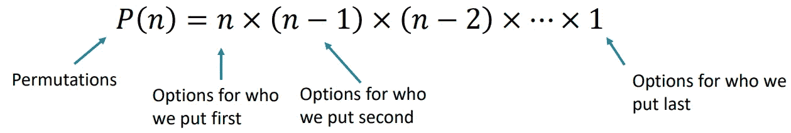
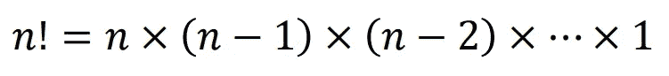
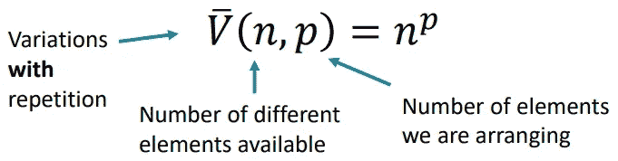
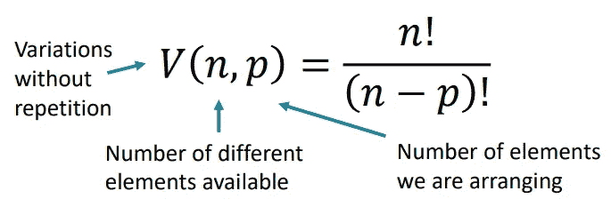
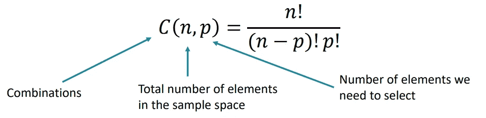
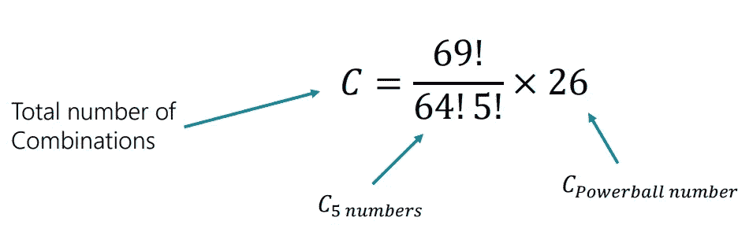
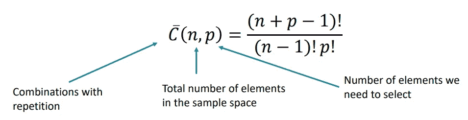

# 数据科学的概率组合学

> 原文：<https://medium.com/geekculture/probability-combinatorics-for-data-science-5e75e6b33500?source=collection_archive---------16----------------------->

# **排列**

排列代表了我们可以**排列**多个元素的不同可能方式的数量。

*排列的特点:——*

1.  在样本空间内排列所有的元素。
2.  没有重复。
3.  P(n) = n x (n-1) x (n-2) x … x 1 => n！(称为“n 阶乘”)

*示例:——*

如果我们需要安排 5 个人，我们将有 P(5) = 5！=> *120* 这样做的方法。

# **阶乘**

阶乘表示从 1 到 n 的所有整数的**乘积**，我们用“！”表示它们符号。

*键值:——*

1.  0! = 1.
2.  If n < 0, n! does not exist.

*阶乘规则(对于 n > 0 和 n > k): —*

1.  (n+k)！= n！x (n+1) x … x (n+k)
2.  (n-k)！= n！/ ((n-k+1) x … x n)
3.  n！/k！= (k+1) x … x n

*例子(n=7，k = 4):——*

1.  (7+4)!= 11!=> 7!x 8 x 9 x 10 x 11
2.  (7– 4)!= 3!=> 7!/ (4 x 5 x 6 x 7)
3.  7!/4!= 5 x 6 x 7

# **变异**

变化代表了我们可以用**选择**和**排列**多个元素的不同可能方式的数量。

*公式背后的直觉(有重复):——*

1.  对于第一个元素，我们有 n 多种选择。
2.  我们**对于第二个元素还有 n 个选项**，因为允许重复。
3.  对于 p-many 元素中的每一个，我们都有 n-many 选项。
4.  n x n x n x … x n = n^p

*公式背后的直觉(无重复):——*

1.  对于第一个元素，我们有 n 多种选择。
2.  对于第二个元素，我们**只有(n-1)个选项**，因为我们不能重复我们一开始选择的值。
3.  对于每一个额外的元素，我们剩下的选择就更少了。
4.  n x (n-1) x (n-2) x … x (n-p+1) = n！/ (n-p)！

# **组合**

组合代表了我们选择元素的不同方式。

*组合特征:——*

1.  考虑到重复计算。(选择 Vijay、Anagha 和 Sakshi 与选择 Anagha、Vijay 和 Sakshi 相同)。
2.  单一组合的所有不同排列都是不同的变化。
3.  组合=变化/排列
4.  组合是对称的，所以 C(n，p) = C(n，n-p)，因为选择 p 个元素和省略 n-p 个元素是一样的。

*样本空间分离的组合特征:——*

1.  我们为任何元素选择的选项不会影响其他元素的选项数量。
2.  我们选择单个元素的顺序是任意的。
3.  我们需要知道每个元素的样本空间的大小。(n1，n2，…，np)

# **彩票中奖的例子**

要赢得彩票，你需要满足两个不同的独立事件:—

1.  正确猜中“强力球”号码。(从 1 到 26)
2.  正确猜中 5 正规数。(从 1 到 69)

公式背后的直觉:——

1.  我们认为这两个不同的事件是两个不同样本量的元素的组合。即，一个事件的样本大小为 26，另一个事件的样本大小为 C (69，5)。
2.  使用*“最受青睐”*公式，我们发现任何一张彩票中奖的概率等于-1/((69！x 26) / (64！x 5！))

# **重复组合**

如前所述，组合代表了我们可以**选择**多个元素的不同可能方式的数量。在特殊情况下，我们可以在组合中重复，对于那些我们使用不同的公式。

现在，你已经知道这个公式是什么样子了，在下一篇博客中，我们将带你从没有重复公式*的组合*中推导出这个公式的过程。这样你将能够完全理解背后的直觉，而不必费心去记忆它。**