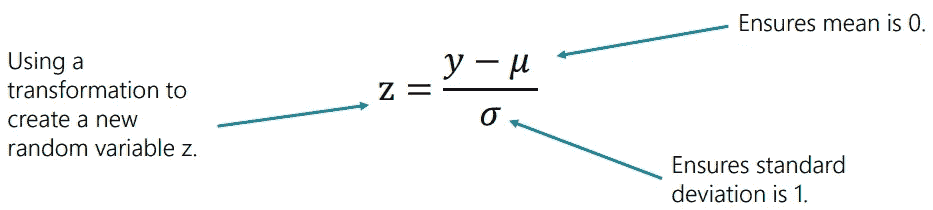
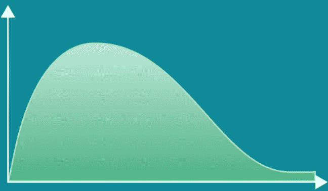
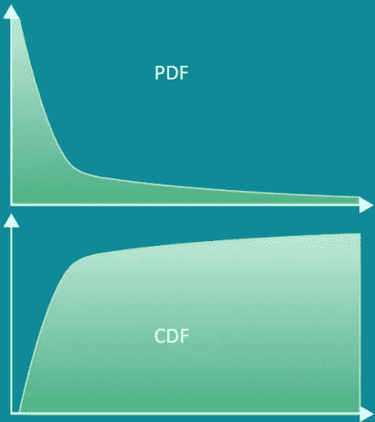
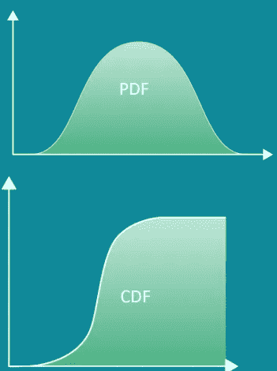

# 概率—连续分布

> 原文：<https://medium.com/geekculture/probability-continuous-distributions-5ddd5a54137b?source=collection_archive---------20----------------------->

# 连续分布

如果一个随机变量的可能值可以取一个无限多个连续值的序列，我们正在处理一个**连续分布。**

*关键特征:——*

*   有无限多个连续的可能值。
*   使用新的公式获得特定值和区间的概率。
*   无法将组成区间的单个值相加，因为它们有无限个**。**
*   **可以用图形或连续函数来表示。**
*   **图表由一条平滑的曲线组成。**
*   **为了计算区间的似然性，我们需要积分。**
*   **它们具有重要的累积分布函数。**

***连续分布的例子有:—***

1.  **正态分布。**
2.  **学生-T 分布。**
3.  **卡方分布。**
4.  **指数分布。**
5.  **物流配送。**

# **正态分布**

**正态分布代表大多数自然事件遵循的分布。**

****

***符号:——***

*   *****Y ~ N(μ，σ )*****

***关键特征:——***

*   **其图形为钟形曲线，对称，有细尾。**
*   *****E(Y) = μ*****
*   *****Var(Y) = σ*****
*   **其所有值的 68%应该落在这个区间内:( ***μ-σ*** 和 ***μ+σ*** )。**

***示例和用途:——***

*   **经常在野外观察动物的大小。**
*   **可以标准化以使用 Z 表。**

# **标准化正态分布**

**为了标准化任何正态分布，我们需要对其进行转换，使均值为 0，方差和标准差为 1。**

****

***标准正态分布的重要性:——***

*   **新变量 z 表示每个对应值距离平均值有多少标准偏差。**
*   **我们可以使用上面所示的转换将任何正态分布转换为标准正态分布。**
*   **使用方便，因为有一个已知 CDF 值的表，称为 Z 得分表，简称 Z 表。**

# **学生 T 分布**

**正态分布代表正态分布的小样本近似。**

****

***符号:——***

*   *****Y ~ t(k)*****

***关键特征:——***

*   **正态分布的小样本近似。**
*   **其图形为钟形曲线，对称，但有**肥**尾。**
*   **比正态分布更好地解释极值。**
*   **如果 k>2: ***E(Y) = μ*** 和***Var(Y)= s x(k/k-2)*****

***示例及用途:——***

*   **通常用于分析通常遵循正态分布的小样本数据。**

# **卡方分布**

****

***符号:——***

*   *****Y ~ X (k)*****

***关键特征:——***

*   **它的图形不对称并向右倾斜。**
*   *****E(Y) = k*****
*   *****Var(Y) = 2k*****
*   **卡方分布是 t 分布的平方。**

***示例和用途:——***

*   **通常用于测试拟合优度。**
*   **包含一个已知 CDF 值的表，称为 ***X*** 表。唯一的区别是表格显示了表格的哪一部分。**

# **指数分布**

**通常在早期显著变化的事件中观察到指数分布。**

****

***符号:——***

*   *****y ~ exp(*𝜆*)*****

***关键特征:——***

*   **在某一点之后，PDF 和 CDF 都趋于平稳。**
*   ****t35【e(y)= 1/𝜆****
*   *****Var(Y) = 1 /* 𝜆****
*   **我们经常使用自然对数来转换这种分布的值，因为我们没有像正态分布或卡方分布那样的已知值表。**

***例子及用法:——***

*   **通常用于动态变化的变量，如在线网站流量或放射性衰变。**

# **配送**

**当试图确定连续变量输入如何影响二元结果的概率时，观察**连续逻辑分布**。**

****

***符号:——***

*   *****Y ~ Logistic(μ，s)*****

***关键特征:——***

*   *****E(Y) = μ*****
*   *****Var(Y)= s x****π****/3*****
*   **当我们接近平均值时，CDF 加快。**
*   **比例参数越小，它越快达到接近 1 的值。**

***例子和用途:——***

*   **常用于体育运动中，预测运动员或球队的表现将如何决定比赛的结果。**