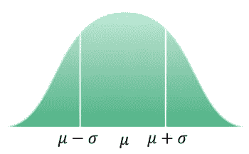
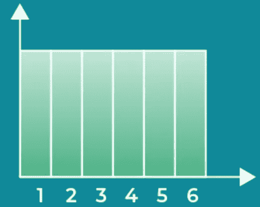
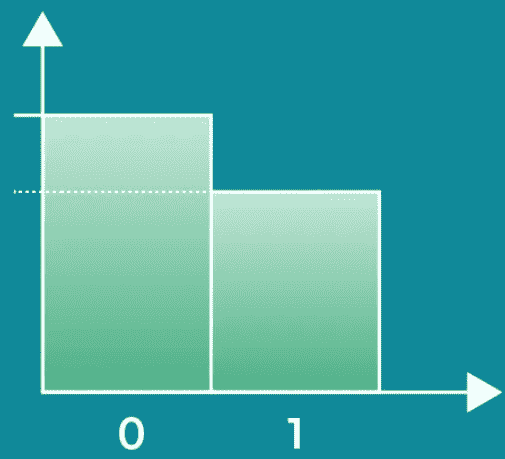
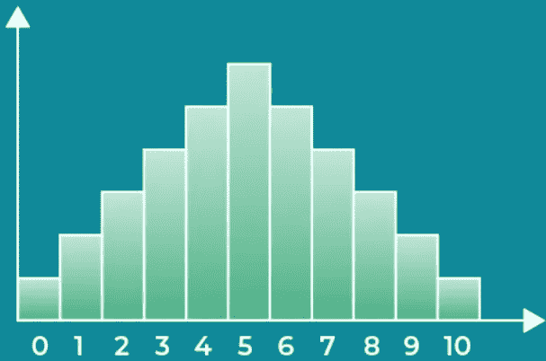
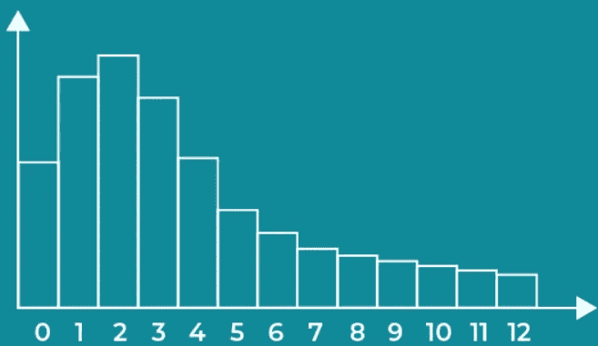

# 概率—离散分布

> 原文：<https://medium.com/geekculture/probability-discrete-distributions-a0f0f214615a?source=collection_archive---------28----------------------->

# 发行版概述

一个**分布**显示了一个随机变量可能取的值以及它们出现的频率。

*分配的重要符号:——*

**Y** 代表一个事件的实际结果。

**y** 代表可能的结果之一。

**P(Y=y)等价于 P(Y)。**

我们将为样本空间中的每个不同结果分配概率的函数称为**概率函数。**

Notation difference between Population Data and Sample Data

General Probability Distribution Graph

# 分布类型

某些分布共享特征，所以我们将它们分成**类型。**我们经常处理的定义明确的分布类型具有优雅的统计。我们根据变量可能值的类型来区分两种大的分布类型— **离散型**和**连续型。**

*离散分布:——*

*   有有限数量的结果。
*   使用我们已经讨论过的公式。
*   可以将单个值相加来确定区间的概率。
*   可以用表格、图表或分段函数来表示。
*   预期值可能无法达到。
*   图表由一个接一个排列的条形组成。

*连续分布:——*

*   有无限多个连续的可能值。
*   使用新的公式获得特定值和区间的概率。
*   无法将组成区间的单个值相加，因为它们有无限多的**个。**
*   可以用图形或连续函数来表示。
*   图表由一条平滑的曲线组成。

# 离散分布

离散分布有有限多种不同的可能结果。它们具有几个关键特征，使它们有别于连续型。

*离散分布的例子有:——*

1.  均匀分布。
2.  伯努利分布。
3.  二项式分布。
4.  泊松分布。

# 均匀分布

所有结果的可能性相等的分布称为**均匀分布。**

*符号:——*

*   ***Y ~ U(a，b)***
*   *或者，如果值是分类的，我们简单地表示分类的数量，就像这样:Y ~ U(a)

*关键特征:——*

*   所有结果的可能性都是一样的。
*   图上所有的条形都一样高。
*   期望值和方差没有预测能力。

*示例和用途:——*

*   滚动单个骰子的结果。
*   由于其公平性，通常用于洗牌算法。

# 伯努利分布

由**单次试验**和仅**两种可能结果**——成功或失败组成的分布被称为**伯努利分布。**

*符号:——*

*   ***Y ~伯尔尼(p)***

*关键特征:——*

*   一次审判。
*   两种可能的结果。
*   ***E(Y) = p***
*   ***Var(Y)= p x(1-p)***

*示例和用途:——*

*   猜一个是非题
*   经常用于当试图确定我们期望从一个实验的单次试验中得到什么时。

# 二项分布

一系列**相同的伯努利事件**被称为二项式，并遵循**二项式分布。**

*符号:——*

*   ***Y ~ B(n，p)***

*关键特征:——*

*   测量 n 次试验中可能结果之一的出现频率。
*   ***P(y) = C(y，n) x p^y x (1-p)^(n-y)***
*   ***E(Y) = n x p***
*   ***Var(Y)= n x p x(1-p)***

*例子及用途:——*

*   确定如果我们抛 10 次硬币，我们期望得到多少次正面。
*   当试图通过一系列试验来预测一个事件发生的可能性时，经常使用。

# 泊松分布

当我们想知道某个事件在给定的时间间隔或距离内发生的可能性时，我们使用**泊松分布。**

*符号:——*

*   ***y ~ po(*𝜆*)***

关键特征:—

*   测量一段时间或距离内的频率。(仅限非负值)
*   ***P(y) = (𝜆^y x e^-𝜆) / y！***
*   ***E(Y) =* 𝜆**
*   ***Var(Y) =* 𝜆**

*例子和用途:——*

*   用于确定特定结果发生的可能性，知道该事件通常发生的频率。
*   通常包含在营销分析中，以确定高于平均水平的访问量是否与众不同。