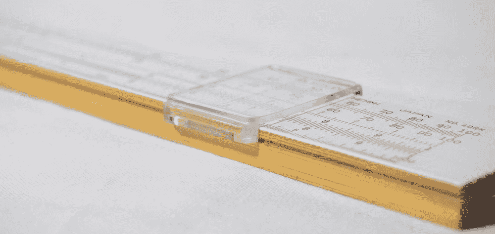

# 用 Python 进行过程能力分析

> 原文：<https://medium.com/geekculture/process-capability-analysis-with-python-a0f3aed8e578?source=collection_archive---------4----------------------->

## 面向工业工程师的 Python

## 衡量流程绩效

Image by [Wim van ‘t Einde](https://unsplash.com/@wimvanteinde) available at [Unsplash](https://unsplash.com/photos/e6pPIcJ05Jg)

# 过程能力分析

过程能力分析是六适马项目中 DMAIC(定义、测量、分析、改进、控制)周期的*测量*阶段的重要组成部分。这个分析…