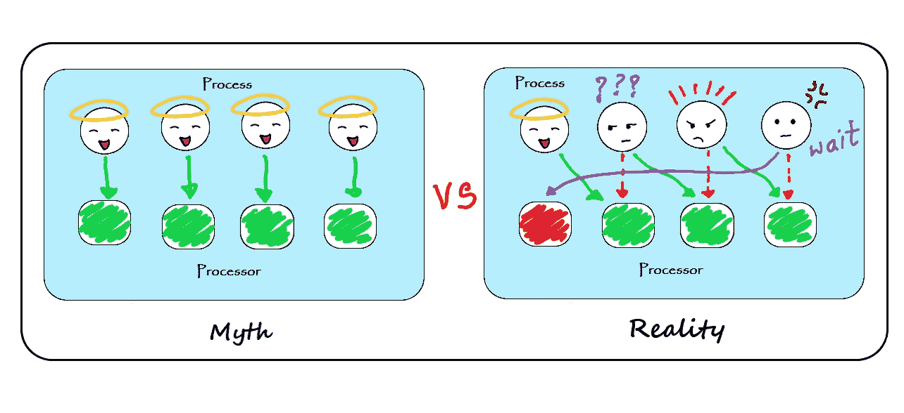
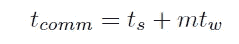
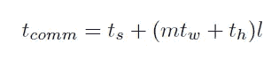
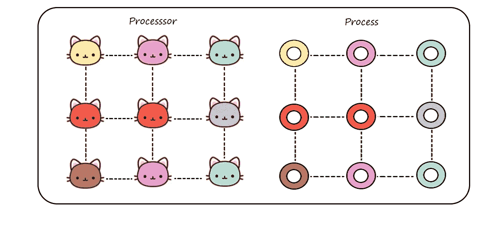
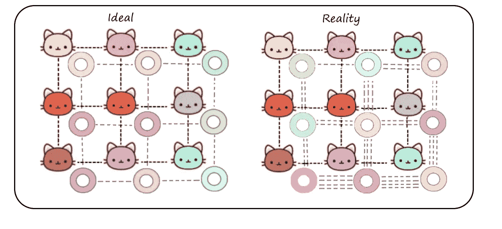
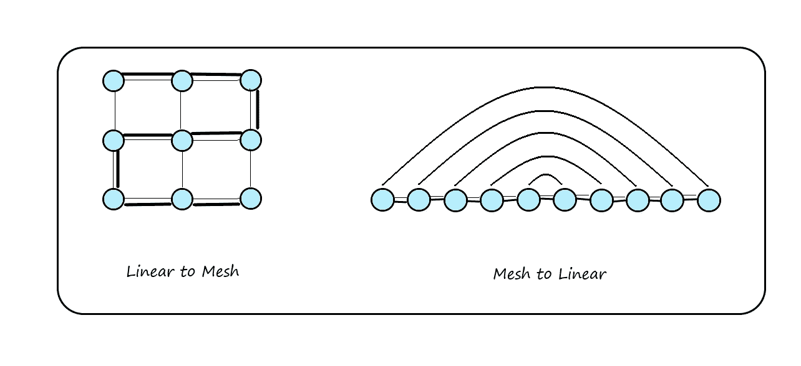

# 进程到处理器的映射

> 原文：<https://medium.com/geekculture/process-to-processor-mapping-bc40e66279e2?source=collection_archive---------18----------------------->

Process-Processor mapping- Illustration by Aditi Rupade

说到并行计算，最容易被忽视的概念之一是进程-处理器映射以及它如何导致性能下降。这个术语可能听起来让人不知所措，但它就是逻辑进程或线程映射到实际处理器的方式。程序员设计了许多技术来提高应用程序的性能，但是有些东西不受程序员的控制，并且是在过程网络中引起争用的主要原因之一。

在深入研究进程-处理器映射之前，让我们首先讨论如何测量成本，以便确定进程的性能及其与其他进程的通信(因为进程很少孤立工作)。

决定并行机通信成本的参数有 3 个

1.  开始时间(ts)-发送方和接收方节点处理消息所用的时间。
2.  每跳时间(th)-消息到达其目的地路径中的下一个节点所用的时间。
3.  每字传输时间(tw)-根据网络带宽传输消息所需的时间。tw = 1/r，其中 r 是通道带宽，单位为每秒字数。

建立了几个过程通信模型，它们有自己的性能改进策略。通信模型的一个例子是使用直通路由的消息传递范例，其中数据被分成“m”个包并通过相同的路径传递。这个的成本等式是-

Cut through routing communication cost

另一个例子是存储和转发路由技术，其中大小为“m”的整个消息被存储并转发到“l”个节点的网络中的下一个节点。这个项目的成本是-

Store and forward routing communication cost

现在回到主要概念，让我们考虑一个假设的情况，有 8 只猫(处理器)吃 8 种特定类型的甜甜圈(处理器)。

Hypothetical representation of processor & process

有各种方法可以将甜甜圈分配给猫，他们可以进行一对一的映射(理想情况)，也可以将一堆甜甜圈混在一起并映射它们(实际情况)。在第一种情况下，网络中没有争用，即猫按时得到油炸圈饼，而在第二种情况下，猫收到油炸圈饼的时间有延迟。那些猫会变得暴躁的！

Ideal vs Reality mapping of processor to process

虽然程序员不能控制进程-处理器映射，但是理解这些映射背后的算法是很重要的。这些映射可用于确定算法性能的下降。

来点技术！

根据图 G(V，E)到 G'(V '，E ')，考虑进程到处理器的映射。这个映射将把集合 V 的顶点映射到集合 V’上，把集合 E 的边映射到 E’上。用于定义映射技术的术语很少。

1.  拥塞-映射到边 E '上的边 E 的最大数量。
2.  膨胀-E '中任意边映射到的边的最大数量。
3.  膨胀-顶点 V 与 V '的比率。

在进程-处理器映射的上下文中，映射的扩展应该与虚拟和物理处理器的比率相同。

让我们研究一下线性阵列和网格之间的映射。左图演示了线性阵列到网格的映射。这是一个拥塞一，膨胀一的映射，不会导致任何性能下降。

右图显示了网格到线性阵列的逆映射，这可以通过反转相同的映射函数来完成。在这种情况下，映射的拥塞是 5，并且随着网络中节点的继续增加，可能导致一些严重的性能下降。

Embedding Linear and Mesh

很容易证明这种映射的拥塞一般是√p + 1。假设线性阵列的拥塞为“c”。因此，如果我们将阵列从中间切成两半，我们将只切割一个链接，对于多个分区，不超过“c”个网状链接。将线性阵列平均分割成 2 也将网格分割成 2，并且至少√p 个网格链接必须穿过该分割。因此，任何映射的拥塞都有√p 的下界。

**参考文献**——第二章第 2.7 节[并行计算简介](https://books.google.co.in/books/about/Introduction_to_Parallel_Computing.html?id=B3jR2EhdZaMC)