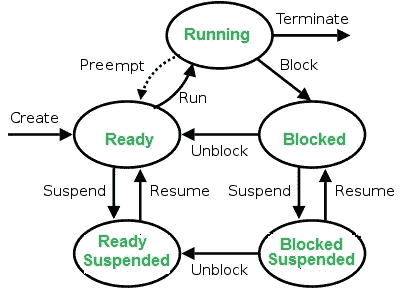
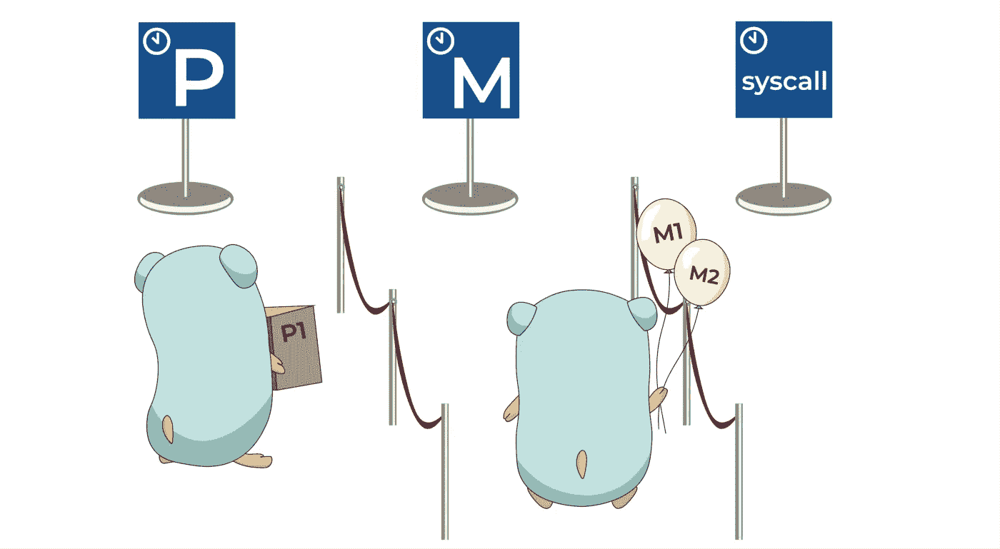
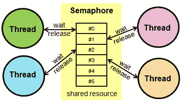
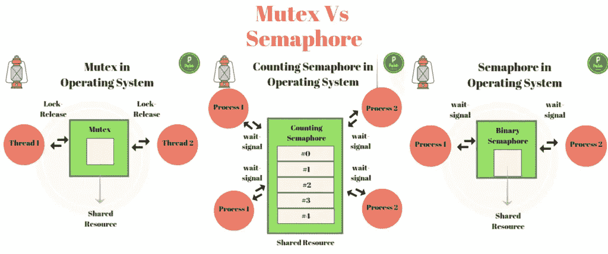

# 进程、线程、死锁、信号量等等

> 原文：<https://medium.com/geekculture/processes-threads-deadlock-semaphores-and-more-f70be5395ef6?source=collection_archive---------2----------------------->

## 操作系统和并发编程主题的简要概述

[https://medium.com/@trevor4e/learning-gos-concurrency-through-illustrations-8c4aff603b3](/@trevor4e/learning-gos-concurrency-through-illustrations-8c4aff603b3)

# 为什么？大局

最近在一次面试中，我被问到了一些关于操作系统和并发编程的问题。虽然我知道这些概念很重要，但我的非技术背景和对功能和前端技术的关注让我有理由不深入研究它们。

我目前最喜欢的编程语言，JavaScript 是单线程语言。虽然我喜欢 JS，但我不能否认并发(多线程)编程是现代编程的一个重要部分，不应该以明显的优势或偏好的名义被忽视。

顾名思义，并发意味着多个计算同时发生。无论是在一个网站上处理多个用户，还是在一台计算机上运行多个应用程序，或者仅仅是处理器增加了额外的内核以增强竞争力，并发编程都将继续存在。

大多数读者可能对程序很熟悉。程序本质上是计算机执行特定任务的指令。现代程序是在计算机上为计算机用计算机编程语言编写的。在并发编程和操作系统中，有一些想法我想了解更多，希望我能大致地把它们展示出来。

这些概念和问题是线程、进程、进程与线程、死锁、信号量、互斥以及这些东西之间的关系。

# 处理

进程是正在执行的程序。代码被编写、编译成二进制，当它被计算机读取时，就变成了一个过程。在程序“被动”的地方，过程是“主动”的。一个程序执行多次会创建一个程序的多个进程(实例)。

[https://www.geeksforgeeks.org/introduction-of-process-management/](https://www.geeksforgeeks.org/introduction-of-process-management/)

流程具有上下文—每个流程特有的属性，也称为流程的流程控制块(PCB)。对于并发运行的流程，需要保存、加载或卸载它们的上下文，如上图所示。

在流程中还可能发生其他转换，我将对此进行更彻底的研究，并在某个时间点进行跟进。

重要的是要知道，在一个进程中存在一个或多个线程。

# 线

[https://emojipedia.org/twitter/twemoji-11.0/thread/](https://emojipedia.org/twitter/twemoji-11.0/thread/)

线程是进程中的执行路径。如上所述，一个进程中可以有多个线程。多线程是将一个进程分成多个线程以实现并行性的想法。

有两种类型的线程，用户级线程和内核级线程。可以推断，用户线程由用户实现，而内核线程由操作系统实现。还有更多的差异，但是为了简单和概述，我现在将省略这些细节。

线程可以有三种状态，运行、就绪和阻塞。

# 进程与线程

[https://www.cs.uic.edu/~jbell/CourseNotes/OperatingSystems/4_Threads.html](https://www.cs.uic.edu/~jbell/CourseNotes/OperatingSystems/4_Threads.html)

[https://medium.com/a-journey-with-go/go-goroutine-os-thread-and-cpu-management-2f5a5eaf518a](/a-journey-with-go/go-goroutine-os-thread-and-cpu-management-2f5a5eaf518a)

进程和线程之间最重要的区别之一是，线程可以在一个进程中共享内存空间，而一个进程在不同的内存空间中运行。然而，在一个进程中，线程并不是相互独立的。因此，线程通常响应更快，切换上下文更快，在多处理器中更有效，并且它们比进程更有效地通信。

# 信号灯

[https://www.keil.com/pack/doc/cmsis/RTOS/html/group__CMSIS__RTOS__SemaphoreMgmt.html](https://www.keil.com/pack/doc/cmsis/RTOS/html/group__CMSIS__RTOS__SemaphoreMgmt.html)

信号量是发信号的核心机制。它们是非负的变量，在线程之间共享，有助于在多处理环境中同步进程。等待信号量的线程可以由另一个线程发出信号。它们有两个基本操作，即等待和发出同步信号。

有两种类型的信号量:

一个二元信号量有互斥性，它只能有两个值，0 和 1，初始化为 1。它用于在处理多个流程时发出信号并提供解决方案。

计数信号量没有互斥，有助于控制对具有多个实例的资源的访问。

# 互斥（体）…

[https://www.cs.uic.edu/~jbell/CourseNotes/OperatingSystems/4_Threads.html](https://www.cs.uic.edu/~jbell/CourseNotes/OperatingSystems/4_Threads.html)

通过我的研究，我发现了很多关于互斥的不同描述。从我收集的信息来看，互斥证明了互斥，并被用作一种锁定机制。它们只有一个任务可以获得互斥锁，只有一个所有者可以释放锁。

信号量可以被认为是一个更一般化的概念互斥体。互斥体和二进制信号量可以有相似的实现，但是理解它们使用背后的目的和意图是不同的，这一点很重要。

[https://prepinsta.com/operating-systems/mutex-vs-semaphore/](https://prepinsta.com/operating-systems/mutex-vs-semaphore/)

# 僵局

[https://prepinsta.com/operating-systems/deadlock-introduction/](https://prepinsta.com/operating-systems/deadlock-introduction/)

死锁描述了这样一种情况，即一组进程被阻塞，因为每个进程都在等待占有一个资源，并等待另一个进程占有另一个资源。

下列情况同时发生会导致死锁:

> ***互斥:*** 一个或多个资源不可共享(一次只能有一个进程使用)
> ***持有并等待:*** 一个进程持有至少一个资源并等待资源。
> ***无抢占:*** 除非进程释放资源，否则不能从进程中获取资源。
> ***循环等待:*** 一组进程以循环的形式相互等待。
> 
> 来源:
> [https://www . geeks forgeeks . org/introduction-of-deadlock-in-operating-system/](https://www.geeksforgeeks.org/introduction-of-deadlock-in-operating-system/)

要解决死锁，您必须准备并避免导致死锁的情况，检测死锁并在死锁发生后处理它，或者完全忽略它们，因为它们非常罕见，如果发生了死锁，您可以重新启动系统进行纠正。第三个选项是 Windows 和 UNIX 操作系统如何处理死锁。

# 结论

在进程和线程之间做出决定以实现并行性的性能优势是微妙的，并且因情况而异。似乎普遍的共识是编写多线程软件是困难的，并且复杂性呈指数增长。多线程处理竞争条件、锁定、异步调用，如果你对理解不够细致的话，很容易出错。

举一个更相关的例子:如果你有一个数据库，你可以让数百万用户同时读取这个数据库。您需要能够通过实现良好的线程实践来管理并发性。

随着职业生涯的成长和学习，我希望继续了解更多这类概念，并获得真实世界的经验。我不指望这些描述或解释是完全准确的，因为我自己也只有粗略的了解。我确实希望这是一篇信息性的文章，并为入门级工程师(可能像我一样，来自非技术背景)提供一些较少触及的话题。

## 资源:

 [## 流程管理简介-极客论坛

### 程序与进程进程是正在执行的程序。例如，当我们用 C 或 C++编写一个程序并编译…

www.geeksforgeeks.org](https://www.geeksforgeeks.org/introduction-of-process-management/)  [## 操作系统中的线程

### 什么是线程？线程是进程中的执行路径。一个进程可以包含多个线程。为什么…

www.geeksforgeeks.org](https://www.geeksforgeeks.org/thread-in-operating-system/)  [## 进程和线程的区别

### 进程和线程进程的区别:进程意味着任何程序都在执行。过程控制块…

www.geeksforgeeks.org](https://www.geeksforgeeks.org/difference-between-process-and-thread/)  [## 进程同步中的信号量

### 先决条件:进程同步，互斥对信号量信号量是由 Dijkstra 在 1965 年提出的，这是一个非常…

www.geeksforgeeks.org](https://www.geeksforgeeks.org/semaphores-in-process-synchronization/)  [## 互斥 vs 信号量-极客 forGeeks

### 互斥体和信号量有什么区别？什么时候应该使用互斥体，什么时候应该使用…

www.geeksforgeeks.org](https://www.geeksforgeeks.org/mutex-vs-semaphore/)  [## 二元信号量和互斥量的区别

### 二进制信号量和互斥量的区别先决条件-进程同步 1。二元信号量:二元…

www.geeksforgeeks.org](https://www.geeksforgeeks.org/difference-between-binary-semaphore-and-mutex/?ref=rp)  [## 程序！流程！线程！

### 我们的朋友计算机是一个真正的工作狂。它同时执行许多不同的指令&并行地，许多…

开发到](https://dev.to/rizz0s/programs-processes-threads-5fbi)