# 用 Python 处理大型数值数组—第一部分

> 原文：<https://medium.com/geekculture/processing-large-numeric-arrays-in-python-part-i-94b5fd46390f?source=collection_archive---------4----------------------->

*在本文***中，他解释了如何与 numpy、pandas、xarray、cython 和 numba 合作，在*[***quanti ACS***](http://www.quantiacs.com)*平台上优化实现大型数值数组的操作。**

***Python** 在数据科学家中非常流行，它被广泛用于处理数据。因为它是一种解释型语言，所以它不是快速数据处理的最佳选择。c、Java 或任何其他编译语言通常要快得多。*

*如果你想用 Python 达到一个可接受的性能，你**必须**使用一些*特殊库*，它们允许你使用编译语言的性能优势。*

*在这篇文章中我将谈论**[**熊猫**](https://pandas.pydata.org/)[**xarray**](https://docs.xarray.dev/en/stable/)[**cyt hon**](https://cython.org/)**和**[**numba**](https://numba.pydata.org/)。我将向您展示如何正确使用它们，并将性能提高两个数量级。*******

*****该示例的源代码可在 [**github**](https://github.com/dgolovin-dev/article-processing-big-numeric-arrays-in-python) 上获得，您可以在那里下载代码并检查性能。*****

# *****任务*****

*****任务很简单。我们从一个数组开始，该数组包含过去 20 年每天的 2000 个股票市场数据。我们要计算一个 [**价格的指数移动平均值**](https://en.wikipedia.org/wiki/Moving_average#Exponential_moving_average) 。*****

*****我会在这里展示结果，所以你可以自己决定这篇文章对你来说是否有趣。*****

*****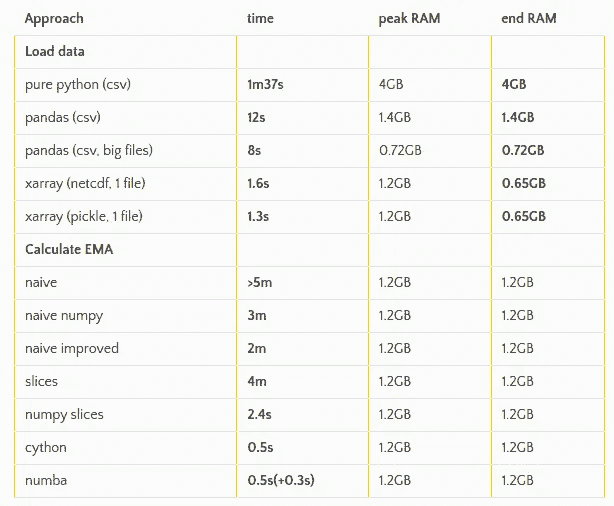*****

*****听起来有趣吗？我希望如此。当我开始这个基准测试时，我使用每日**市场数据**，包括价格(开盘价、最高价、最低价、收盘价)、成交量、股息和拆分:*****

*****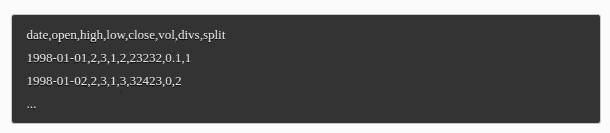*****

*****我的目标是在以下约束条件下计算指数移动平均值:*****

*   *******执行**的时间必须比 ***小【T10 秒***；*****
*   *******RAM** 内存消耗*不得超过* ***1.5 GB*** 。*****

# *****标杆管理*****

*****开始之前，让我快速描述一下我是如何*测量*执行时间和 RAM 消耗的。*****

*****为了测量执行时间和峰值内存，我使用了:*****

**********

*****此外，我使用`timeout`命令来限制执行时间，因为有时处理可能需要几个小时:*****

**********

*****为了在加载数据之前清除文件系统缓存，我使用:*****

**********

*****加载数据后，我用`memory_profiler`测量当前的内存消耗:*****

*****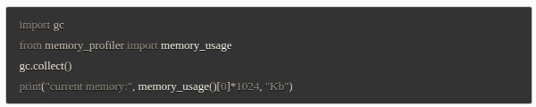*****

*****当我计算指数移动平均值时，我使用`time`模块来测量执行时间，并且我排除了加载时间:*****

*****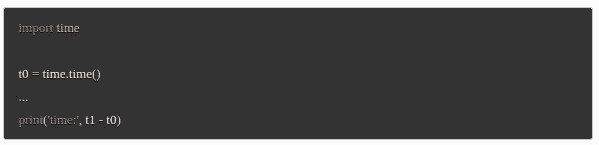*****

*****我用一个简单的[脚本](https://github.com/dgolovin-dev/article-processing-big-numeric-arrays-in-python/blob/master/src/e00_generate_test_data.py)生成 2000 个时间序列的数据。这些系列的大小约为 0.5 GB。*****

*****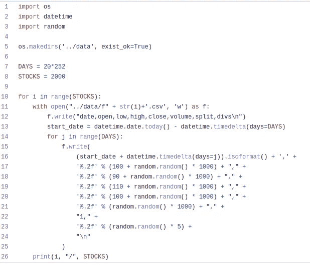*****

# *****加载数据*****

*****首先，我们加载数据。在尝试了不同的方法之后，我将向您展示如何重新组织数据，并显著减少执行时间和 RAM 消耗。*****

## *******加载纯 Python (csv)*******

*****使用**纯 Python** 加载数据可以使用下面的[代码](https://github.com/dgolovin-dev/article-processing-big-numeric-arrays-in-python/blob/master/src/e01_load_pure_python.py)来完成:*****

*****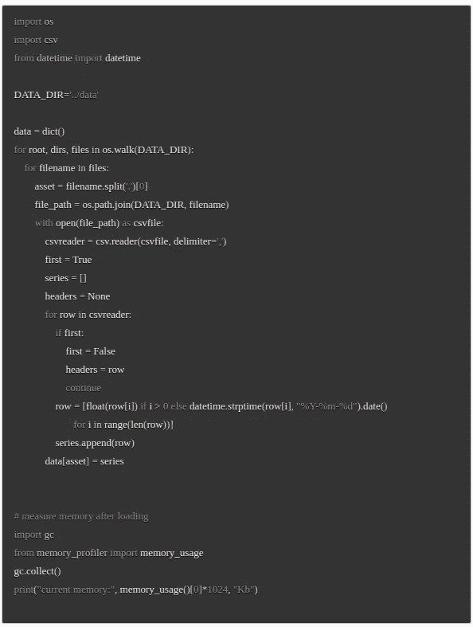*****

*****这种实现是非常低效的。执行时间为 **1 m 38 s** ，消耗内存约为 **4 GB** :*****

*****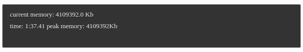*****

## *******装载熊猫(csv)*******

*****让我们使用 [**熊猫**](https://pandas.pydata.org/) 作为代码，可以从这里[下载](https://github.com/dgolovin-dev/article-processing-big-numeric-arrays-in-python/blob/master/src/e02_load_pandas.py):*****

*****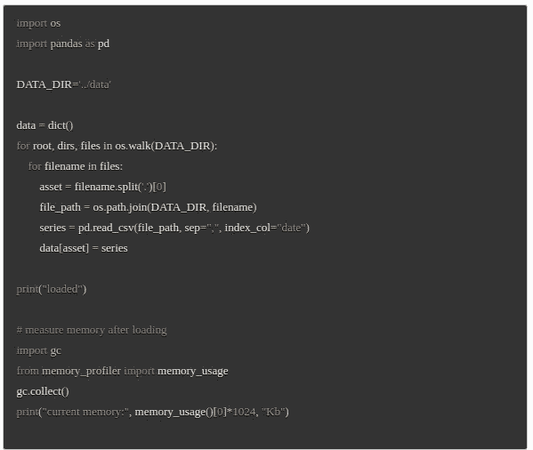*****

*****执行时间为 **12 s** ，消耗内存约为 **1.4 GB** 。这是一个巨大的进步，但我们可以做得更好。*****

*****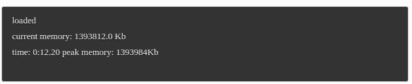*****

*****熊猫比纯 Python 消耗内存少很多。原因是 pandas 内部使用了基于 C 数组的[**【numpy】**](https://numpy.org/)数组。后者对于存储数字非常有效(比 python 列表好得多)。然而，请注意，RAM 中的数据仍然比硬盘上的数据大大约 3 倍，因为 pandas 为每个文件创建了单独的索引。可以重新组织数据以减少文件数量。*****

## *******加载熊猫(csv，大文件)*******

*****由于每个文件包含相同的列，我们可以加载所有数据，并通过使用这个[文件](https://github.com/dgolovin-dev/article-processing-big-numeric-arrays-in-python/blob/master/src/e03_group_by_column.py)对列进行分组，以重新组织的形式保存它们:*****

**********

*****新文件可以很容易地[加载](https://github.com/dgolovin-dev/article-processing-big-numeric-arrays-in-python/blob/master/src/e04_load_pandas_7.py):*****

*****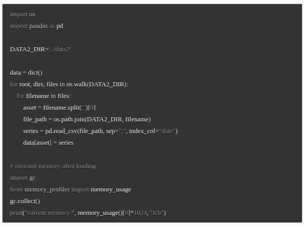*****

*****执行时间现在是 **8 s** ，消耗的内存大约是 **0.72 GB** :*****

*****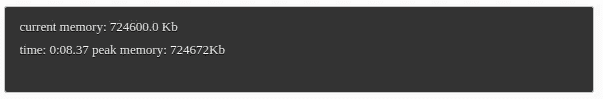*****

*****通过从 CSV(文本格式)切换到任何其他**二进制**格式(netcdf 或 pickle ),可以显著提高性能。*****

## *******加载 xarray (netcdf，pickle)*******

*****熊猫在二维下工作最佳。我们使用**[**xarray**](https://docs.xarray.dev/en/stable/)，因为它本身可以处理任意维度，并将所有数据合并到一个文件中。xarray 支持 **netcdf** 二进制文件格式(自带 scipy)。我们还测试了 **pickle** 文件格式。*******

*****这个[脚本](https://github.com/dgolovin-dev/article-processing-big-numeric-arrays-in-python/blob/master/src/e05_convert_to_nc_and_pickle.py)将所有数据连接到一个文件，并保存到 netcdf 和 pickle:*****

*****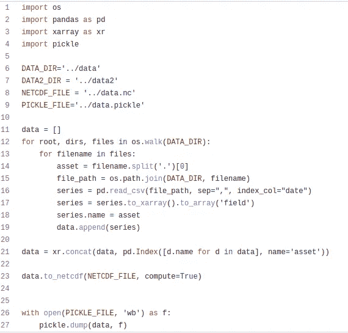*****

*****然后我们可以用 [netcdf](https://github.com/dgolovin-dev/article-processing-big-numeric-arrays-in-python/blob/master/src/e06_load_xr_nc.py) 加载数据:*****

*****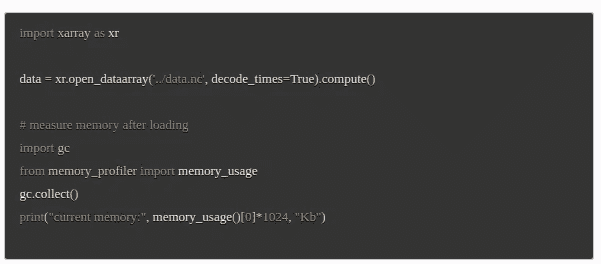*****

*****还有[泡菜](https://github.com/dgolovin-dev/article-processing-big-numeric-arrays-in-python/blob/master/src/e07_load_xr_pickle.py):*****

*****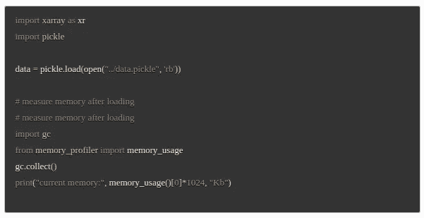*****

*****结果是相似的。netcdf 的执行时间为 **1.7 秒**，最终 RAM 为 **0.65 GB** ，峰值 RAM 为 **1.2 GB** :*****

*****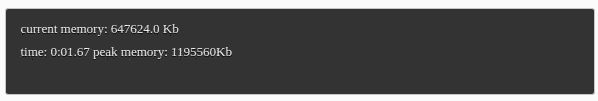*****

*****使用 pickle 执行时间为 **1.3 s** ，最终 RAM 为 **0.65 GB** ，峰值 RAM 为 **1.2 GB** :*****

**********

*****在两种情况下，执行时间都小于 **2 s** 。峰值内存比 pandas 大(使用二进制格式，pandas 在计算时间方面也非常高效)。相对于 pickle，我更喜欢 netcdf，因为根据我的经验，pickle 更容易受到其他库的特定版本的影响。*****

*****你学到新东西了吗？请随时在 [Quantiacs 论坛](https://quantiacs.com/community/)发表评论！不要错过第二部分，我会告诉你如何有效地实现指数移动平均线。*****