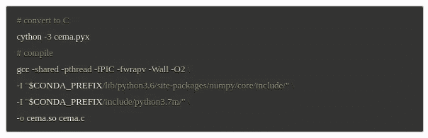

# 用 Python 处理大型数值数组—第二部分

> 原文：<https://medium.com/geekculture/processing-large-numeric-arrays-in-python-part-ii-1a15e54b8c60?source=collection_archive---------13----------------------->

*在第二篇文章***中，他解释了如何与 numpy、pandas、xarray、cython 和 numba 合作，在*[***quanti ACS***](http://www.quantiacs.com/)*平台上优化实现大型数值数组的操作。**

*在[上一篇文章](/geekculture/processing-large-numeric-arrays-in-python-part-i-94b5fd46390f)中，我们已经展示了如何优化加载计算价格的 [**指数移动平均值**](https://en.wikipedia.org/wiki/Moving_average#Exponential_moving_average) 所需的数据。这里我们将展示不同的计算方法。*

**

# *天真的计算*

*Python 中的一个简单实现如下:*

*执行时间超过 5 分钟，就会超时。*

# *用 numpy 进行简单计算*

*由于 [xarray](https://docs.xarray.dev/en/stable/) 是基于 [numpy](https://numpy.org/) 的，并且我们的工具箱基于 xarray，我们可以尝试使用 numpy 的简单实现。*

*评价报告:*

**

*3 分钟比较好，但还是太多了。*

# *改进的朴素计算*

*主要的问题是，我们是一个元素一个元素地读写数据。xarray、numpy 和 pandas 使用对外部库的系统调用来访问内部 C-array，这些调用很慢。*

*一种可能是将整个序列提取到一个 python 列表中，计算移动平均值并将序列写回。让我们检查一下:*

*计算大约需要 2 分钟，仍然很慢:*

**

# *使用切片*

*另一种方法是使用切片和布尔遮罩:*

*不幸的是，执行时间仍然太长:*

**

# *对 numpy 使用切片*

*numpy 中的切片操作非常快。让我们绕过 xarray，直接使用 numpy:*

*计算速度非常快，大约 3 秒钟:*

**

# *使用 cython*

*有了 cython，我们可以提高速度，但是编码更加复杂。一种可能的实现是:*

*这里的细节很重要(试着看看删除第 17 行会发生什么)。我们需要转换和编译代码:*

**

*最后:*

*执行需要半秒钟:*

**

# *使用 numba*

*我们的优选实现使用 [numba](https://numba.pydata.org/) 。Numba 允许我们在运行时用 JIT 编译 python 代码。它对数据类型(numpy 数组和基本类型)和可以使用的操作增加了一些限制:*

*性能非常好，代码非常干净:*

**

# *结论*

*   *带切片的 numpy 在大多数情况下足够快；*
*   *直接和 numpy 合作，绕过 xarray 和熊猫；*
*   *你可以用 cython 或 numba 编译你的代码，直接使用 RAM 中的底层 C 数组；*
*   *cython 不是 python，它比 numba 更棘手。Numba 需要额外的时间(通常很少)来进行 JIT 编译。*

*你学到新东西了吗？请随时在 [Quantiacs 论坛](https://quantiacs.com/community/)发表评论！*