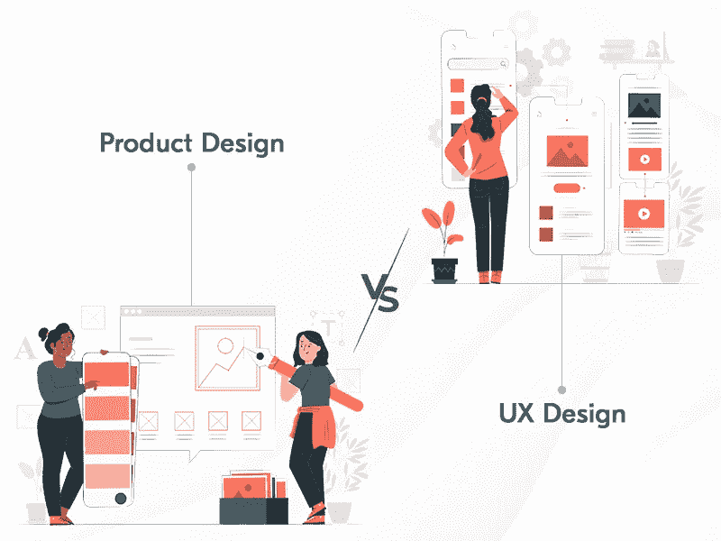
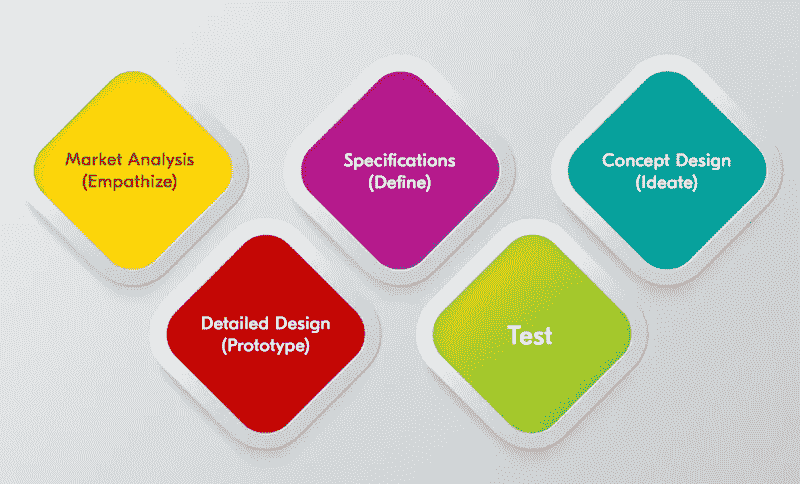
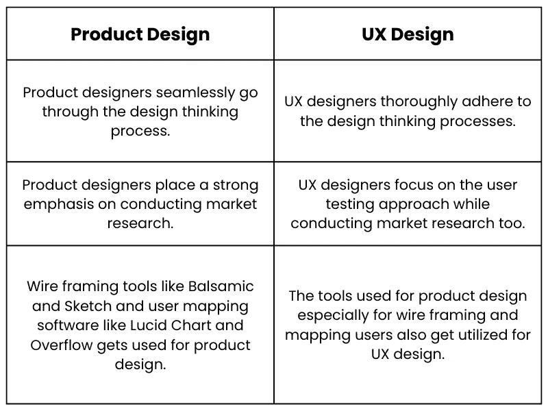
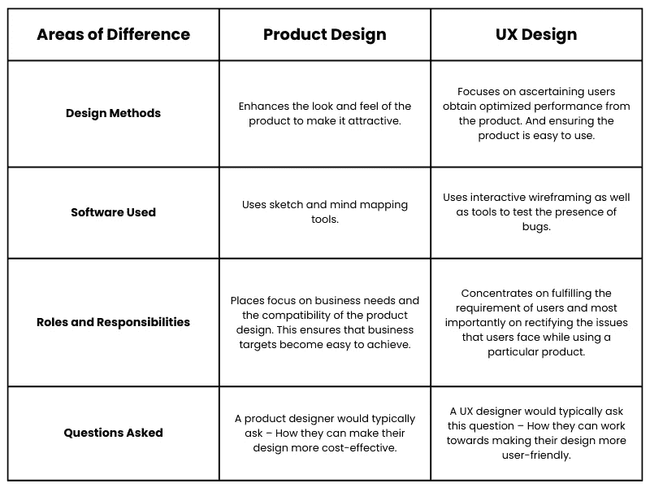

# 产品设计与 UX 设计的异同

> 原文：<https://medium.com/geekculture/product-design-vs-ux-design-e0b5b74bf8f8?source=collection_archive---------16----------------------->

从商业角度来看，漂亮的设计不仅仅是图像和布局。它还关注 UX 或用户体验，以便用户保持与网站的联系，企业可以实现其最终目标——在短时间内获得最大数量的访问者。

你可能在思考设计的意义。嗯，主要原因是，通过接受设计服务，企业很容易产生平均多 32%的收入和多 56%的股东回报。

这足以描绘出设计的整体重要性。这里要说明的是；当我们谈论设计时，两种形式的设计被讨论得最多。第一是产品设计，第二是 UX 设计。

在本文中，我们将向您介绍这两个概念，解释两者之间的异同。

# 产品设计—定义

> 简而言之，[产品设计](https://en.wikipedia.org/wiki/Product_design)是一个主要涉及想象、创造和迭代产品的过程，以便用户问题变得容易解决，用户需求变得容易满足。

这是通过评估最终用户和那里的市场人口统计数据，以便最终产品是最高的价值和企业实现最大的回报。

需要注意的是，这种设计类型由三个元素组成——外观、功能和质量。此外，它还要求遵守流程，例如下面列出的流程。

## 产品设计过程

在上图中，你可以看到创造独特产品设计的五个主要过程。

这包括-

*   进行强有力的市场分析
*   在定义设计中需要的规格时保持清晰
*   构思概念设计
*   创建一个原型
*   试验

在下面的几行中，我们详细解释了每一个过程。

1.  **执行强有力的市场分析。**在这个过程中，问题定义过程发生。这使得产生想法变得容易，并且是一个整体无缝的过程，这将使问题容易解决。
2.  在定义设计中需要的规格时保持**清晰。这意味着你应该通过记录需求来定义你对设计的期望。**
3.  **构思概念设计。**在这里，你决定设计的流程，你将包括的特性，等等。
4.  **创建原型。**该流程包括通过使用协作工具探索设计和内容，以便设计提议的解决方案变得容易。
5.  **测试。**在这个过程中，您报告步骤，为优化创建假设，并持续测试以识别任何可能的错误或差异的存在。

了解了产品设计的意义以及确保产品设计达到最高质量的相关流程后，让我们了解一下 UX 设计和不同的 UX 设计流程。

# 什么是 UX 设计？

> [UX 设计](https://www.xongolab.com/important-aspects-of-ui-ux-design-and-development/)是对流程的坚持，有助于确保用户在与网站或应用程序交互时获得独特的体验。这是通过确保不同的任务，如品牌、可用性和功能性在设计中很容易实现。

它是客户在与产品界面交互时的个人体验。

了解了概念之后，现在让我们深入了解 UX 期间遵循的不同流程，以创造独特的用户体验，并确保用户与最终产品的交互变得无缝。

## UX 设计流程

在上图中，你可以一窥不同的 UX 设计流程，以确保用户保持参与。

*   了解 UX 过程在产品中的作用。这是通过深入了解用户和他们的需求，以及你的品牌将如何满足这些用户的需求。
*   根据访谈和调查进行研究，分析用户需求。
*   分析包含哪些元素会使 UX 具有最高的质量。这意味着你需要了解用户角色和用户旅程。
*   通过包含网站地图、用户流程等项目来构建设计。
*   启动以了解用户对您创建的 UX 设计的满意度。

了解了 UX 的设计流程后，现在让我们来了解一下其中的相似之处和不同之处。

 [## 构建直观应用的 10 个惊人的移动应用设计技巧

### 正如时尚趋势永远不会一成不变；企业也观察到不断的变化。在持续的基础上…

medium.com](/nerd-for-tech/mobile-app-design-tips-de7fe8da60d6) 

# 产品设计与 UX 设计的异同

## 产品设计与 UX 设计:相似之处

## 产品设计与 UX 设计:不同点

现在知道了产品和 UX 设计流程之间的区别，就可以理解，从长远来看，好的设计有助于企业的成功。在实现这些设计类型之前，使用正确的工具并询问一些重要的问题，肯定会帮助您获得设计竞争优势。

## 包扎

> 一个好的设计就足够了

当我们谈论一个产品和一个 UX 设计师之间的相似之处时，使两者相似的是他们在为企业创造设计时对以人为本的方法的维护和对几个设计思维过程的坚持。接下来是他们用于任务的类似工具，如线框和映射用户。

另一方面，如果我们谈论将这两者分开的点，产品设计师的责任是提出解决方案。另一方面，对于一个 UX 设计师来说，责任是识别问题。因此，确定你知道这两个也是最重要的，可以增强产品设计的工具。这将确保你能获得最大的回报，你将成功地增加潜在客户对你的业务的忠诚度。最后，您将确定您降低了总体开发费用。