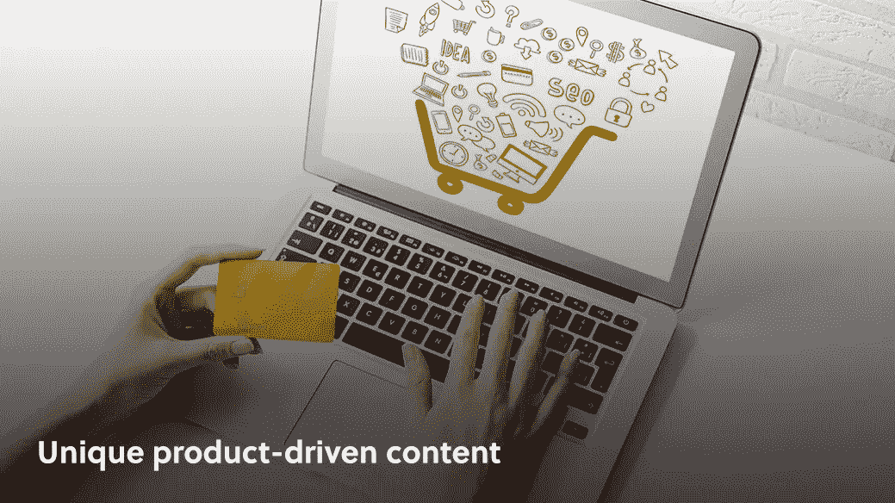
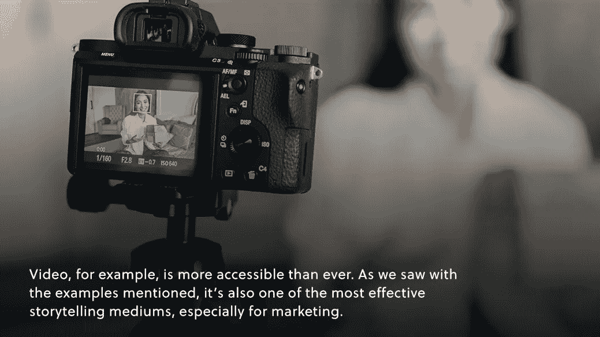

# 独特的产品驱动内容

> 原文：<https://medium.com/geekculture/product-driven-content-that-paid-off-f28f8d73f481?source=collection_archive---------12----------------------->

## **产品引导营销**

至少在概念上，产品驱动的内容相当容易理解。与所有产品导向的增长和营销一样，你本质上是在传递这样一个信息，即你的产品是在“自我销售”

当然，经过几个月甚至几年的市场研究、产品开发和营销，你的产品肯定不是“自我销售”，但那是客户得到的故事。一个相关的叙述是精心制作的，在其中你的产品被无缝地呈现为一个普通而重要问题的解决方案。

然而，在一个颠覆性发展和产品主导的世界里，这种说法并不总是最容易销售的。消费者不可能拥有市场上的每一种产品，所以不是每一种产品都能成为解决常见问题的“显而易见”的解决方案。

制作这个叙事棒需要一个伟大的产品和伟大的市场研究，但也需要一点创造力。制作独特的产品驱动的内容可能是让你的产品[在所谓改变生活的产品海洋中脱颖而出的好方法。](/amberengine/brand-secrets-to-stand-out-in-e-commerce-5625212295d8?source=collection_home---6------6-----------------------)

让我们来看几个独特内容的例子。

# 会融合吗？

当谈到突破性的营销活动时，搅拌机市场可能不是我们首先想到的，但有一个例子肯定很突出。就解决问题而言，任何搅拌机所有者可能遇到的问题是，他们的搅拌机对于手头的任务来说不够强大。

你如何围绕这个构思一个故事？混合一些超出任何人可能需要混合的东西。

这个 Blendtec 广告的天才之处在于*完美地传达了信息*——这个搅拌机将处理你扔给它的任何东西——甚至没有提到食物或食谱。令人震惊的因素和荒谬的视频使它令人难忘，但不是没有失去潜在的信息。

这个广告活动的另一个天才之处在于，该公司的制作成本*低得令人难以置信*，仅这个视频就有超过 700 万的浏览量。不仅如此，该公司的销售额增长了 700%,这种广告形式至今仍很流行。

# 沃尔沃 Van Damme 拆分

一旦你走进兔子洞，你会发现像 Blendtec 这样的超级独特的营销活动实际上相当普遍，这是因为一个重要的原因:它们有效！回想一下沃尔沃 2013 年与尚格·云顿的广告。

就其本身而言，这是一个超过 1 亿次观看的病毒式视频。当然没什么可嘲笑的。作为一个产品驱动的内容，这是一个令人难以置信的展示车辆难以置信的精度和稳定性。

该产品再次被展示为一个问题(卡车稳定性)的解决方案，但只是作为叙事的一个(关键)部分:令人印象深刻的范达梅分裂。有了这些病毒式的数字，沃尔沃在这段视频上线后报告卡车销量增长 31%就不足为奇了。

# 卡特彼勒堆栈

最后，为了说明独特的以产品为导向的内容可以在任何地方找到并应用，我们来看一下卡特彼勒机器叠人偶游戏。

再一次，产品的功能作为整个故事的一部分被清楚地展示出来。这些机器在玩叠人龙，看起来肯定有趣又刺激。当然，每个人都玩过叠人偶，但不是用能把你压垮的积木。而且，因为每个人都玩过叠衣服，所以每个人都知道保持叠衣服所需的小心的精确度——这些机器似乎毫不费力地提供了精确度。

结果呢？900 万次 B2B 演示。

# 底线

进一步虚拟化的趋势不会很快减弱，虽然这肯定会带来挑战，但也会带来优势。

例如，视频比以往任何时候都更容易获取。正如我们从提到的例子中看到的，它也是最有效的讲故事的媒介之一，尤其是对于市场营销。有针对性的广告和电子邮件活动都很好，也很有必要，但没有什么能像视频一样讲述一个故事。

与视频更容易获取一样，有效的产品驱动内容也更容易获取。毕竟，最有效的产品驱动的内容是一个精心制作的叙事，将产品无缝地编织到故事中。秀，不要说。