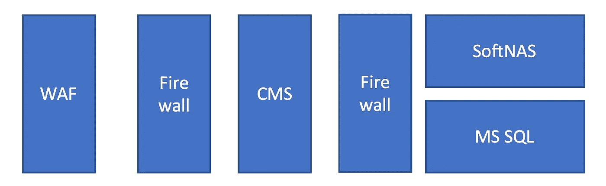
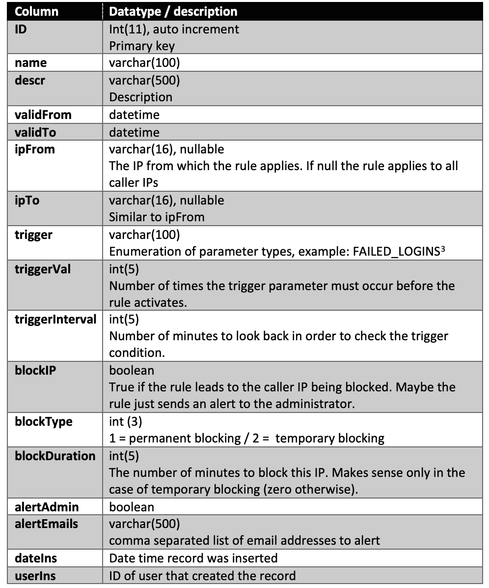
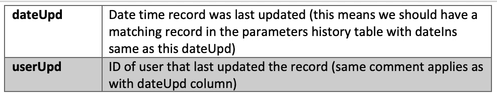
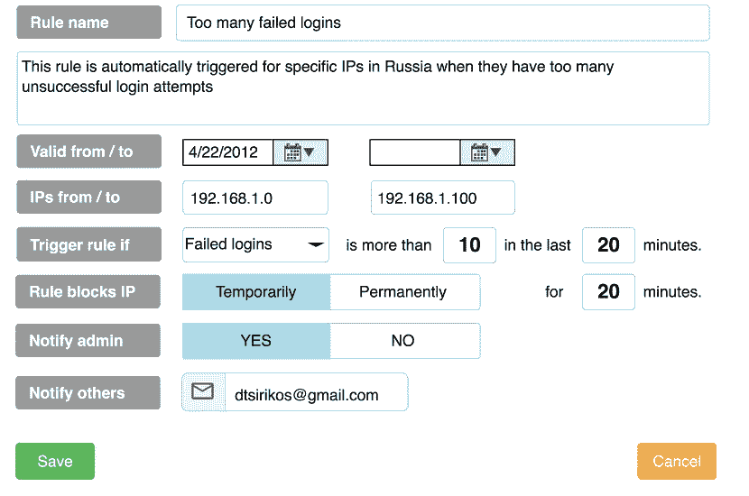
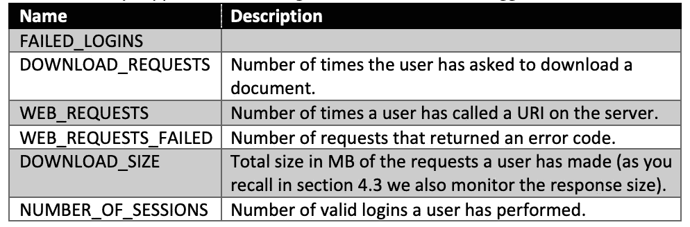

# 产品管理，简单的案例研究。

> 原文：<https://medium.com/geekculture/product-management-a-simple-case-study-62235617c5dc?source=collection_archive---------51----------------------->

回到 2017 年，我申请了科学出版软件全球领导者 [Atypon](https://www.atypon.com) 的产品管理职位。作为这个过程的一部分，我必须展示我将如何着手为他们的旗舰产品(“Literatum”)设计一个功能。规格相当高:

> “*我们客户的网站受到不同程度的滥用，从密码破解企图到过度下载企图，以及介于两者之间的一切。*
> 
> *我们想要的是一个处理系统中滥用的机制的迷你规范:滥用应该如何被发现，以及它应该如何被减轻。包括一些相关最终用户和管理屏幕的模型。”*

我花了大约 3 个小时来做这件事，并提交了我的作品。作为回应，我接到了首席执行官的电话，向我提供了这份工作，所以我想他一定很喜欢这份工作。(注:很遗憾我不能接受，但那是另一回事了。)

以下是我的投稿，*与我发的*一模一样。我不是一个安全专家，这个提交远非完美，它可能包含设计或逻辑错误(让我们记住，它是匆忙完成的，作为一个虚构的功能的一部分，除了上面的两个短语没有其他信息)。

它不是一个 PRD(产品需求文档),缺少许多关键部分，例如用户故事、成功标准等。我现在分享的原因是，我认为它部分地展示了每个产品经理都应该记住的一些要点，例如:

*   我们为什么要建这个？我们要解决的产品是什么？这是给谁的？
*   我们目前的状况如何？我们知道些什么？我们会做出什么假设？
*   业务需求:我们提议的解决方案是什么？什么在范围内，什么不在范围内？
*   技术需求:我们将如何构建它？后端会做什么？UI 会是什么样子？还有其他技术问题吗？这个新特性可能会增加什么技术债务，或者在开始实现之前我们必须解决什么技术债务？
*   如何铺开？
*   最重要的是我们经常容易忘记的东西:**反馈**。我们如何监控我们做得好还是不好？我们将如何改进它？什么时候我们应该停止浪费资源？

# 1 范围

本文档的目标是展示关于识别和处理由 Literatum 支持的典型客户网站的安全违规企图的初步想法。初始规格状态:

*“我们客户的网站会受到不同程度的滥用，从密码破解尝试到过度下载尝试，以及介于两者之间的一切。*

我们想要的是一个处理系统中滥用的机制的小型规范:如何检测滥用，以及如何减轻滥用。包括一些相关最终用户和管理屏幕的模型。"

我们将只关注对客户网站的外部攻击，不包括来自内部用户(如不满的员工)的攻击或由于缺乏流程(如四眼原则，TFA)或疏忽造成的安全漏洞。

# 2 假设/定义

[注:这些假设只是为了便于分析手头的任务。它们在现实生活中可能不适用。]

# 2.1 系统架构

Literatum 是一个 SaaS 解决方案，允许出版商管理其网站的用户界面/ UX 和内容，以及处理用户/订阅。Literatum 还提供基于任意分类法、引文和大量标准的高级搜索功能。

Literatum 建立在 Java 之上(它作为 Java applet 运行),通常作为运行在 AWS 上的云服务提供。交易数据存储在 MS SQL server 上，文档存储在运行于 AWS 上的 SoftNAS 上(没有单独的 NO SQL 数据库，如 MongoDB)。元数据用 XML 描述，大量的 XLST 用于转换、数据输入/输出。

# 2.2 网络拓扑

假设(我假设过于简单):

*   CMS 只能通过 HTTP 或 HTTPS 在互联网的 80 端口上访问。
*   在 CMS 之前有一个 web 应用防火墙，在 WAF 之前有一个普通防火墙。
*   CMS 和 NFS (SoftNAS)之间存在第二个普通防火墙来创建 DMZ。
*   外部用户无法直接访问 SoftNAS，所有内容都通过 CMS 上传/下载。
*   在同一层上存在用于事务数据/ XML 元数据的 MS SQL。

# 3 个利益相关者/角色

出于此分析的目的，我们将定义以下类型的用户。[1]

# 3.1 匿名网络用户

这些是访问客户网站的匿名访问者。他们很可能会尝试:

*   浏览网站上的表单。
*   获得对订户帐户的未授权访问(假冒)。
*   注入脚本(注入)。

# 3.2 用户

这些用户通过付费订阅来获取科学内容。他们很可能试图访问他们没有付费的内容(未授权访问)。他们不会在网站上发起 DDOS 攻击，因为我们有他们的身份数据(因为订阅)。

# 3.3 出版商

他们是依靠网站获取收入的非典型用户。出版商有两种类型的用户

*   **内容创建者**:登录 CMS 并管理其内容的人。
*   **管理员**:为特定发布者设置各种参数，并在检测到安全漏洞时发出警报。

# 4 业务需求

# 4.1 攻击类型

我们只关心对 CMS 的攻击。我们不会研究对数据库或 NFS 的直接攻击。

我们将尝试监控和缓解以下类型的攻击。

[注意:以下对各种攻击类型的定义只是它们在现实生活中的实际定义的一个子集。我们只是用这些定义来设定范围。]

# 分布式拒绝服务攻击

一个匿名的网络用户试图通过重复呼叫来关闭一个站点以获取内容。

# 模拟

当一个匿名网络用户试图猜测付费用户的用户名/密码组合来访问他们的帐户时。通常通过字典或暴力尝试来完成。

# 未经授权的访问

当用户试图下载内容时，他们并没有付费。

# 注射

我们担心 SQL 和 XML 注入攻击，以及跨端脚本(XSS)。通常通过表单提交(如搜索表单)或当参数出现在 URL 中时完成(编码在 HTTP get 方法或 URL 路径中)。

# 4.2 不可否认性

我们必须能够证明有人采取了行动，是谁在何时采取的行动。这允许我们解决问题，例如当订户否认做了特定的动作(例如试图下载他们没有付费的内容)时。

# 4.3 监测

我们将监控对客户网站的所有访问，以及对 CMS 登录屏幕的访问，以防渗透者试图以发布者身份登录。

对于每次访问特定资源(网页、文件等)的尝试。)我们会记录

*   日期和时间
*   HTTP 方法(get、post、delete)
*   资源 URI(协议、服务器、端口、路径、参数)
*   呼叫者 IP
*   呼叫者代理(操作系统、设备、浏览器)
*   推荐人

如果这是一个 CMS 用户(订阅者或发布者)，我们可以选择记录用户 ID。

对资源的每个调用都会产生一个 HTTP 响应，该响应具有:

*   特定代码(200 =成功，404 =未找到，5XX =服务器错误，等等。)
*   以字节为单位的特定响应大小

我们也将记录这些。

# 4.4 封锁/警报

发布者管理员将设置特定的阈值，以便我们:

*   如果每分钟来自同一个 IP 的请求超过 Y 个(DDoS 攻击),则阻塞呼叫者 IP X 分钟。
*   如果来自同一个 IP(模拟)的失败请求(HTTP 错误代码 4XX)超过 Y 次，则阻塞呼叫者 IP X 分钟。
*   如果呼叫者尝试登录不成功，阻止他们的 IP 地址 X 分钟(模仿)。[2]
*   如果来电者 IP 在过去 24 小时内被拦截超过 Y 次，则拦截 X 天。

所有块可以是临时的，也可以是永久的。每个数据块都将记录在一起，并注明导致数据块的原因(DDoS、假冒等。).

发布者管理员可以决定向哪些块发送电子邮件(并定义接收警报的电子邮件地址列表)。

每当我们在 Y 分钟间隔内收到来自 X 个以上不同 IP 的 DDoS 拦截时，系统会自动向发布者管理员发送警报。

如果可疑活动与某个特定订户相关联(不管 IP 地址如何)，我们也会提醒发布者管理员。

# 4.5 审计/报告

根据记录的数据，我们将能够提供以下报告

*   每个客户网站的使用情况(分析)。
*   试图在多个方面破坏安全[攻击类型、时间、国家(基于 IP)]。

# 5 技术实施

# 5.1 封锁规则

我们将能够结合这些参数来创建涵盖上述情况的阻止规则，以及针对将来可能出现的情况的新的特别规则。

规则由发布者管理员管理。

*规则表*

# 规则屏幕

这是用于创建规则的模拟屏幕。

# 触发条件

我们最初将支持下面一组触发规则的条件。

# 5.2 各种

*   密码将以加密形式存储在单向加密的数据库中(即无法解密密码)。
*   将实施强有力的密码策略(最小密码长度，确保它包含特殊字符，不同于前 X 个密码，每 Y 个月到期，等等。).
*   每个用户会话将有一个以分钟为单位的最大持续时间。然而，用户可以按下一个可视元素(例如刷新图标)来将其再延长 X 分钟。
*   登录屏幕将只在 HTTPS 显示。

# 5.3 记录

记录的数据将在 4 个月后在冷库中存档，并在 3 年后永久删除。与特定订阅者或发布者用户相关的记录数据永远不会被删除(因为可能会出现不可否认性问题)。

# 5.4 注射攻击

防止此类攻击的第一步是通过在 AWS WAF 中设置规则来监控和防止注入尝试。

第二步是强化 web 应用服务器(这方面有很多可用的资源)。

第三步是编写考虑到安全性的代码。这是一个非常广泛的话题，因此我们将只发布一些指导原则:

*   使用 Java 持久性来访问数据库。
*   总是根据 DTD 验证 XML。

# 6 项目管理

# 6.1 实施时间计划

与开发经理一起定义(另请参见相关资源)。

# 6.2 内部测试

基于公司程序(单元测试等)。).

强烈建议雇佣专门的安全团队，通过执行渗透测试和准备场景来协助测试。

# 6.3 UAT /生产推广

最初将更改部署到单个发布者，查看是否有任何问题。然后我们向 4 个出版商的团队推广，然后向每个人推广。

# 7 现场直播后的后续步骤/反馈循环

我们应该尝试从以下几个方面来衡量改进:

*   每天每种类型的攻击次数。
*   由于阻塞，服务器必须处理更少的请求，从而降低了 CPU 使用率。

我们还应该广泛查看日志，以发现我们遗漏的攻击类型。应每 6 个月安排一次审查。

[1]Literatum 用户的完整列表可在 https://www . atypon . com/WP-content/uploads/2015/02/2015 02 06 _ Introduction-to-Literatum _ lit-14.4 . pdf，第 9 页找到。

[2]实际上，我尝试登录 sage 管理工具(http://journals.sagepub.com/admintool ),它允许我使用各种无效的用户名/密码连续尝试 6 次以上。

同样的事情(=我的 IP 没有被屏蔽)发生在我尝试在没有认证的情况下调用 REST API(https://journals . sage pub . com/API/REST/commerce/create subscription？subscriber number = % 2212345% 22 & subscriber group = % 22 水母% 22 & offer code = % 22 NCP-po % 22 & email = % 22 居里% 40 example . com % 22 & license parameters = % 22 开始日期% 3d 2014-05-22% 26 结束日期%3D2015-05-22%22。

[3]我们也可以有一个单独的触发器表，来定义和/或表达式来触发规则。例如“2 次失败登录和 4 次下载尝试”。这种方法意味着本质上我们创建了一个规则引擎。在继续之前，我认为我们应该看到与拥有一组标准触发器相比，引擎将强加的性能损失。

我们还必须考虑性能影响:

*   如果管理员将参数设置得太大(例如:如果在过去 *1000* 分钟内有 3 次不成功的登录尝试，则阻止该 IP)。
*   如果管理员决定对记录的数据重新运行规则。