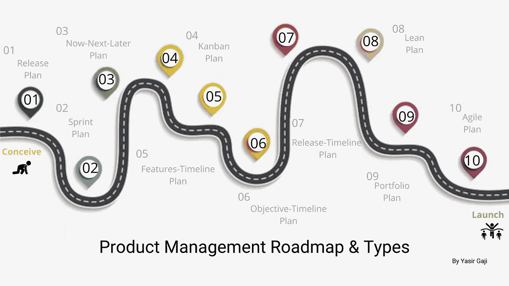

# 5 分钟产品管理(第二部分)

> 原文：<https://medium.com/geekculture/product-management-in-5-minutes-part-2-b1b9cdff7d7d?source=collection_archive---------7----------------------->

> “工程师——为什么我们现在要这么做？
> 我—(陈述理由)
> 利益相关者—我们下一步做什么？
> 我——(陈述下一阶段)
> 营销人员——实际计划是什么？
> 我——(翻了翻白眼，盯着他们)，你知道吗，请浏览一下我创建的产品路线图，这样我们就在同一条轨道上……(走开以避免另一个问题)”

作为项目经理，你应该具备随机应变的能力，而作为产品经理，你可能会从组织中的任何人那里听到这些问题，从利益相关者到工程和销售，再到客户成功和营销。是的，这可能会令人沮丧。在前面的 [*部分*](/@Yasirgaji/product-management-in-5-minutes-part-1-6af41ef5e207) 中，我们已经公正地将产品管理视为一个概念并区分了产品和项目管理，在这一部分中，我们将更深入地了解产品管理&开发流程，其中我们将了解**产品管理路线图&的类型。**

Product Management Roadmap & Types Image representation by [**Yasir Gaji**](https://yasirgaji.com)

但是，**我们为什么需要产品管理路线图？**我们需要它来确保产品团队从产品构思、计划、开发、迭代、发布的那一刻起就处于正确的轨道上，并保持稳定的状态。

那么，**什么是产品管理路线图？**产品管理路线图是一个**“活文档】，**一个**“视觉总结”**，一个**“行动计划”**产品的方向，以促进沟通(与客户、利益相关者、潜在客户、客户和合作伙伴)，以及产品或解决方案将如何随时间发展。产品管理路线图将阐明您的产品战略，以便每个人，包括具有独特需求的不同受众，都能理解它。

# 构建路线图

在构建路线图时，您需要考虑市场轨迹、价值主张和工程约束，基本路线图通常包括功能和产品发布，但除此之外，大多数路线图都超出了这一范围。以下是产品路线图应该包括的一些项目。时间表、任务描述、特性和战略发布、战略里程碑、数据-数据、业务或团队计划、史诗、目标和用户故事。

对于一个刚开始为产品制定路线图的产品经理来说，首先要问一些基本问题，比如“路线图应该包括什么，关注什么，看起来像什么？”以及“这个路线图应该做什么？”

## **创建产品路线图的原则。**

作为项目经理，我们应该磨练随机应变的能力，但在技术领域，事情发展得如此之快，以至于意想不到的情况可能会出现。作为产品经理，我们应该为这样的转折点做好准备，这带来了第一个原则，即**保持随机应变的能力，但总是能预见错误**这样你就能评估漏洞，更好地理解产品。

下一个原则是**知道不包括什么**作为产品经理，我们需要有良好的沟通渠道，这样说不就不会在产品团队内部和之间造成问题。一旦有了总体的愿景，产品团队就必须达成共识。

一个经验法则建议你从大的开始，然后想到可以解决更多问题的间隙，同时提出想法。这意味着作为产品经理，我们应该**理解特性分类的艺术**，这是创建产品管理路线图的第三个原则。

# 路线图的类型

**01。**
**发布计划**路线图可以被认为是你将如何交付你决定要做的工作以及你将完成该工作的时间表的执行级计划。发布计划向利益相关者、产品团队甚至客户传达即将发布的产品的高级概述。它非常适合计划没有时间限制的里程碑，但有固定的范围或定期发布的产品新版本(例如移动应用程序)。它让其他团队知道特性即将到来，而不需要你的团队承诺一个具体的发布日期。

**02。**
**冲刺计划**路线图是一个以交付为中心的详细计划，当然，对冲刺计划很有用。产品团队使用 sprint 计划将他们的开发团队与即将到来的工作联系起来，这样他们总是最新的和同步的。您可以在多个 sprints 中计划您的交付，并显示每个功能的努力和所有者，以监控您团队的工作量。

**03。**
**N L 计划路线图在广泛的时间框架内传达了你的优先事项，重点是**现在-下一个-以后的期限，**分三个时间段。“现在”槽中的功能在您工作时会有更多的细节，而“以后”槽中的功能会更高级，并反映您的长期战略，您可能会猜到“下一个”槽中会有什么。它们非常适合在快速变化的环境中工作的产品团队，在这种环境中，发布日期可能会发生变化，并且允许您向客户传达全面的计划，而无需严格遵守特定的截止日期。**

****04。**
**看板计划**路线图是开发团队的另一个关注交付的路线图。它有助于产品团队清楚地将计划分组到积压的工作中(你正在计划什么，正在进行什么，以及你已经完成了什么)。看板计划允许产品团队交流他们的近期计划，而不需要承诺确切的日期。您可以展示您正在开发的特定功能，并提醒他们正在朝什么方向努力。**

****05。**
**功能-时间表计划**是一个输出驱动的路线图，允许您为单个功能设置时间框架。如果您想从 1000 英尺的高度了解工作如何朝着最后期限或有时间限制的里程碑进展，那么使用时间线路线图规划功能和跟踪进展是理想的。您可以根据特定的截止日期和里程碑来跟踪特性的进展，并在具体日期上与开发团队内部保持一致。您还可以根据需要随时随地分配资源。**

****06。**
**目标-时间表计划**路线图是一个结果，而不是一个输出驱动的路线图。该路线图在产品方向上提供了广泛的组织一致性。任何人都很容易理解你什么时候会朝着你的每一个商业目标努力，以及相对于你最重要的里程碑它位于哪里。对于较大的组织和那些在更复杂的环境中工作的人来说，总有一天高级管理人员和利益相关者想要一个关于产品的更缩小的方法。**

****07。
发布时间表计划**路线图允许您在不久的将来为跨职能团队(如销售和客户成功团队)制定清晰的时间表，并就何时发布进行计划和沟通。利益相关者可以看到下一个应用版本的计划，每月的错误修复，每季度的发布等等。使用产品管理软件，如 [Productboard](https://www.productboard.com/) ，拥有多个团队以不同节奏发布功能的大型产品组织可以创建多个发布组来组织这些发布，并让跨职能团队了解情况。**

**08 年。
精益计划路线图是一个战略工具，它提供了一致性、焦点和可预测性，但它不是**发布计划**或**产品积压**。它由顾客、客户和/或公司需要解决的问题、需求、利益或难题组成，总是与产品目标相关联。**

****09。
产品组合计划**路线图是整个团队所有产品工作的战略和时间表的可视化。它在单个路线图上展示了多个产品计划，以帮助高管和产品经理了解每个产品如何与总体目标和计划相关联。**

****10。
敏捷计划**路线图为产品团队的日常工作提供了至关重要的背景，并且应该对竞争格局的变化做出反应。多个敏捷团队可以共享一个产品路线图。**

# **结论**

**作为产品经理，产品路线图对于我们的成功至关重要，请注意**产品路线图不是一个放之四海而皆准的战略计划**，但是所有的路线图都有一些共同的基本特征。它们应该易于更新和共享、高水平、可视化，并且易于呈现给任何受众。我期待问题的澄清。在下一部分，我们将了解想法和用户需求。**