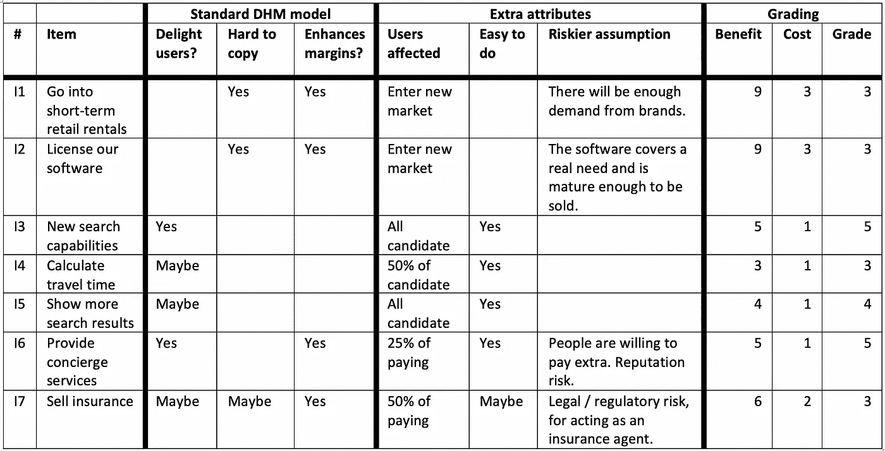

# 产品经理面试任务—第 2 部分，构思和优先排序

> 原文：<https://medium.com/geekculture/product-manager-interview-assignment-part-2-ideate-and-prioritize-5abcf2206b99?source=collection_archive---------15----------------------->

## 产品方面

## 如何想出点子，挑出最有希望的？

Photo by [Clark Tibbs](https://unsplash.com/@clarktibbs?utm_source=unsplash&utm_medium=referral&utm_content=creditCopyText) on [Unsplash](https://unsplash.com/?utm_source=unsplash&utm_medium=referral&utm_content=creditCopyText)

这篇文章是[系列](/@dtsirikos/how-to-nail-the-product-management-interview-assignment-7654685daa85)的一部分，回答了真实的面试任务。这份工作是为 Blueground 的一个产品经理职位准备的。这项任务总计:

> **第一步**:提出一个或多个有助于 Blueground 的想法，并解释你选择它们的原因。
> **第二步**:定义 MVP，如何评价其成功。
> **步骤 3** :描述 MVP 如何发展，给出路线图。

让我们看看如何回答第一步。

# 1.形成概念

以下是关于不同类别的一些想法。我将简要介绍每个想法，对它们进行优先排序，然后(在第三部分中)我将进一步检查最有希望的一个。

## 类别 1 —新的商业机会

**想法 1，进入短期商业租赁** 允许房东短期租赁他们的商业空间(像[https://www.appearhere.co.uk/](https://www.appearhere.co.uk/)

*   尽管入住率较低，但这可能会显著提高利润率，因此我们需要进行全面的数据分析来评估这一想法。
*   这个想法是一个连接房东和品牌的市场，这与 Blueground 所做的不同→它可能会影响品牌，因此可能需要剥离。
*   幸运的是，Blueground 已经有了很多实现这个想法的必要元素(技术、许多城市的本地团队、摄影师等等。).

**想法 2，许可我们的软件** 调查 Blueground 为其客户或供应商内部开发的软件(当他们装修房屋或进行维护时)是否可以以 SaaS 模式提供给第三方。

这是一个*非常*长远的尝试，我需要评估现有的软件，看看这个想法是否有任何意义，以及潜在的客户可能是谁。然而，如果成功了，它提供了一个替代的收入来源，甚至可能成为投资者的替代退出策略。

## 类别 2——让客户满意的功能

**想法 3、新的搜索能力** 提供更好的搜索体验，让潜在客户更容易租赁。

*   将搜索结果列表中的列表标记为收藏→ *喜欢的家*。
*   在搜索结果中隐藏他不想再看到的家→ *隐藏的家*。
*   保存搜索(标准、分类选项)并能够轻松重复→ *保存的搜索*。

(参见 Flyhomes、Airbnb、Zillow)

**创意 4、计算出行时间** 在首页详情页面上，让用户轻松计算从家出发到任何目的地的出行时间。(见 Zillow)。

**创意 5，显示更多搜索结果** 降低搜索结果上照片的高度，让超过两行的结果出现在折叠上方。用无限滚动替换分页[1]。

## 类别 3 —盈利计划

**想法 6、提供礼宾服务** 让客户订购礼宾服务(收费)，如送衣服去洗衣店、带宠物散步、预订戏票等。这可能包括与其他服务于特定领域的公司合作。

**理念 7、销售保险** 向客户提供旅游保险等免费服务，特别是:

a)他们逗留期间的财产保险。
b)旅游保险，主要针对商务客户。
b1) Blueground 确切知道这些客户何时结束租赁(最有可能是回到他们的家)。Blueground 还可以了解客户何时会回娘家做一次短途旅行，比如说去度周末，并为她提供旅行保险。

这可能是非常有利可图的，因为 Blueground 是保险公司的销售渠道，佣金通常在合同总额的 10%-30%之间[2]。

# 2.优先处理

在产品管理领域，已经提出了许多方法，我发现下面的方法特别有用。它只是将 [DHM 模型](https://gibsonbiddle.medium.com/2-the-dhm-model-6ea5dfd80792)与粗略的成本收益分析相结合，作为一种快速的方法来比较想法并给它们评级(见下文)。

显然，这只是一种方法。Blueground 可能会采用不同的方法。*关键是我们需要有系统地评估想法并对其进行优先排序的方法。*

这是我对上一节提到的各种想法的看法。

注:空白单元格的值通常为“否”或“无”。为了使表格更容易阅读，我宁愿把它们留在银行里。

DHM 模式是公开记录的，没有必要解释它。关于其他列:

## 2.1 E **xtra 属性**

1.  **受影响的用户**估计受影响的用户数量；百分比是 100、50、25 和 0。在 Blueground 的案例中，我们区分了候选客户和付费客户。
2.  **简单易行**意味着该项目需要不到 X(比如说 80)个工作日来实施，并且不需要复杂的新合作关系/整合。在对公司更加熟悉之后，我们可能会用对实现一个想法所必需的努力的高层次估计来代替这个专栏，正如 UX 和开发团队所验证的那样。努力可能有大小之分:小、中、大、超大。

*(重要的事情，是它是我们估计的范围吗？我们是在尝试评估成熟的新特性还是仅仅是它的 MVP？我建议大家试着估算一下候选 MVP。它的范围更小，更容易理解。只有在我们创建了 MVP 并且结果令人鼓舞之后，我们才需要评估下一版本特性的工作。在* [*第四部分*](/@dtsirikos/product-manager-interview-assignment-part-4-think-beyond-the-mvp-5750a662aa15) *中可以清楚地看到，要创建礼宾服务的整个路线图显然并不“容易”。)*

## 2.2 分级

评分是给各种想法的属性分配一个数值的简单方法。虽然数值并不精确，但它可以开启非常有趣的讨论，并在比较想法方面有很大帮助。

1.  **好处**:我们把前四栏的积分加起来:

*   对于标准 DHM 模型的三列中的每一列:
    是= 2 分
    可能= 1 分
    否或空白= 0 分。
*   受影响用户:
    进入新市场= 5 分。
    100%或“全部”= 3 分
    50% = 2 分
    25% = 1 分。

**2。成本**:“容易做到”一栏的分，如下:
是= 1 分
也许= 2 分
没有价值或者努力= 3 分。

如果你已经将“容易做到”一栏替换为工作评估，你可以使用下面的评分系统进行评估:小= 1 分，中= 2 分，大= 3 分，x-大= 5 分。

**3。等级** =收益/成本。

此外，如果想法变得很多，那么把它们画在成本效益图上可能有助于可视化。

到目前为止，提出的候选想法在范围上有很大不同(因为它们属于不同的类别)。由于本次任务的目标是展示一种思维方式，因此在[第 3 部分](/@dtsirikos/product-manager-assignment-part-3-define-the-mvp-155c51c728a8)中，我们将进一步研究“想法 6——礼宾服务”，与其他得分最高的“想法 3——新的搜索功能”相比，它有更多“牛肉”可供分析。

**尾注:**

[1][https://www.nngroup.com/articles/scrolling-and-attention/](https://www.nngroup.com/articles/scrolling-and-attention/)

[2][https://www . quora . com/How-much-commission-a-typical-travel-insurance-payment-for-redirect-on-a-travel-website](https://www.quora.com/How-much-commission-would-a-typical-travel-insurance-payout-for-reselling-on-a-travel-website)