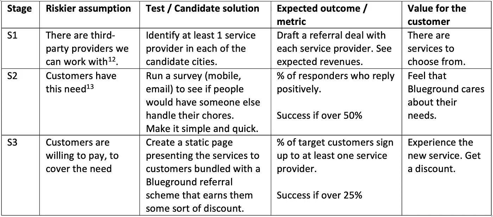
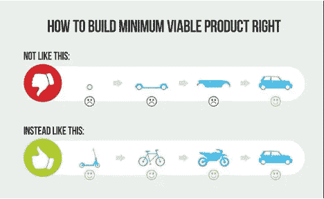
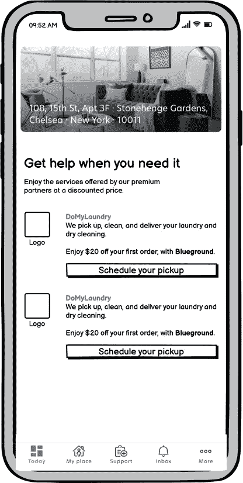

# 产品经理面试任务—第 3 部分，定义 MVP

> 原文：<https://medium.com/geekculture/product-manager-interview-assignment-part-3-define-the-mvp-155c51c728a8?source=collection_archive---------6----------------------->

## 产品方面

## 如何决定在 MVP 中放什么，为什么？

Photo by [S O C I A L . C U T](https://unsplash.com/@socialcut?utm_source=unsplash&utm_medium=referral&utm_content=creditCopyText) on [Unsplash](https://unsplash.com/?utm_source=unsplash&utm_medium=referral&utm_content=creditCopyText)

这篇文章是[系列](/@dtsirikos/how-to-nail-the-product-management-interview-assignment-7654685daa85)的一部分，回答了真实的面试任务。这份工作是为 Blueground 的一个产品经理职位准备的。这项任务总计:

> **第一步**:提出一个或多个有助于 Blueground 的想法，并解释你选择它们的原因。
> **第二步**:定义 MVP，如何评价其成功。
> **步骤 3** :描述 MVP 如何发展，给出路线图。

让我们看看如何回答第二步。

# 1.展示我们的理由

在开始定义 MVP 之前，我们应该考虑我们拥有的备选方案，并清楚地展示我们选择特定 MVP 的理由。不要忘记，在第二部分[中，我们已经强调了每个想法的高风险假设，这将在这里使用。](/@dtsirikos/product-manager-interview-assignment-part-2-ideate-and-prioritize-5abcf2206b99)

首先，我们更详细地检查礼宾服务的想法。

**1。假设** *(我们的价值主张是什么？客户为什么会为此烦恼呢？)*

我们假设忙碌的 Blueground 客户会花钱请人处理他们的日常杂务[1](带宠物散步、洗衣服、收拾东西等等)。)或提供优质服务(预订电影票、做保姆等)。).

2.**业务需要** *(为什么我们首先需要有这个特性？它会对盈利、声誉或其他方面有帮助吗？这是否符合我们的战略？如果答案不令人满意，那么也许我们应该重新考虑进一步的行动。)*

礼宾服务将允许 Blueground 通过两种方式提高客户忠诚度和利润率:
2.1。从每项服务中获得少量收入。
2.2。随着整个体验变得更加高级，增加月租。

礼宾服务也符合公司战略，即专注于高端市场并提供优质的客户体验(参见[第 1 部分](/@dtsirikos/product-manager-interview-assignment-part-1-set-the-ground-76ffaf7a2fc9)，第 1.5 节)。

3.**成功标准** *(这是我们希望这个新特性会产生的预期影响。它应该是可测量的和简洁的。)*

有礼宾服务的公寓利润至少增加 5%。

*(不要被小小的 5%所迷惑。它指的是利润增长，而不是收入增长，因此实现起来要困难得多。)*

4.**目标客户群** *(在这一点上我们还应该定义这个特性指的是谁。这将帮助我们找到合适的客户/用户来展示该功能，并进行我们的 A/B 测试。另一方面，如果目标客户群太小，那么也许我们应该重新评估我们在* [*第二部分*](/@dtsirikos/product-manager-interview-assignment-part-2-ideate-and-prioritize-5abcf2206b99) *中对“受影响的用户”一栏的回答。)*

4.1.租金较高的昂贵城市的富裕顾客。
4.2。忙碌的顾客。
4.3。男人。

5.**实施注意事项** *(这一节非常重要，因为我们强调了创建特征和选择路径的各种选项。这可能并不适用于每一个特性，但是如果是这样的话，表明你已经考虑清楚这一点是很重要的。)*

对于第三方提供的服务，有两种方法。

5.1.客户只与 Blueground 互动。

*   Blueground 可以通过打折购买服务并按标价收费来赚取收入。
*   Blueground 品牌变得更加强大[2]。
*   我们可以在没有与服务提供商进行任何软件集成的情况下开始—当一个 Blueground 客户请求一项服务时，然后一个人工代理从相应的提供商那里请求这项服务。如果礼宾服务流行起来，那么与服务提供商的真正整合将是必要的。这可能很难做到，并且需要维护。
*   注意:我们应该更新蓝色背景服务条款，以避免在服务提供商提供低于标准的服务的情况下承担责任。

5.2.客户直接与每个服务提供商互动。

*   Blueground 只是将客户介绍给服务提供商(可能需要介绍费)。我们必须确保我们可以与竞争服务提供商合作，并且这不会影响介绍费。
*   客户要直接给每个服务商开户，可能下载他们的 app →很多摩擦点。
*   如果服务提供商没有提供很好的服务，那么 Blueground 的声誉风险会更小。客户很清楚谁做什么。

考虑:
a)blue ground 目前面临的任何限制(参见第 1 部分中的[第 1.4 节)。
b)事实上，实施方法 5.2 更容易做到，对公司来说风险更小。](/@dtsirikos/product-manager-interview-assignment-part-1-set-the-ground-76ffaf7a2fc9)

我们将从客户直接与每个服务提供商互动开始[3]。如果这个特性获得了牵引力，并交付了预期的价值，那么就没有太多的理由采用方法 5.1。如果不是，那我们也没有做这么大的投入。

# 2.定义 MVP

(现在我们继续实际回答作业的第二步。)

为了执行礼宾服务的想法，我们将不断测试我们的高风险假设。如果一项测试通过，我们就进入下一阶段。所有测试都在目标客户群中运行，如上所述，变更还没有发布给所有客户群体[4]。

Table 1: stages before the MVP

MVP 是 S3 阶段的候选解决方案，具有以下特点:

1.用户看到可用服务列表(每个城市不同)。对于 MVP，我们将只在一两个城市推出，因此可用的服务可以硬编码。

2.对于每项服务，都有一个链接将用户带到相应的外部注册页面，让用户创建一个帐户(打开手机的网络浏览器——这比在手机上使用 webview 更容易)。

我们的 MVP 从一开始就以最少的努力提供了真正的客户价值，正如下面这张众所周知的图所巧妙地描绘的那样。

## 2.1 用户故事

*(一个产品经理应该会准备用户故事，所以这是补充几个的合适点。我必须承认，这个特别的 MVP 并不适合许多用户故事。)*

在 MVP 的范围内，我们描述以下用户故事:

1.  作为一名客户，我看到一份可以帮助我处理日常杂务的公司列表，以便节省我的时间。
    验收标准:
    —清单应包含公司的标志、服务的简短描述以及通过 Blueground 签约的好处。
    —用户应该能够进入公司的注册页面。外部注册页面应该在手机浏览器中打开，而不是在 Blueground 移动应用程序中。

## 2.2 MVP 的用户界面

*(接下来，你可能想用几个简单的用户界面模型来展示 MVP 的样子。)*

**Screen 1: modify the today screen.** Add the new “Get help with chores” button

**Screen 2: list of services.** Static page. When the user clicks on the button for each service, he is redirected to an external website in to sign up.

## **2.3 如果 MVP 失败会怎样？**

(增加这一部分肯定会给你带来优势，因为大多数人只会坚持快乐的道路，不会事先想到这一点。)

如果我们在 S3 没有达到我们的成功标准，我们必须考虑如何继续。选项包括:

1.  什么都不做:让 MVP 保持原样，因为它仍然提供一些价值。
2.  降级:让客户看服务提供商列表不那么显眼。
3.  删除它:把它从手机应用程序中取出，并通知注册用户。

**尾注:**

[1]这种假设部分地被这种杂务的服务提供者的存在所证实。

[2]如果客户体验不佳，情况可能正好相反，这可能发生在:
—服务提供商不佳。
—通过 Blueground app 提供的客户体验不如服务商 app 提供的好。**这是一个非常现实的风险。**

[3]在销售保险的情况下，决策可能相反，即 Blueground 将处理客户申请，并确保客户在此阶段不必与保险公司打交道。

[4]表 1 中给出的测试很容易运行。在更典型的情况下，我们还应该考虑运行测试的用户。对照组？
—运行测试的平台？(Web / iOS / Android)
—做 A/B 还是多元测试？我不确定 A/B 测试在 S2 和 S3 阶段会有多大帮助，因为目标人群不是很大。
—测试的持续时间。(通常，至少 3 周。)
—如何记录/分析/解释结果。

[12]人们可以认为这是一个先有鸡还是先有蛋的问题。我们首先需要聚集足够多的服务提供商还是足够多的客户？我认为我们需要首先创造供应，所以我们从寻找服务提供商开始。

[13]注:有人可能认为 S2(进行调查)是多余的，我们可以直接进入 S3。在这种特殊情况下，可能是这样的，但一般来说，在进一步处理之前，核实客户的实际需求是最重要的。