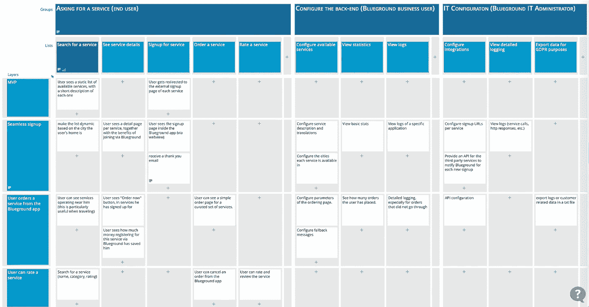

# 产品经理面试任务—第 4 部分，超越 MVP 思考

> 原文：<https://medium.com/geekculture/product-manager-interview-assignment-part-4-think-beyond-the-mvp-5750a662aa15?source=collection_archive---------19----------------------->

## 产品方面

## 展示 MVP 如何通过高级路线图和功能图发展。

Photo by [Mark König](https://unsplash.com/@markkoenig?utm_source=unsplash&utm_medium=referral&utm_content=creditCopyText) on [Unsplash](https://unsplash.com/?utm_source=unsplash&utm_medium=referral&utm_content=creditCopyText)

这篇文章是展示真实面试任务答案的[系列](/@dtsirikos/how-to-nail-the-product-management-interview-assignment-7654685daa85)的一部分。这份工作是为 Blueground 的一个产品经理职位准备的。这项任务总计:

> **第一步**:提出一个或多个有助于 Blueground 的想法，并解释你选择它们的原因。
> **第二步**:定义 MVP，如何评价其成功。
> **步骤 3** :描述 MVP 如何发展，给出路线图。

让我们看看如何回答第三步。

在第三部分的第[阶段 S3 之后，我们已经确认客户将注册高级服务，Blueground 将开始赚取一些推荐收入。但是，我们尚未涵盖业务需要增加租金(见第三部分](/@dtsirikos/product-manager-interview-assignment-part-3-define-the-mvp-155c51c728a8)中[清单项目 2.2)；为此，我们需要改进服务并提供优质体验，因此我们为未来 12 个月制定了以下高级路线图。](/@dtsirikos/product-manager-interview-assignment-part-3-define-the-mvp-155c51c728a8)

**Q1:** 无缝签约服务提供商
**Q2:** 用户从 Blueground app 内部订购服务
**Q3:** 用户可以对服务进行评级
**Q4:** Blueground app 预测客户需求

这个路线图肯定会涉及很多特性，而一个完整的分析超出了这个任务的范围。但是，我准备了下面的功能图，以展示我们需要记住的各种角色(客户、内部用户、外部提供商等)。)以及我们将在每个季度开发的最重要的功能。

为了简单起见，我只研究通过 Blueground 移动应用程序而不是通过网站的客户交互。

**Potential high-level feature map for the concierge services**

我对这个产品经理面试任务的回答到此结束。

非常感谢你读到这里，请分享你的想法！