# 使用 Azure DevOps、AWS 和 Terraform 进行生产就绪型 CICD 设置

> 原文：<https://medium.com/geekculture/production-ready-cicd-setup-with-azure-devops-aws-and-terraform-4c87bdef3e41?source=collection_archive---------1----------------------->

持续集成和持续部署是现代敏捷开发环境中的常见做法，这个概念本身并没有一个固定的、放之四海而皆准的解决方案。它要求你在 CICD 的核心理念和价值观下进行实践和调整，并适应你自己的流程。这很容易上手，但需要在规划、设计和协作方面付出大量努力，才能让它很好地适应您的环境。在本文中，我们将探索使用 Azure DevOps 平台的生产就绪 CICD 设置，使用 Terraform 部署到 AWS 环境中。

# 为什么选择 Azure DevOps 和 AWS

在我们开始之前，人们会奇怪为什么我们不使用 AWS 服务来设置 CICD。主要原因是 Azure DevOps 为开发团队提供了完全集成的体验，它涵盖了从问题和票证管理、开发、测试和部署的工作流。一个完全集成的平台允许团队将他们需要的一切集中在一个地方，并减少了环境切换时浪费的资源。

# 你希望知道什么

这个故事不会教你 CICD 的基本知识。CICD 是一个非常常见的话题，你可以很容易地在其他地方搜索到大量相同的信息。在这个故事中，我们关注运行可伸缩和可维护的 CICD 架构的高级选项。您应该知道以下内容

1.  基本的 CICD 知识
2.  基本 Yaml 脚本
3.  基本地形脚本
4.  基本 Azure DevOps 配置
5.  AWS Elastics 集装箱服务的工作经验
6.  码头工人的工作经验
7.  了解微服务概念
8.  了解 12 因素 App 原则
9.  任何分支战略的工作经验

# 项目先决条件

如果您想按照步骤操作，您需要以下工具和设置:-

1.  Azure DevOps 帐户
2.  AWS 帐户
3.  已安装 Terraform 1.0+版本
4.  已安装码头

# 示例项目

这篇文章将从[到](https://github.com/jazztong/node-micro-app-demo)使用一个示例项目。以便我们能够按照项目要求配置 CICD。示例应用 ***节点-微应用-演示*** 由两个 API 组成，产品 API 和用户 API。它是使用 NodeJS Express Backend 和 TypeScript 开发的。每个服务都可以使用 Postgres 和 [Prisma](https://www.prisma.io/) 框架访问自己的数据存储。

[](https://github.com/jazztong/node-micro-app-demo) [## GitHub-jazz tong/node-micro-app-demo:一个示例 nodejs 微服务演示应用程序

### 一个示例 nodejs 微服务演示应用程序运行 docker Run-d-e POSTGRES _ PASSWORD = PASSWORD-p 5432:5432 POSTGRES…

github.com](https://github.com/jazztong/node-micro-app-demo) 

# 高层次目标

设定以下目标来控制我们的工程范围

1.  安装程序继续集成管道以验证代码更改
2.  继续集成管道应该在代码验证后生成新的工件
3.  当新配置发生变化时，应继续部署管道
4.  基础架构组件应该能够管理持续部署

# 高级图表

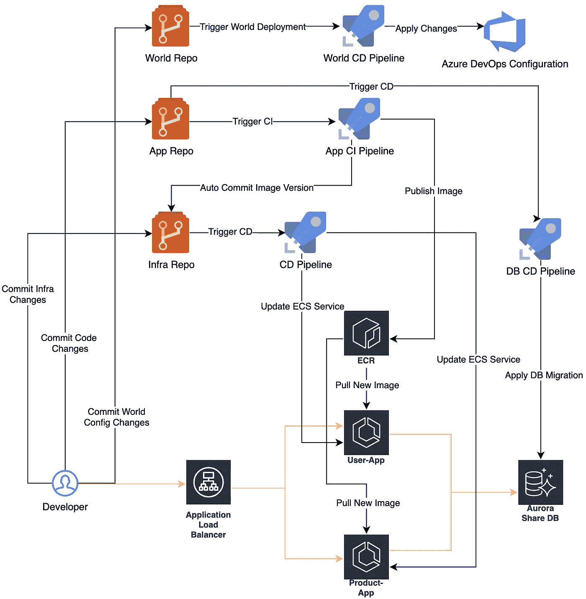

上图解释了使用 AWS ECS Fargate 架构的高级集成流程。CICD 架构利用 Azure DevOps 平台来管理源代码和管道。

# CICD 设计与规划

我们将通过所有的设计和规划因素，给整个 CICD 建筑更多的背景。

## 知识库策略


Credit to [https://medium.com/burak-tasci/full-stack-monorepo-part-i-go-services-967bb3527bb8](/burak-tasci/full-stack-monorepo-part-i-go-services-967bb3527bb8)

这个主题提出了以下问题:-

1.  我们为这个项目选择什么类型的存储库？
2.  这个项目需要多少存储库？

> 回答:-

1.  我们将为该项目使用 [Monorepos](https://semaphoreci.com/blog/what-is-monorepo#:~:text=A%20monorepo%20is%20a%20version,Monorepos%20can%20reach%20colossal%20sizes.) 设置。与 Multirepos 设置相比，Monorepos 设置有很多好处，我们选择这种设置的主要好处是在执行大规模重构时简化共享模块和自动提交。当你第一次理解 Monorepos 时，你可能会产生疑问，但请相信我，所有的科技巨头，如[【脸书】](https://engineering.fb.com/2014/01/07/core-data/scaling-mercurial-at-facebook/)和[谷歌](https://cacm.acm.org/magazines/2016/7/204032-why-google-stores-billions-of-lines-of-code-in-a-single-repository/fulltext)都是通过 Monorepos 成功开发产品的。
2.  对于这个项目，我们将有 3 个存储库，1 个是****世界**存储库，1 个是****应用**存储库，1 个是****下**存储库。****世界**存储库将存储配置 Azure DevOps 所需的所有设置，例如管道定义、存储库权限等等，术语**世界**使用这个术语来解释这是您需要配置的第一个存储库。将应用和基础架构配置划分为不同存储库的主要原因是为了符合 [12 因素应用原则](https://12factor.net/)。准确的说是[原则 I——单代码库](https://12factor.net/codebase)、[原则 III——环境中的配置](https://12factor.net/config)、[原则 V——构建、发布、运行分离](https://12factor.net/build-release-run)。********

## ****分支策略****

****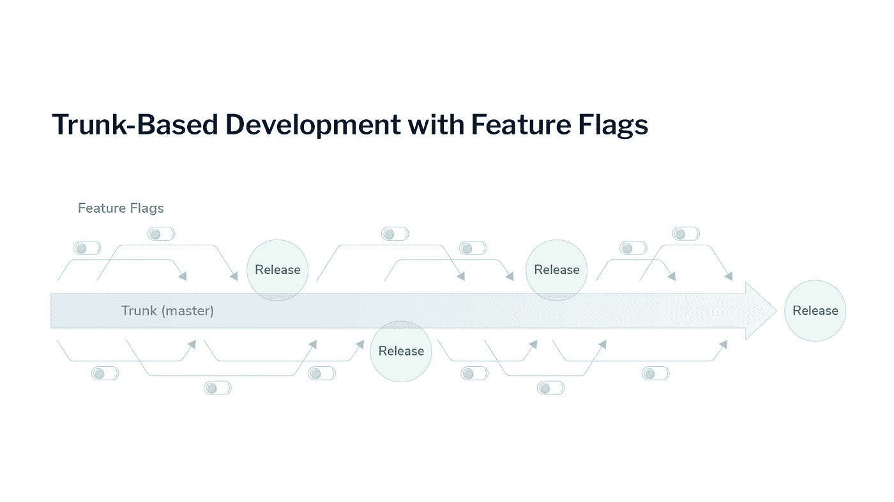****

****Credit to [https://launchdarkly.com/blog/git-branching-strategies-vs-trunk-based-development/](https://launchdarkly.com/blog/git-branching-strategies-vs-trunk-based-development/)****

****每个团队和项目都必须有一个他们同意并遵循的分支策略。团队成员必须紧紧跟随开发工作流，CICD 工作流将围绕分支策略构建。有许多类型的[分支策略](https://launchdarkly.com/blog/git-branching-strategies-vs-trunk-based-development/)，为了本文和 CICD 演示的简单，我们将使用基于主干的开发(TBD)作为我们的分支策略。TBD 强制简化并频繁整合你的代码以减少 [**合并**](https://www.stxnext.com/blog/escape-merge-hell-why-i-prefer-trunk-based-development-over-feature-branching-and-gitflow) 的机会。****

## ****动态部署或 GitOps 方法****

****当您想要向 CICD 系统提供关于要部署到哪个版本的代码的输入时，有两种部署方法。1 是动态部署，您应该听说过在映像工件中使用**最新的**标记、或变量来存储您想要部署的版本，您可以使用管道变量或 CICD 平台中的全局设置来配置或传递该值。 [GitOps 方法](https://www.weave.works/blog/gitops-operations-by-pull-request)是另一种实践，因为所有的配置更改都将记录在 Git 系统中，并且必须使用 [Pull Request](https://docs.github.com/en/github/collaborating-with-pull-requests/proposing-changes-to-your-work-with-pull-requests/about-pull-requests) 方法审查更改。在这个演示项目中，我们将使用 GitOps 方法来记录图像版本。****

## ****管道配置方法****

****管道配置方法有两种方式。1 是从 UI 进行管道配置，这是配置管道最常见、最容易开始的方法，但是它有很多问题，比如可伸缩性问题。另一种方法是 [Pipeline as Code](https://about.gitlab.com/topics/ci-cd/pipeline-as-code/) 方法，它解决了可伸缩性问题，并且更符合开发人员将配置作为代码进行管理的经验。在这个项目中，我们将使用管道作为代码方法。****

## ****进化数据库设计****

****在敏捷开发中，大多数时候开发人员会忽略我们应该如何以敏捷或自动化的方式管理数据库变更，数据库的变更和迁移被认为是关键的操作，人们会倾向于使用手动方式来管理数据库变更。有了[进化数据库设计](https://martinfowler.com/articles/evodb.html)，数据库中的变化可以像我们管理应用程序代码一样进行管理，同时继续集成和继续部署。在这个项目中，我们将通过 [Prisma migration](https://www.prisma.io/) 的持续部署来展示进化数据库设计。****

# ****创建世界知识库和管道****

********

****Credit to [https://www.nytimes.com/2016/04/17/magazine/the-minecraft-generation.html](https://www.nytimes.com/2016/04/17/magazine/the-minecraft-generation.html)****

****世界存储库，或者你可以称之为上帝存储库，是管理我们配置 Azure DevOps 所需的一切的 GitOps 存储库。这是您需要手动创建的唯一的存储库和相关管道。其他 Azure DevOps 配置将依赖于此存储库。****

## ****创建地形 S3 后端****

****我们使用 Terraform 来提供世界知识库中的所有配置。为了在多个团队成员维护 terraform 时保持其状态，您需要创建持久存储来存储[状态文件，](https://www.terraform.io/docs/language/state/index.html)有多种方式来设置您的 Terraform 后端，在我们的示例中，我们将使用带有 DynamoDb 表的 S3 后端。[在本地配置](https://docs.aws.amazon.com/cli/latest/userguide/cli-chap-configure.html)您的 AWS 凭证，并按照步骤操作。****

****在您的根目录下创建 Cloudformation 脚本作为 backend.yml:-****

****使用 AWS CLI 创建后端:-****

```
**aws cloudformation create-stack --stack-name terraform-backend-setup --template-body file://backend.yml --parameters ParameterKey=LockTableName,ParameterValue=terraform-state-lock ParameterKey=StateBucketName,ParameterValue=terraform-s3-state-random**
```

****使用以下命令检查堆栈状态:-****

```
**aws cloudformation describe-stacks --stack-name terraform-backend-setup**
```

> ****如果您的堆栈创建不成功，大多数情况下是您的 S3 存储桶名称不可用，请尝试更改 S3 存储桶名称并重试。****

## ****安装 Azure DevOps 扩展****

****将以下扩展安装到您的 Azure DevOps 组织，以允许您的 Azure DevOps 帐户部署 Terraform 和 AWS 任务:-****

1.  ****[https://marketplace.visualstudio.com/items?itemName = ms-dev labs . custom-terra form-tasks](https://marketplace.visualstudio.com/items?itemName=ms-devlabs.custom-terraform-tasks)****
2.  ****[https://marketplace.visualstudio.com/items?itemName = Amazon web services . AWS-vsts-tools](https://marketplace.visualstudio.com/items?itemName=AmazonWebServices.aws-vsts-tools)****

## ****创建新帐户和项目****

****该项目需要一个 Azure DevOps 帐户，如果您还没有帐户，请确保在此处注册一个帐户。并为此项目创建一个项目，如下所示:-****

****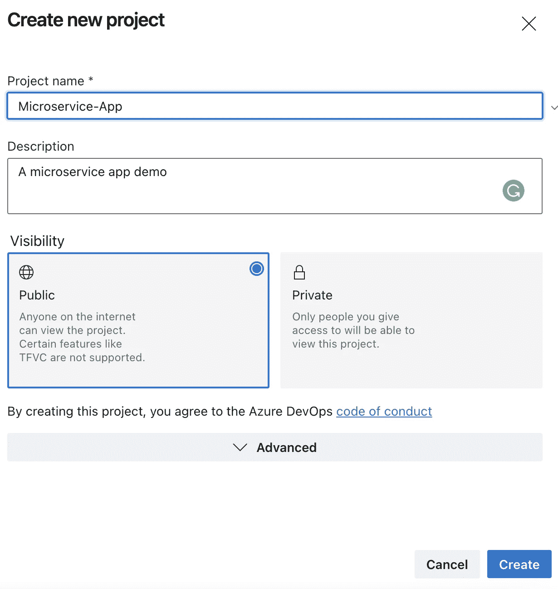****

****出于演示目的，建议选择公共可见性，以便您可以通过使用 Microsoft 托管的代理拥有 10 个并行作业。****

## ****创建新的 AWS 服务连接****

****[服务连接](https://docs.microsoft.com/en-us/azure/devops/pipelines/library/service-endpoints?view=azure-devops&tabs=yaml)是您可以配置以安全访问 AWS 等各种服务的设置。进入**项目设置** > **服务连接>新建服务连接，并**填写您想要用于 Terraform 权限的 AWS 访问和密钥。如果您愿意遵循我的步骤，请给出服务连接名称 **AWS_CONNECTION** 。****

****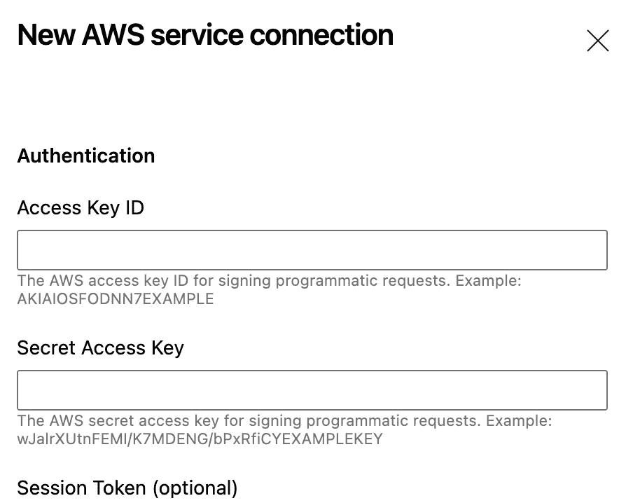********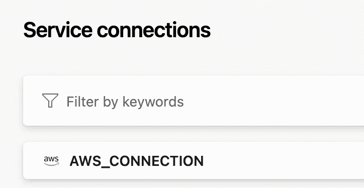****

## ****生成个人访问令牌****

****PAT 或个人访问令牌是 Azure DevOps 用来作为服务帐户运行以访问 Azure DevOps 服务的特殊秘密。我们将生成一个 PAT 供 Terraform 使用，以供应我们在 CICD 的存储库和管道。转到您的个人资料并打开个人访问令牌页面。****

****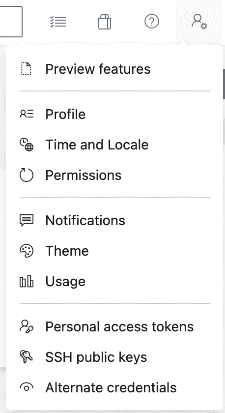****

****创建一个具有**代理池**读取&管理权限、**代码**完全权限和**构建**读取&执行权限的新令牌。****

************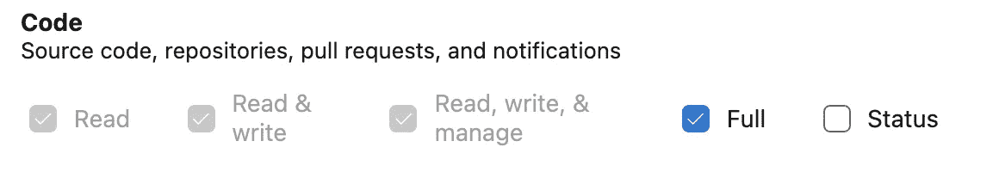************

*****保存您的 PAT 令牌，以便我们稍后使用。*****

## ****配置变量组****

****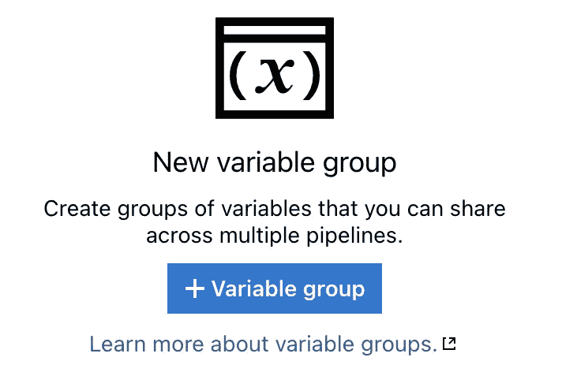****

****变量组是将在管道执行期间使用的环境变量集，我们需要创建一些变量设置来正确配置管道。导航到 ***管道>库> +变量组。*******

****用以下变量创建一个名为 **common-vars** 的新变量组:-****

****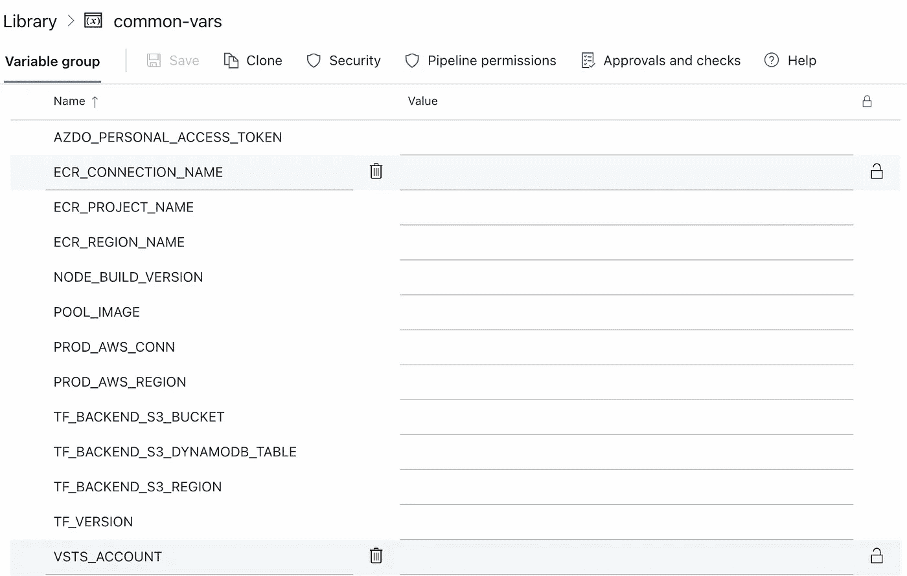****

****该值将按如下方式输入:-****

*   ****AZDO _ PERSONAL _ ACCESS _ TOKEN—****
*   ****ECR _ 连接名称—AWS _ 连接****
*   ****ECR _ 项目名称—演示****
*   ****ECR_REGION_NAME — ap-southeast-1****
*   ****NODE_BUILD_VERSION — 14.x****
*   ****POOL _ IMAGE—Ubuntu—最新****
*   ****生产 _ AWS _ 连接-AWS _ 连接****
*   ****PROD _ AWS _ REGION-AP-southeast-1****
*   ****TF _ back end _ S3 _ BUCKET-terra form-S3-state-random****
*   ****TF_BACKEND_S3_DYNAMODB_TABLE —地形-状态-锁定****
*   ****TF _ 后端 _ S3 _ 地区—AP-东南-1****
*   ****TF_VERSION — 1.0.5****
*   ****VSTS _ 账户—****

## ****导入世界知识库****

****转到 Repos，选择如下导入存储库:-****

****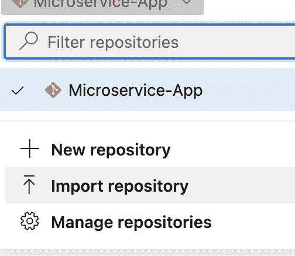****

****从 https://github.com/jazztong/microservice-theworld 克隆而来，并将新的存储库命名为**微服务世界。******

****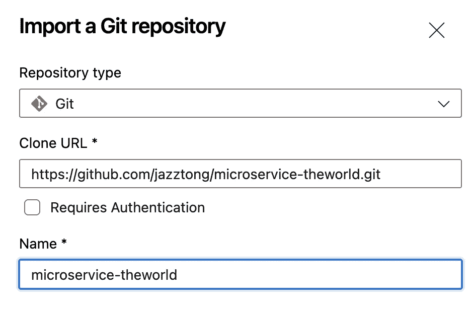****

****如果你浏览文件 **azdevops/vars.tf** ，为了运行这个演示，它已经填充了默认值。您可以更改自己的项目名称和另一个导入 URL。****

## ****配置项目管道权限****

****项目中的项目交叉引用存储库，我们需要自动创建记录部署历史的环境，在 ***项目设置>管道>设置>常规*** 中启用管道，如下所示:-****

****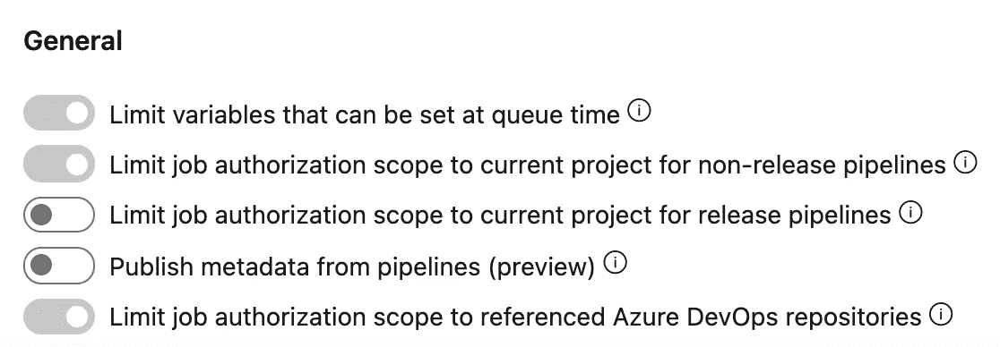****

## ****配置世界管道****

****我们将配置管道，以便世界存储库中的任何更改都可以自动将更改部署到我们的项目中。转到管道>创建管道>选择 Azure Repo Git >选择 World Repo >选择现有管道文件，如下所示，单击保存并运行管道:-****

****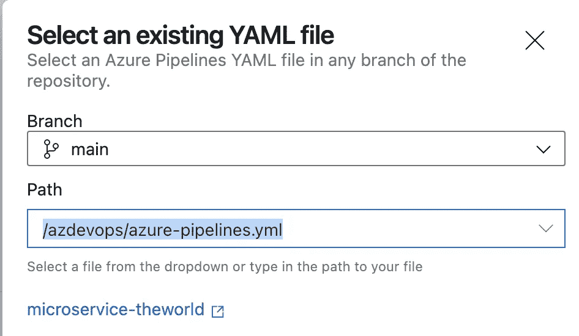****

****对于首次运行，您需要授予对环境和可变组资源的权限。****

************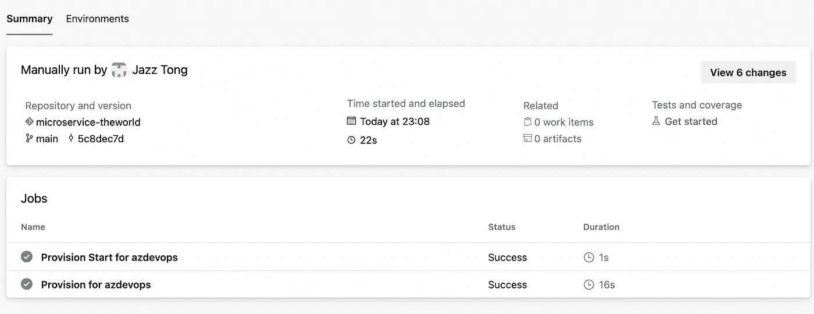****

****成功运行管道后，将创建以下资源:-****

1.  ****1 个代理池****
2.  ****导入了 2 个存储库****
3.  ****9 条管道****

****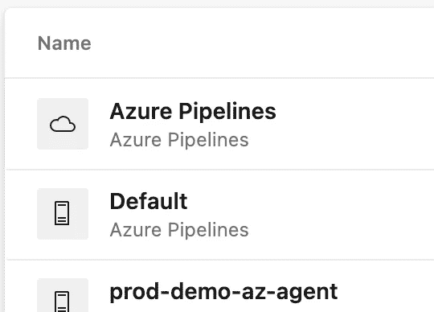********************

# ****供应环境****

****在这一步中，我们将逐个触发管道来构建所有的环境。我们将触发继续集成管道或继续部署管道来构建工件或部署对环境的更改。您应该按顺序遵循管道触发器，因为它们之间存在依赖关系。****

## ****基地继续部署管道****

****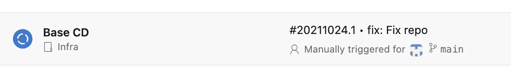****

****基础 CD 是指基础设施的持续部署，它使用地形管理基础设施的所有配置，例如:-****

1.  ****ECS 集群****
2.  ****应用负载平衡器****
3.  ****角色和策略****
4.  ****安全组****

****管道完成后，您可以在您的 AWS 帐户中验证结果，如下所示****

****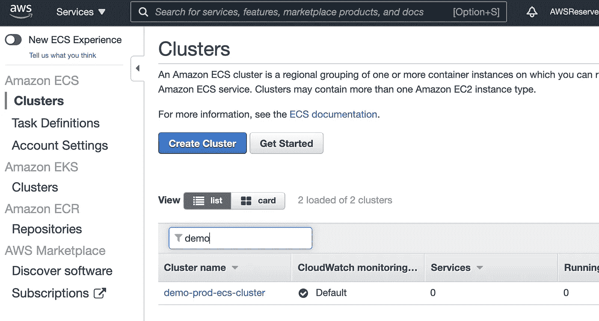********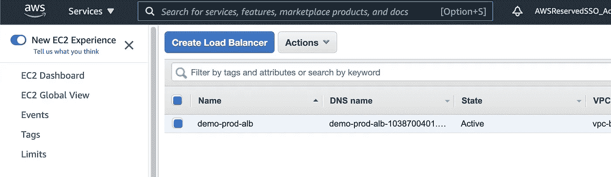********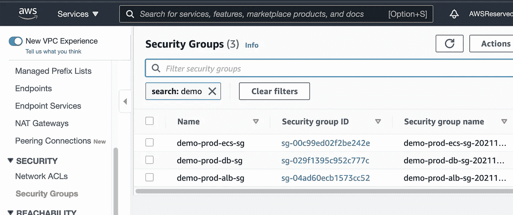****

## ****数据库继续部署管道****

********

****数据库是服务启动的依赖项之一，因此我们需要在服务启动之前首先提供它。如上所述，在 Infra 文件夹中运行数据库 CD 管道。成功运行后，您可以验证在您的 AWS 帐户中创建的新 RDS。****

****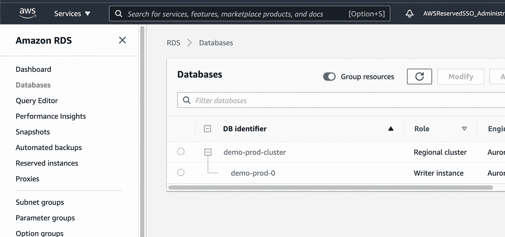****

## ****Azure 代理继续部署管道****

****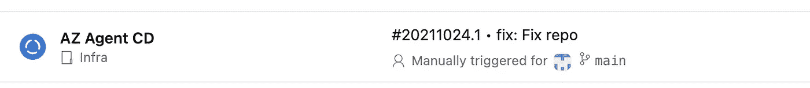****

****Azure Agent CD 是提供 Azure Agent ECS 服务的管道。它将使用作为代理，允许 Azure DevOps 通过管道部署数据库更改。管道运行成功后，您可以验证它是否在 ECS 群集中调配了新的 ECS 服务，如下所示****

****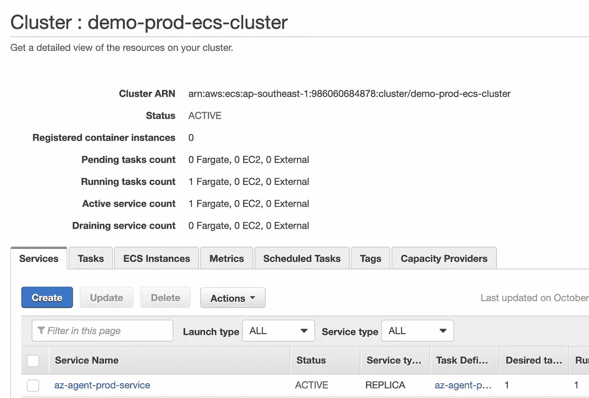****

****ECS 服务将作为我们之前创建的代理池中的一个代理运行。您可以在**组织设置>管道>代理池> prod-demo-az-agent** 中检查代理是否运行****

****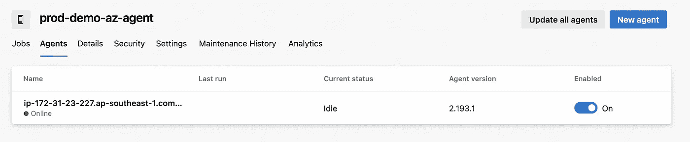****

## ****产品数据库和用户数据库继续部署管道****

****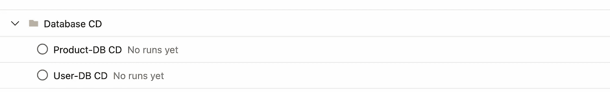****

****我们有 2 个基于服务的数据库部署管道，当有新的模式更新时，它们将部署数据库更改。运行 Product-DB CD 和 User-DB CD 来创建服务数据库模式。当您观察管道细节时，它显示迁移已经成功地应用于数据库。****

****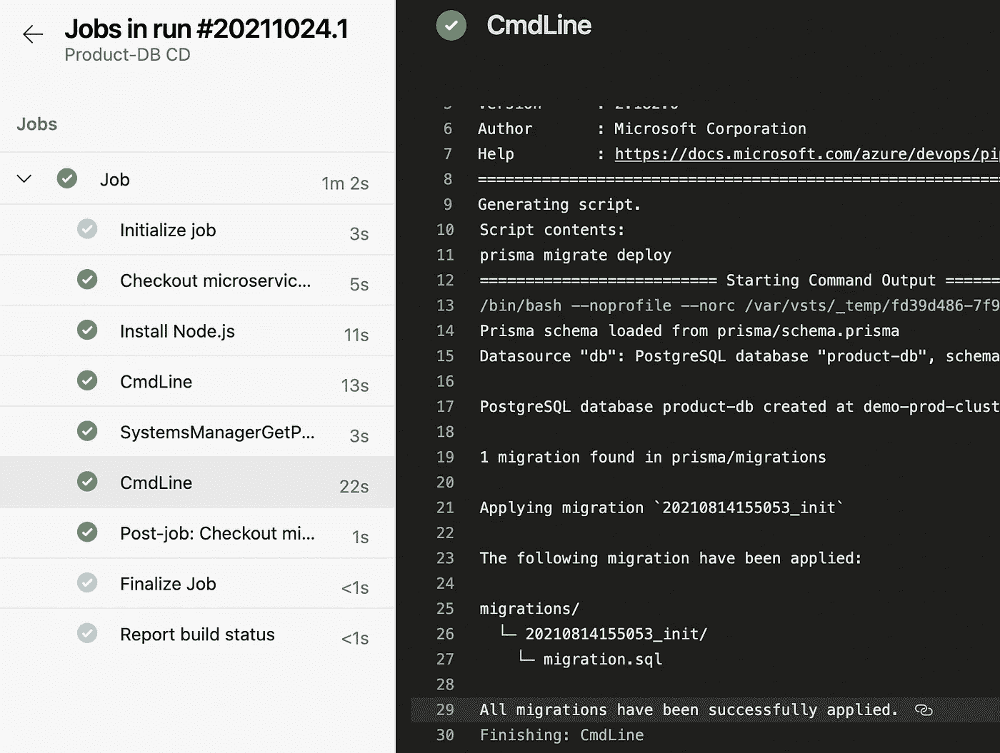********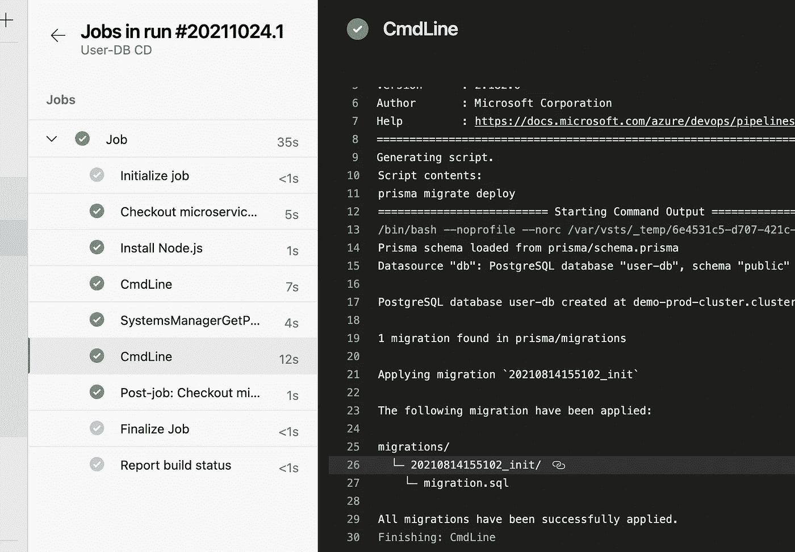****

****因为它使用我们在 ECS 群集中部署的托管代理，所以它不需要对您的数据库进行公共访问来运行数据库迁移。****

## ****产品-应用程序、用户-应用程序继续整合渠道****

****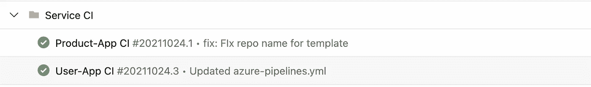****

****在此步骤中，我们将触发产品应用程序和用户应用程序配置项，以生成 docker 映像并将其发布到 ECR。****

****管道成功运行后，它会将 docker 映像推送到您在 AWS 服务连接中配置的 ECR 存储库。****

> ****您需要授予变量组对管道的权限****

****登录到您用来生成凭证的 AWS 帐户，并打开 ECR 页面，当项目配置到 ap-southeast-1 区域时，您可以使用此[链接](https://ap-southeast-1.console.aws.amazon.com/ecr/repositories?region=ap-southeast-1)来打开页面。****

****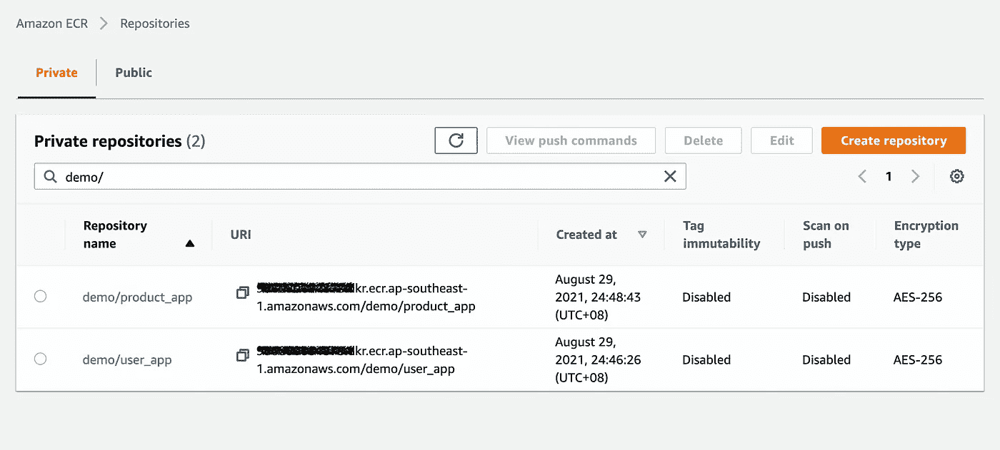****

****CI 存储库还配置*自动拉请求*生成，以将部署更改提交到基础架构存储库，拉请求工作流是 GitOps 实践之一，它确保所有更改都记录在 Git 历史记录中，甚至对于基础架构更改也遵循合并流程。****

****转到 Infra pull request 页面，您应该会看到一个使用新的 docker 映像 URI 生成的新 pull 请求，批准该 pull 请求并完成更改，以便进行服务部署。****

****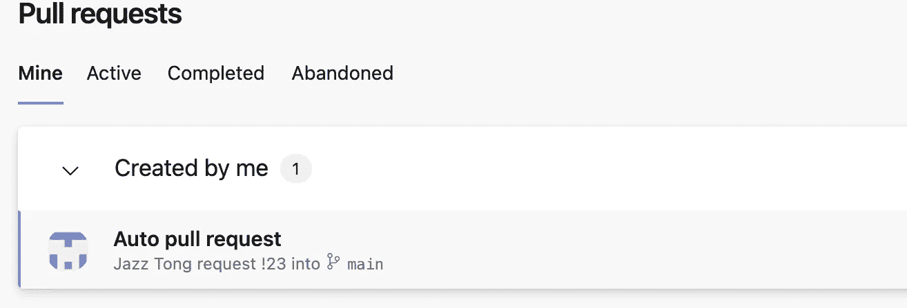********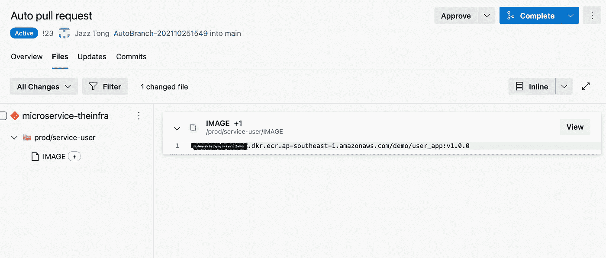****

****pull 请求是从嵌入在 CI 脚本中的 PowerShell 脚本生成的，用于调用 Azure DevOps API。它提取 Docker URL 并将 Pull 请求提交给服务的 CD，该 CD 位于基础设施 repo 内部。单击 Approve Pull Request 并完成它，您应该意识到继续部署管道正在运行。****

## ****产品服务和用户服务继续部署渠道****

****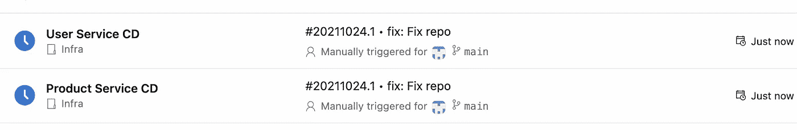****

****由于从先前的用户服务和产品服务的拉请求完成继续，继续部署管道将如上运行。管道完成后，登录您的 AWS 帐户，您应该注意到创建了两个新服务。****

****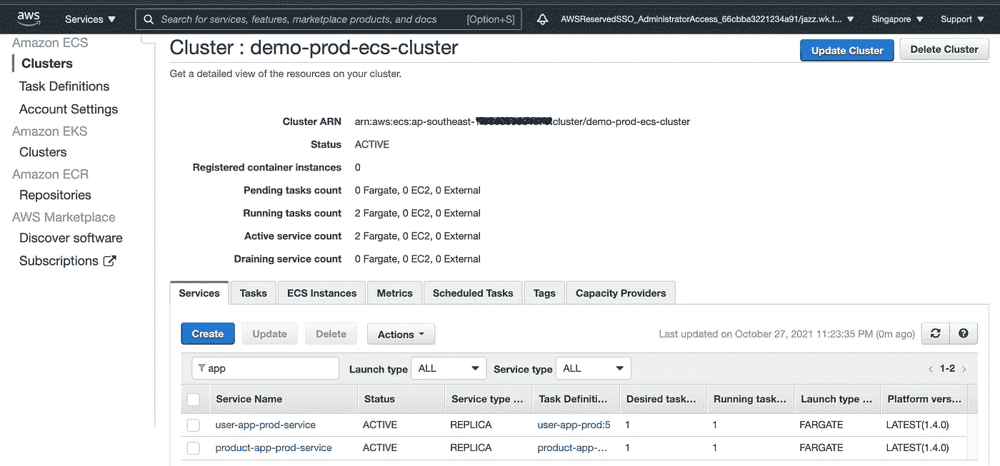****

## ****测试您的服务****

****现在您的基础设施已经准备好了，您可以执行下面的测试了****

1.  ****添加新产品 API****

****2.列出产品 API****

****3.添加用户 API****

****4.列出用户 API****

> ****用您的 ABL 中的实际 CNAME 替换您的 _ALB_CNAME****

# ****打扫****

****像往常一样，当您对结果满意时，您可以执行清理。所有的管道都有一个隐藏的销毁步骤，选择您想要运行的管道，并添加额外的变量，如下所示。****

****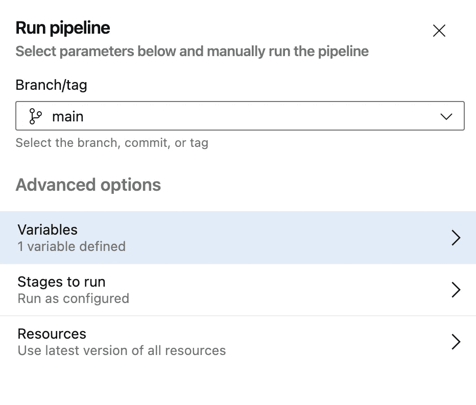********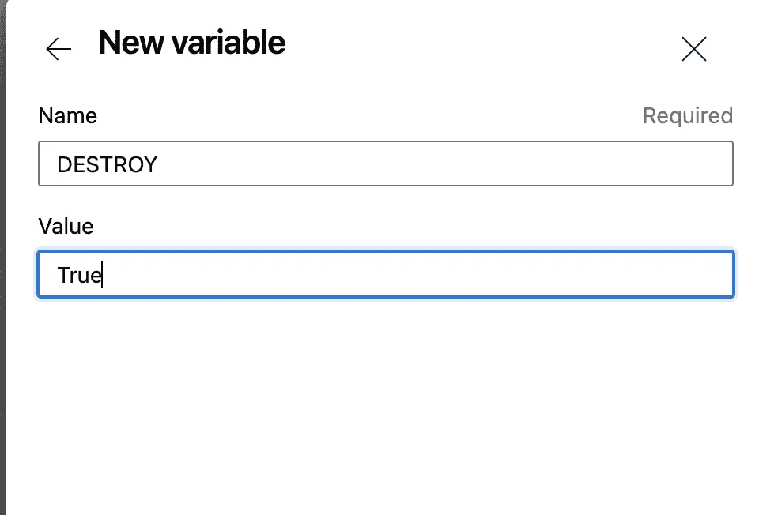****

> ****名称=销毁，值=真****

****由于组件之间存在依赖关系，为了正确清理，您需要按照以下顺序运行销毁步骤****

1.  ****产品服务光盘****
2.  ****用户服务光盘****
3.  ****AZ 代理 CD****
4.  ****数据库光盘****
5.  ****基础 CD****
6.  ****微服务-世界****

> ****销毁微服务世界管道时请小心，它将删除所有的导入库****

# ****拿走****

****我知道，我知道，我们没有完成所有的细节设置。正如在开始时提到的，这是为了分享一个高级工作流和建立一个生产级 DevOps 代码库，如果你想详细了解它是如何工作的，你需要研究我的代码。可扩展和可维护的管道项目需要大量的设计和测试，尤其是当您迁移到新的 DevOps 平台时。虽然所有主要的 DevOps 平台都支持管道作为代码设置，但理论上相同的概念和思想可以应用于任何 DevOps 平台。如果你想让我解释更多具体的概念和步骤，请给我留言。我希望你喜欢这个项目。****