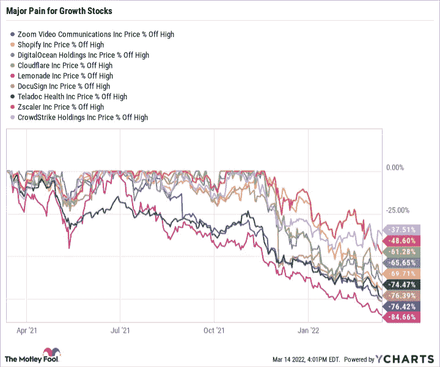
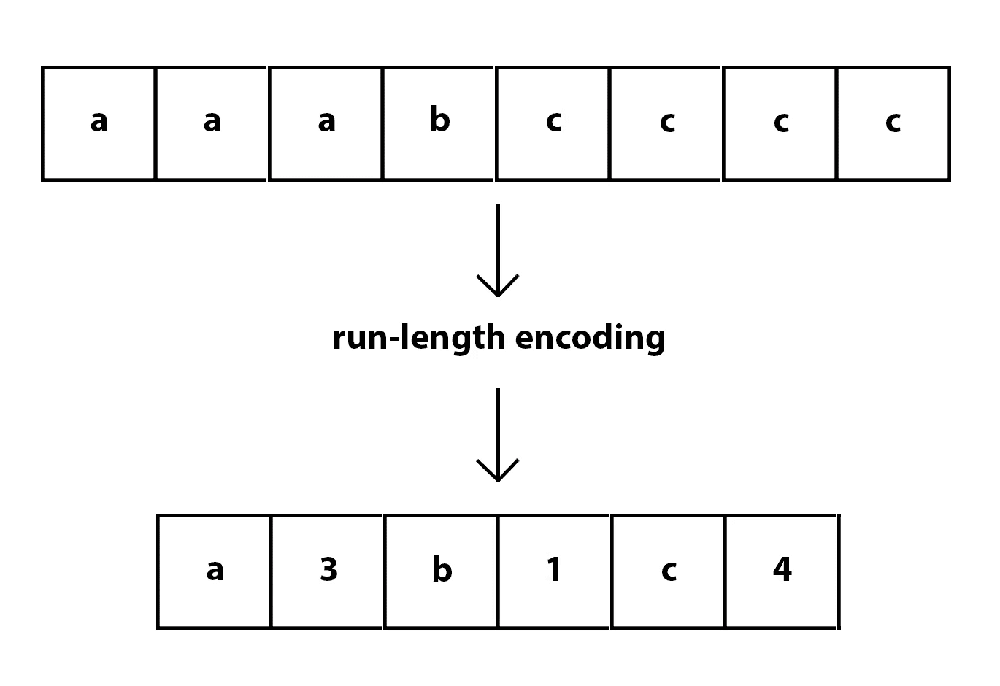

# 编程:一个过时的职业？

> 原文：<https://medium.com/geekculture/programming-a-bygone-profession-6ef2ee8de47a?source=collection_archive---------2----------------------->

## 另外——用这个简单的心智模型在几分钟内理解 AI。

W elcome to [**风口浪尖**](https://nicksaraev.com/adaptable-intelligence/) :前沿 AI 新闻(及其含义)用简单的英语讲解。

在本周的[期中](https://nicksaraev.com/adaptable-intelligence/):

*   技术裁员迫使程序员失业。随着人工智能编码助手现在编写超过 30%的代码，人类将不会被重新雇用。
*   一个让你快速理解 AI 如何工作的有用心智模型: **AI 作为压缩。**
*   对这份时事通讯做了几处巧妙的修改。

让我们开始吧。

# 1:编码助手将人类需要编写的平均代码量减少了 30%以上

还记得 Github Copilot 吗？微软去年推出的“[口袋里的结对程序员](https://github.com/features/copilot)”？

起初，Copilot 只不过是一个人工智能驱动的代码完成小工具。但从那以后，它一直在快速迭代和改进。

今天，它不仅能完成你的代码，还能无缝地编写新的函数和文档——所有这一切都要考虑到你的代码库的整体环境。

令人震惊的是:对于许多编程语言来说，超过 30%的新编写的代码是由人工智能助手如 Copilot 生成的。

换句话说:30%的代码*不是*由人类编写。

## 技术裁员正在加速就业机会的流失

人工智能编程的进步出现在一个特别灾难性的时刻，因为我们也看到了整个行业的大规模技术裁员。

公司纷纷裁员(主要是因为新冠肺炎引发的经济不确定性)。仅在上个月:

*   Spotify 解雇了 5%的员工。
*   DocuSign 解雇了 9%的员工。
*   微软解雇了 1000 多名员工。
*   自 2004 年公司成立以来，脸书首次冻结招聘。

我们可能只看到了开始。当你将这一点与 Copilot 等编程自动化工具的兴起结合起来时，不难看出软件工程的未来是暗淡的(至少对人类而言)。

## 这对我们意味着什么？

经济是否快速复苏:

*   随着更多的程序员被解雇，以及更多的人工智能生成的代码，人类程序员的作用将继续减弱。
*   人工智能编程的趋势只会加速，更大的、[栗鼠](https://arxiv.org/abs/2203.15556)般的模型很快就会成为标准。

就像“远程工作”在新冠肺炎时期大受欢迎一样(之后只是略微减少)，许多公司在程序员离开后不再雇佣他们。

他们不需要这样做:他们剩下的员工会用人工智能来收拾残局，直到不再需要他们。

## 我们如何利用这一点呢？

如果你从事技术行业，请记住这一点:初级程序员将是第一个被解雇的。

为熟练的老年人配备人工智能助手，并提高对产量的预期，比在新手身上投入时间和精力更具成本效益。考虑:

*   高级角色更自然地理解如何提示人工智能。
*   他们也更有能力验证人工智能生成的代码是好是坏。
*   高级程序员更好地理解每个模块或功能如何适应更大的环境——所以他们不会局限于零碎的部分(就像初级程序员那样)。

鉴于上述情况，以下是如何让自己适应未来的方法:

*   你是程序员吗？选择你从事复杂代码库工作的职位，这些代码库有许多相互关联的依赖项。
*   尽快进入管理层或导师队伍。
*   你是创始人/经理吗？投资于少数明星程序员，而不是大量平庸的程序员。前者将让你充分利用即将到来的人工智能编码热潮。

# 2: AI 作为压缩

AI 极其复杂。这就是为什么世界上一些最聪明的人从事这项工作——他们需要这些聪明才智，否则他们就无法为这项工作的发展做出有意义的贡献。

但是我们大多数人并不关心引领人工智能的理论基础。我们只是希望能用它做一些很酷的事情。幸运的是，你不需要火箭科学博士学位。

相反，你所要做的就是围绕人工智能如何工作内在化一些有效的心智模型。其中一种越来越受非技术观众欢迎的方法是 [**人工智能压缩**](https://www.youtube.com/watch?v=E1AxVXt2Gv4&feature=youtu.be) 。

AI as compression 是理解大量人工智能最新进展的一种简单、直接的方式，只需几分钟就能学会。让我展示给你看。

## 解压过文件吗？

当你压缩或解压一个文件时，到底发生了什么？一个简单的解释可能是:

*   文件被存储为长串的数字和符号。
*   有时候，这些数字里有规律。例如，您可能有这样一个序列:**834444444493**。
*   假设存储每个数字需要一个“单位”的信息。这样，上面的数字将需要 13 个内存单元(因为它有 13 个数长)。
*   但是很多信息都是多余的。例如，数字 4 会重复 9 次。难道我们不能更好地表达这些信息吗？
*   当然啦！如果你添加一个像*这样的符号，代表某件事情重复的次数，你可以将整个数字存储在 7 个单元中——几乎减少了 50%!
*   在实践中会是什么样子？ **834*993** 。后面带*9 的 4 表示“4 重复 9 次”。

上面的算法其实有个名字: [**游程编码**](https://www.futurelearn.com/info/courses/representing-data-with-images-and-sound/0/steps/53156#:~:text=A%20simple%20compression%20algorithm,they%20are%20driving%20a%20car.) (RLE)。它的工作原理是取长串重复的位，并将它们编码为单个值，而不是它们实际的长表示。

你的电脑使用 RLE 和几十种类似的算法来帮助压缩和解压缩数据。简而言之:它找到模式，然后用这些模式来用更少的存储空间表示信息。当你想让文件变得更大时，你只需颠倒这些模式。

## 人工智能以类似的方式工作

事实证明，人工智能做了一些极其相似的事情。

用过**图像放大 AI 吗？**(如果不是，[访问此链接](https://www.upscale.media/)，花一分钟，做完再回来)。

简而言之:图像放大模型将一幅小而模糊的图像作为输入，然后发回一幅大而高质量的图像作为输出。

在基本层面上，人工智能正在做一些类似于“解压”图像的事情。它假装你的图像已经被压缩，然后找到模式(比如重复，如果你想从游程编码的角度来考虑的话)来解压缩它。

主要区别？这些模式是通过训练有机学习的，而不是由软件工程师明确编程的。这是有道理的:游程编码是一种很容易编写的算法(如果一个数字出现不止一次，计算它并用*x 替换它)，但是“将人类牙齿之间的像素*变暗到刚好足够*以使它们可以区分”是……有点困难。

## 文本生成器呢？

值得注意的是，像 GPT-3 这样的文本生成算法做了完全相同的事情。

你的提示？这和解压缩前的“压缩”文件是一样的。该模型使用它在训练期间获得的知识来分析它，寻找模式，然后吐出最终版本——你的“未压缩”文本完成。

# 对此时事通讯的更改

最后，你可能已经注意到了，但是这一期有一些大的变化。即:

*   名字从尼克·萨拉耶夫(多么自负！)到了**的风口浪尖**。
*   语言现在更简单了&更切题了。你们中的大多数人是行政人员、程序员或商人；我想提高信息密度，让你的投资回报率最大化。
*   我们已经明确了这篇通讯的重点:Cusp 将覆盖**真实世界的后果和 AI** 的应用，每周三发布。

拥有超过 1000 名读者的《应用与后果》是目前最常被问到的两个话题。你们都(可以理解地)想知道*未来会是什么样子，*你将如何融入其中，以及是否有你可以利用的机会。这份新闻简报将提供所有三个。**

在过去的几年里，人工智能走过了一段漫长的路程。关于这个主题的信息也比以往任何时候都多。但是这些信息的平均质量直线下降——噪音越来越多，信号越来越少。我的目标是让这份时事通讯成为充斥着点击诱饵和低劣话语的惊涛骇浪中的一盏明灯。

E 喜欢这个？考虑和你认识的人分享。如果你读这篇文章是因为你认识的某个人给你发了这封信，请在这里注册[获取下一期时事通讯。](https://nicksaraev.com/#/portal/signup)

下周见。

尼克