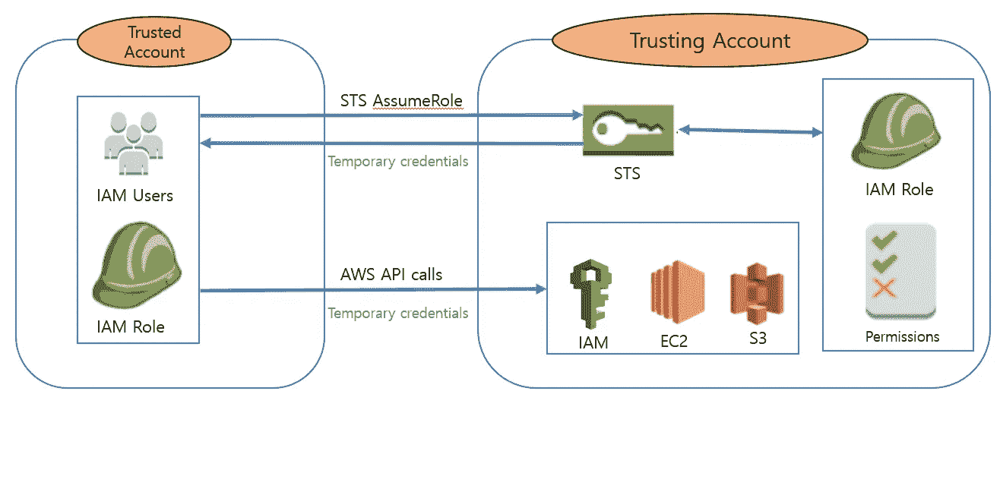

# 使用 AWS python SDK boto3 编程 AWS IAM 第 4 部分

> 原文：<https://medium.com/geekculture/programming-aws-iam-using-aws-python-sdk-boto3-part-4-62f2f1c21584?source=collection_archive---------0----------------------->

## 从受信任的 AWS 帐户中承担信任 AWS 帐户的 IAM 角色，并检索附加到给定用户的 IAM 组名。

Trusted Account assuming role on trusting account

> *在之前的***文章中，我们看到了如何在* **信任** *账户中创建 IAM 角色并附加信任关系策略。在本文中，我们将看到如何假设* …*