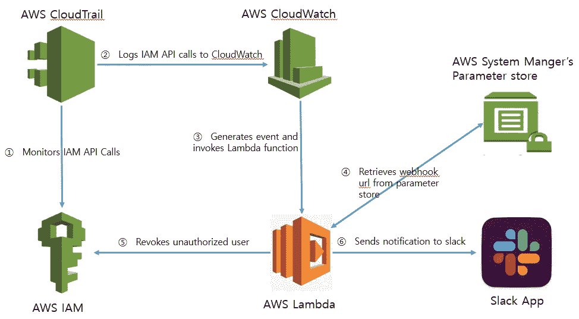

# 使用 AWS python SDK boto3 编程 AWS IAM 第 5 部分

> 原文：<https://medium.com/geekculture/programming-aws-iam-using-aws-python-sdk-boto3-part-5-3f34e2e732b3?source=collection_archive---------1----------------------->

## 检测非预期的 IAM 访问，撤销未授权用户的 IAM 访问，并向您的 slack 通道发送通知。

Architecture

> 在我以前的文章中，我介绍了编程基本 IAM 特性。在本文中，我们将看到如何检测非故意的 IAM 访问，撤销未授权用户的 IAM 访问并发送…