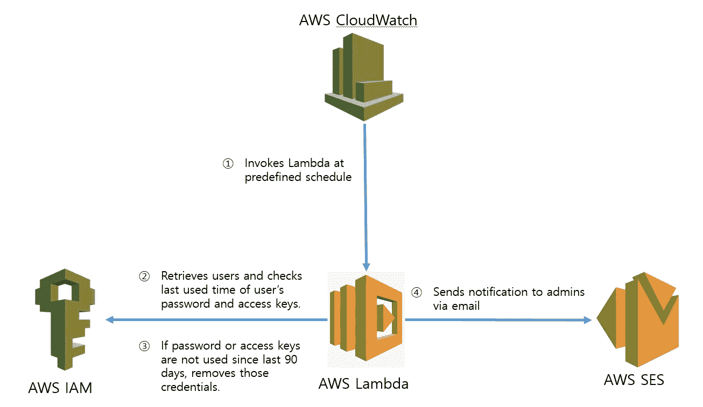

# 使用 AWS python SDK boto3 编程 AWS IAM 第 6 部分

> 原文：<https://medium.com/geekculture/programming-aws-iam-using-aws-python-sdk-boto3-part-6-3d7493afb25f?source=collection_archive---------0----------------------->

## 检测并删除未使用的 IAM 凭据。

Architecture for detecting and removing unused credentials

为了提高 AWS 帐户的安全性，我们需要删除不再需要的 IAM 用户凭证(即密码和访问密钥)。删除未使用的凭证是 IAM 的最佳实践之一。在本文中，我们将看到如何找到未使用的凭证并删除它们。