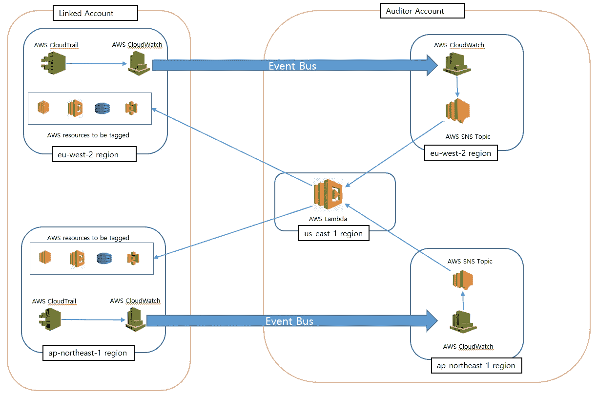

# 使用 python SDK boto3 编程 AWS 第 7 部分

> 原文：<https://medium.com/geekculture/programming-aws-using-aws-python-sdk-boto3-part-7-13110a8b9b9?source=collection_archive---------0----------------------->

## 使用 CloudWatch 事件总线将 CloudTrail 事件推送到一个集中的 AWS 帐户，并在创建时自动标记资源。

Architecture

在我以前的文章中，我一直强调使用集中的审计员帐户来在您的组织中实施最佳实践和治理。审计员帐户可以…