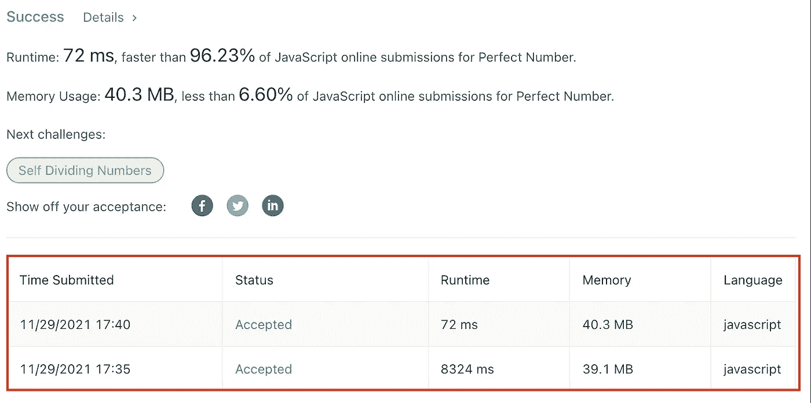

# 寻找完美、不足和丰富的数字——用 JavaScript 编写面试问题

> 原文：<https://medium.com/geekculture/programming-interview-questions-3-perfect-deficient-and-abundant-numbers-easy-d3923697a885?source=collection_archive---------5----------------------->


当`Number N === Sum of its proper divisors`。然后，它被称为一个[完全数](https://en.wikipedia.org/wiki/Perfect_number)。**例子:**

```
Number = 28
Proper divisors of 28 = 1, 2, 4, 7, 14Since, 1 + 2 + 4 + 7 + 14 = 28
It is a perfect number.
```

任何一个数`N`当其约数之和小于`N`时称为**亏**，当其和超过`N`时称为**盈**。

我们将编写一个带有数字`N`的函数`checkNumber`作为输入参数，并根据上述定义返回字符串**完美**、**不足**或**丰富**。

使用 [JavaScript](https://developer.mozilla.org/en-US/docs/Web/JavaScript) 实现:

首先，我们需要找到给定`number`的所有约数。最直接的方法是在一次迭代中检查所有小于给定`number`的数的直接除法，如果余数为零，它就是我的一个约数。

**例如:**

```
const getDivisors = (number) => {
    const all_divs = []; for (let i=0; i<number; i++) {
       if (**number % i === 0**) {
          all_divs.push(i);
       }
    } return all_divs;
}
```

然而，这是一种寻找除数的幼稚方法，可能会耗费大量时间，尤其是当给定的`number`很重要的时候。因此，该方法的时间复杂度为`O(N)`，其中`N = number`。

现在我们知道因素总是成对的。示例:

```
1 & 24
2 & 12
4 & 6
```

诸如此类…

因此，最好是迭代到给定的`number`的平方根，而不是一直迭代到`number`本身。然后使用`num/i`得到成对的因子，其中`i`是当前数和迭代中的一个因子。

实现如下所示:

```
const getDivisors = (number) => {
    const all_divs = []; for (let i = 1; i<=Math.sqrt(number);i++) {
        if (number % i == 0) {
            if (number/i == i) {
                all_divs.push(i);
            } else {
                all_divs.push(i);
                all_divs.push(number/i);
            }
        }
    } return all_divs;
}
```

这将把时间复杂度降低到`O(SQRT(N))`其中`N = number`。

> **注:**当我们想求许多数的约数时，这种情况可能不成立。根据上面的例子，我们只想找到给定`number`的约数。然而，当有许多数需要求它们的约数时。然后，对所有的数字使用单个迭代循环，并迭代到这些数字的最大值以获得更快的结果，这可能会更好。同样，它是可以测试的，并且取决于用例。

我还使用这两种实现分析了 [leetcode](https://leetcode.com/) 平台，以找到除数。

下图显示了第一种方法使用了`8324ms`，而当使用第二种方法`72 ms`执行相同的测试用例时，结果要快得多。



Runtime analysis on Leetcode platform

这个结果是意料之中的，因为我们已经知道使用第一种方法的时间复杂度是`O(N)`，使用第二种方法的时间复杂度是`O(SQRT(N))`。

现在我们有了给定`number`的所有约数。我们来看看数字是`Perfect`、`Deficient`还是`Abundant`。

```
const checkNumber = (number) => {
    const all_divs = getDivisors(number);
    let sum = 0;

    for (let i=0; i<all_divs.length; i++) {
        if (all_divs[i] !== num) {
            **sum = sum + all_divs[i]**;
        }
    }

    if (sum === num) {
        return '**Perfect**';
    }
    if (sum < num) {
        return '**Deficient**';
    }
    return '**Abundant**';
};
```

我们迭代除数并将它们相加。
——到了`sum == number`的时候，就完美了。
——到了`sum > number`的时候，就丰富了。
-`sum < number`时，为亏。

仅此而已。
现在类似的问题在 [leetcode](https://leetcode.com/) 平台[这里](https://leetcode.com/problems/perfect-number/)。

> **参考其他编程问题—**
> [求作业调度中的最大利润](https://mansimanhas.medium.com/interview-questions-series-part-1-dynamic-progrogramming-find-maximum-profit-in-job-scheduling-bf95c17146ba?source=friends_link&sk=57f3ba582e4f0c264beb016a27d034ec)
> [*将链表中的二进制数转化为整数*](https://mansimanhas.medium.com/interview-questions-2-convert-binary-number-in-a-linked-list-to-integer-easy-754e180a7490?source=friends_link&sk=666aafd77d789f2a577a7e9fe8d2663e)[求给定年份的第一个月有多少个星期天](https://mansimanhas.medium.com/programming-interview-questions-4-find-how-many-sundays-fell-on-the-first-of-the-month-for-a-93cb054b3abc?source=friends_link&sk=9ba258bdf74abeab77be41cb2f93b664)