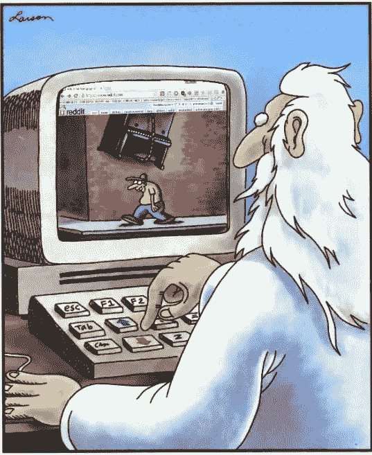
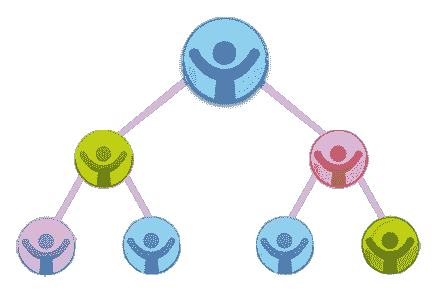
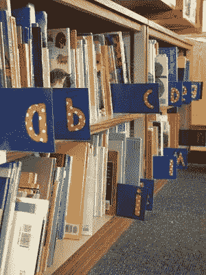

# 规划上帝的道路—我

> 原文：<https://medium.com/geekculture/programming-the-gods-way-i-73d24ecded5d?source=collection_archive---------17----------------------->

如果人类只是上帝的程序会怎样？如果周围发生的一切只是她/他的超级计算机中运行的一个代码呢？如果你想学习上帝之道的编程，并把每个概念与发生在我们周围的现实生活联系起来，就和我一起加入这个新系列吧！

God in his coder avatar, planning to eradicate this bad guy! Source: Imgur

# 整理你的组织方式

大家好，我的整洁怪胎和清理专家们！(即使你只是喜欢编码，不知何故来到这里，这就足够了)

有没有发现数据结构中的不同种类比与你的前吸尘器的关系更复杂？这里有各种分类算法的分类，你可以在日常生活中应用，也许可以从混乱中整理出秩序，这是一个不那么单调但更具创新性的过程:

**附注**:假设升序是新的“时尚”，同时浏览以下示例:

# 1.冒泡和选择排序

场景:和不同身高的人在大厅里看电影。电影还没有开始，每个人都不安地四处张望，有些人伸长脖子，有些人低下头。

找到小组中的长颈鹿，说服他/她坐在后面！即前面的第一个人与后面的人比较他/她的身高。如果前者更高，他/她互换。否则他/她不需要移动。这个过程(由“遍数”组成)一直持续到最大的一个在后面。从而找到第二大的、第三大的等等，让最矮的坐在前面。

S **选举排序:**找到群体中的蜉蝣，说服他/她坐在前面！也就是说，与冒泡排序相反，我们检测最小的人，第二小的人，等等，让最小的人坐在后面。

(同样的作品，只是接近的方向不同。)

我们爱所有的长颈鹿和蜉蝣，现在不要欺负我了。

# 2.合并和快速排序

就像罗马人喜欢的那样，“maxim divide et impera”也就是分治算法

去听音乐会的队伍太大了，无法立刻处理

M **戈尔排序:**警卫将单行分成 2 个子行，已经过身份证检查的人组成第三行，即包含那些可以简单通过大门的人。(3 行，即等待区最好足够大，以便进行外部分拣)

Q **uick Sort:** 警卫随机选择支点，即站在队列中的任何人。(你会成为某个地方的贵宾，哈哈)然后他们会重新安排整个队伍，询问那些身份证号码比他/她前面的支点低的人，以及那些身份证号码比他/她后面的人。

# 3.插入排序

玩纸牌游戏(有人是扑克或 21 点的粉丝吗？)

玩家根据他们想要的位置分离他的一副牌，通过取出每张牌，为它创造一个空间，最后插入它。

# 4.堆排序

假设在一个有两个孩子政策的国家，一个孩子得到一个家庭作业问题:画他/她的家谱，从老人到年轻人，你严厉的老师递给他/她一堆空的剪贴画(一堆数据)。

**注意**:默认情况下，这种排序会形成一个完整二叉树或者降序排列的最大堆。

S **ort** :为了系统化地快速通过堆&(在平均、最好和最坏的情况下花费相同的时间！)，聪明的孩子在剪纸上写下他/她的家庭成员的名字，并把他们堆起来做以下事情:

**a)** 从堆中找到并移除最伟大的祖先(删除)

**b)** 将他/她放在图表纸(插页)的顶部(树根)

然后对随后的年龄较小的成员重复上述步骤(是的，妈妈们和阿姨们，你们不用再隐瞒你们的年龄了！)看哪，得到了一棵树。

# 5.桶/箱排序

一所大学的图书馆，里面有一架子从 A 到 Z 的空书架，还有一大堆无聊的新参考书摆在上面(为什么这些书闻起来这么香！)

按照书名将每本书分类，从相同的字母开始，然后按顺序排列在书架上。

伙计们，现在就到这里吧！请继续关注下一部分，即将来到你的中等故事书架；)