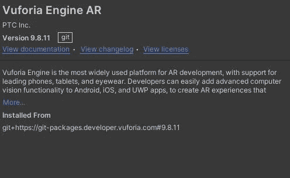
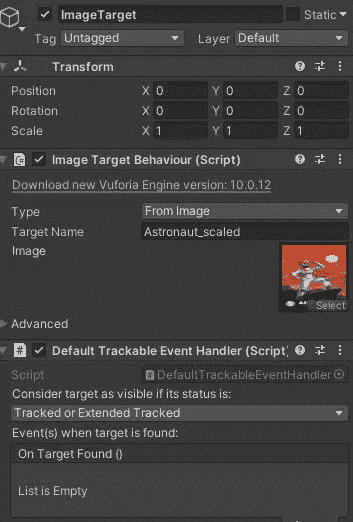
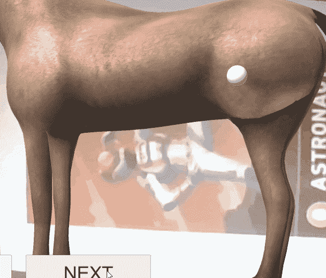

# 进度报告:Unity 中的 AR 项目

> 原文：<https://medium.com/geekculture/progression-report-ar-project-in-unity-e61d628fd31?source=collection_archive---------61----------------------->

今天在 GameDevHQ 计划中，我刚刚完成了一个快速项目，以了解更多关于 AR 的知识。这个课程非常有趣，因为它向我介绍了一些非常酷的新想法，因为我以前没有在 Unity 中尝试过 AR。

Vuforia SDK Unity

> Vuforia SDK

为了这个项目，我们决定使用 Vuforia SDK 来启用 T2 AR，而不是 unity 自己的 AR。 **Vuforia** 允许用户轻松地将先进的计算机视觉功能添加到任何应用程序中，允许它识别图像和对象，并与现实世界中的空间进行交互。

从包管理器添加了 Vuforia 之后，我们就可以开始 AR 了。

> 增强现实摄像机和图像目标

为了启用 AR，您应该从 **Vuforia** 上下文菜单中添加一个 *AR 摄像机*，而不是使用主摄像机。AR 相机将允许您的相机识别某些图像(称为图像目标)，以便在这些目标图像上方显示内容。

因此，除了 AR 相机，我们还添加了一个目标图像对象，并向它添加了一个将被识别的图像。

AR Camera & Image Target

Target Image

在这个项目中，我添加了一个宇航员作为我的目标图像。即使你做得不好，你也应该永远追求成功。

> 马解剖学

我们在这个 AR 项目中的目标是展示一匹马，并深入研究它的解剖结构。对于学习建议，我们将只能展示马的腿部解剖。

我们使用的马预设有两个动画，一个从马身上显示肌肉，另一个动画从肌肉上显示骨骼。

我们将马预置放在目标图像上，这将允许 AR 相机显示马，并自动或通过按钮播放动画。

Horse Anatomy AR