# 项目总结:创造一个美丽的统一场景

> 原文：<https://medium.com/geekculture/project-conclusion-creating-a-beautiful-unity-scene-b2a5532e3c73?source=collection_archive---------10----------------------->

## 在过去的 6 周里，我已经完成了美丽的游戏 GDHQ 课程，并创建了 2 个高质量的 Unity 环境。

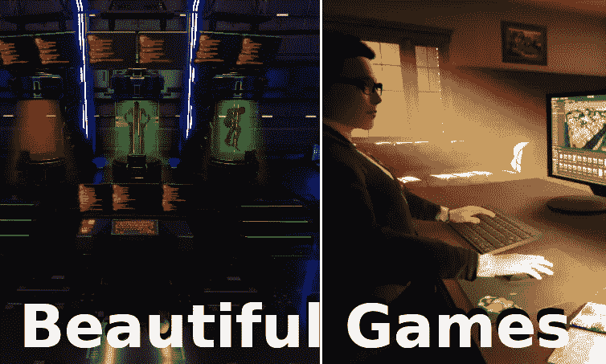

# 科幻科学实验室:

这个场景的目标是利用高质量的模型和纹理、良好的环境设计原则、高效的照明和有效的后期处理效果来创建一个寒冷、科技科幻的走廊和测试室。

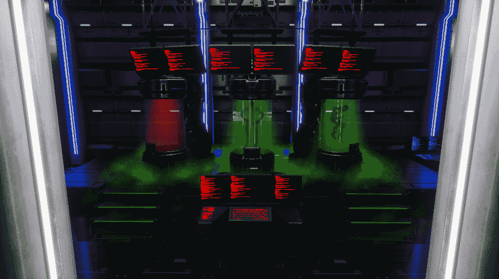

为了适应“冷”/科学/金属的氛围，我主要使用金属模型和材料，并保持颜色在灰度范围内。

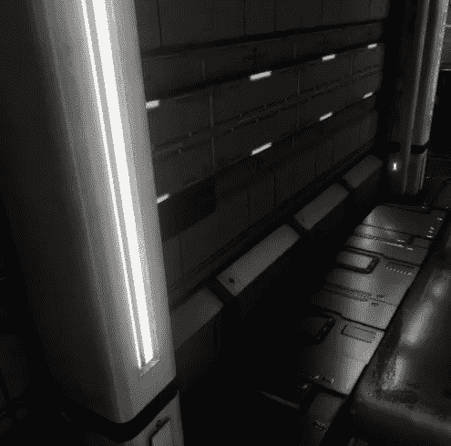

因为我想突出屏幕和显像管的亮色，所以我把场景的大部分做得很暗，只在柱子和墙壁上使用发光材料来照亮场景。

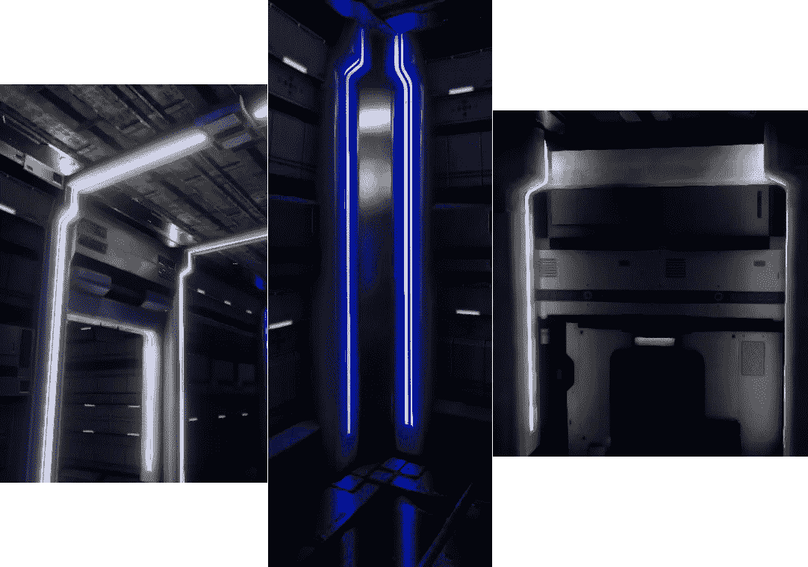

I also use blue lights on the corner columns to give a cooler atmosphere.

作为场景的焦点，试管和电脑屏幕几乎以霓虹般的颜色明亮地照亮，以对比其余相当灰色的场景。

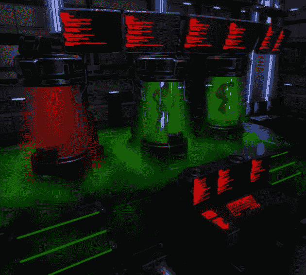

对于场景中所有光滑的金属表面，我使用屏幕空间反射来获得(大部分)精确的环境反射。

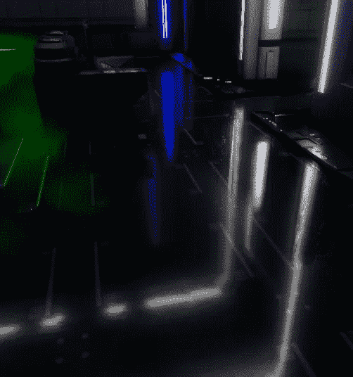

# 舒适的家庭办公室:

这个场景的目标是，再次利用高质量的模型和纹理、良好的环境设计原则、高效的照明和有效的后期处理效果来创建一个温暖、舒适的家庭办公室。

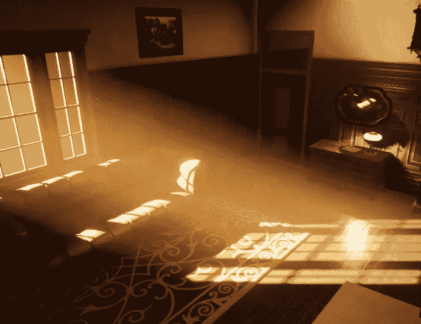

为了获得更温暖的感觉，我在这个场景中使用了更温暖的颜色，如黄色、橙色和棕色。明亮的阳光透过窗户照射进来，利用间接照明照亮了房间的大部分，在沙发和地板上投射出精确的阴影。

房间的设计给人一种老式的感觉，有旧的木制家具、灯和各种各样的物品。

对于场景照明的其余部分，为了使一些部分摆脱过度的黑暗，我使用了两盏灯和一盏吸顶灯来给房间增加一些额外的照明。

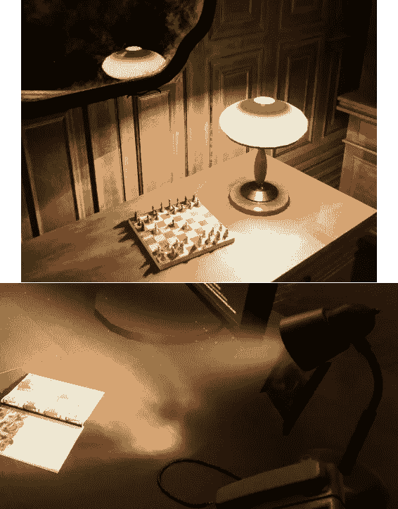

These are small lights, and affect quite a limited area.

计算机和灯使用发光材料来给场景添加一点额外的真实灯光颜色，而实际的实时灯光对象用于更明亮的灯光效果。

由于这是一个办公室，而我是一个游戏开发人员，我通过添加一台带有一些自定义屏幕纹理的现代计算机和一个工作中的游戏开发程序(不，这不是我；) ).

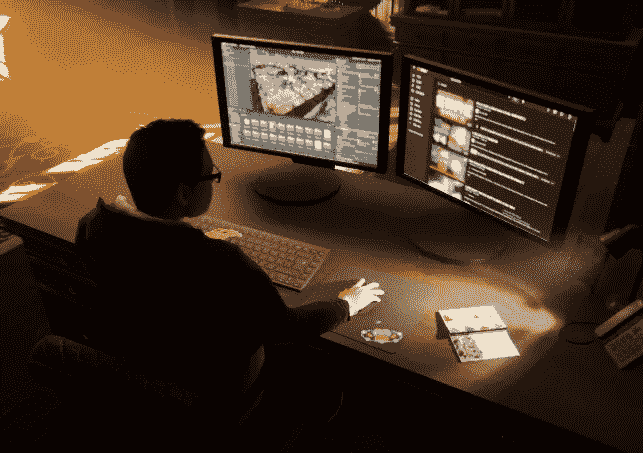

一面老式的镜子给场景添加了一些非常漂亮和精确的实时反射，使得在房间里走动看起来非常好。

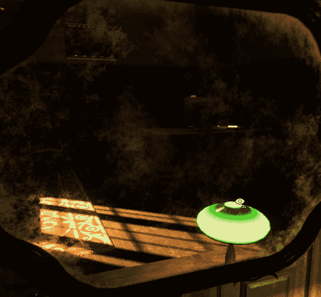

阳光和台灯区域的粒子系统显示了在这样一个看起来古老的房间里会发现的漂浮的灰尘。

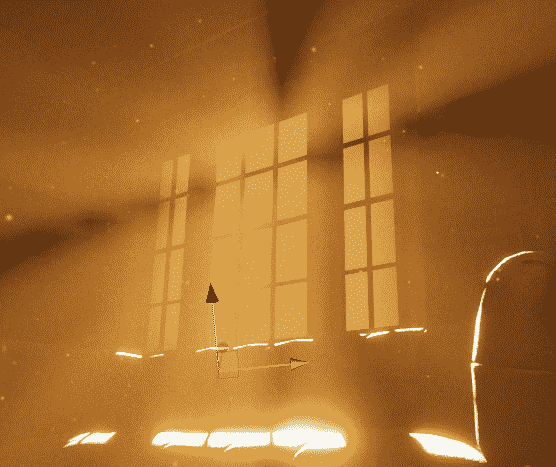

实际上，粒子系统不覆盖灯光照射区域之外的区域，这在现实生活中是常见的。

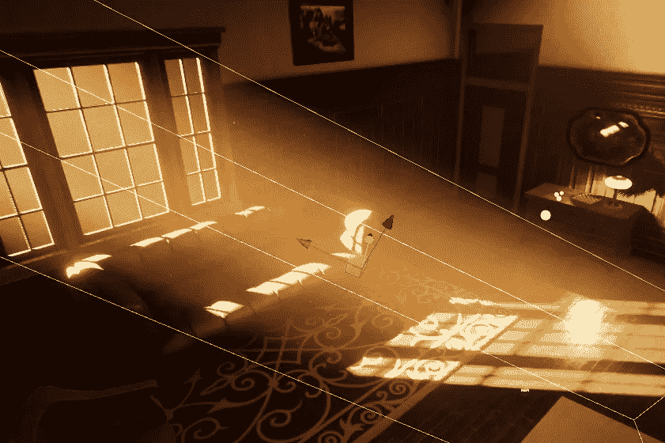

对我来说，在过去的几周里，这是一个非常有趣的项目，因为我之前在 Unity 的 HDR 管道中没有太多的工作经验。可用于在场景中创建高视觉质量的功能令人印象深刻，玩起来也很有趣。

特别是，我对如何在其他计划项目中使用后期处理、照明、镜子和各种材质着色器有一些想法。这些功能在 URP/标准管道中的可用程度较低(取决于功能)，但 HDRP 真正发挥了它们的全部潜力。