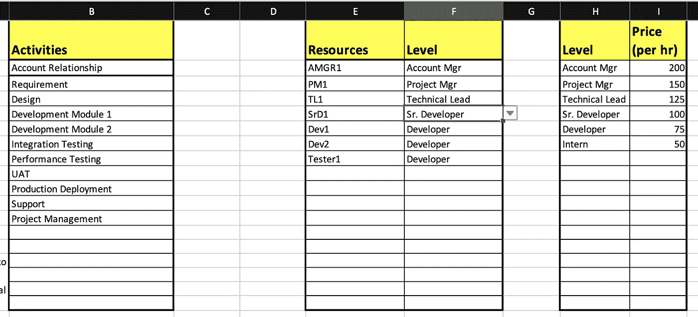
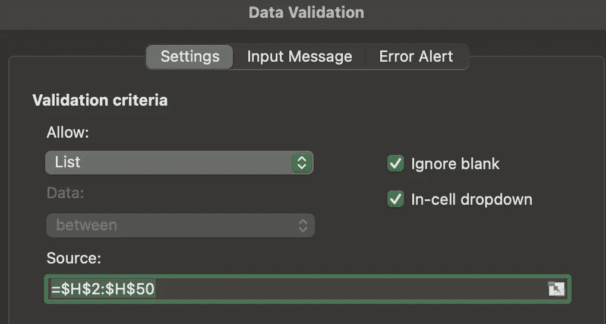
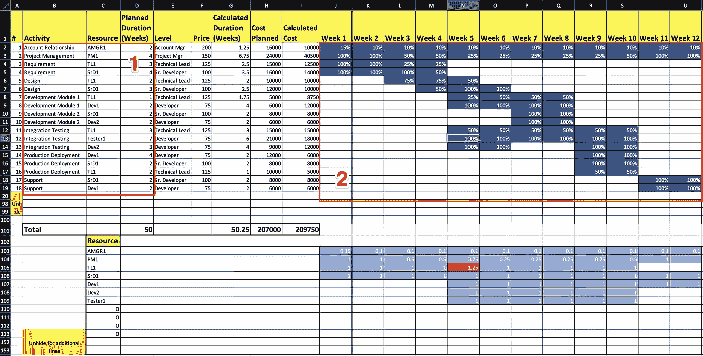
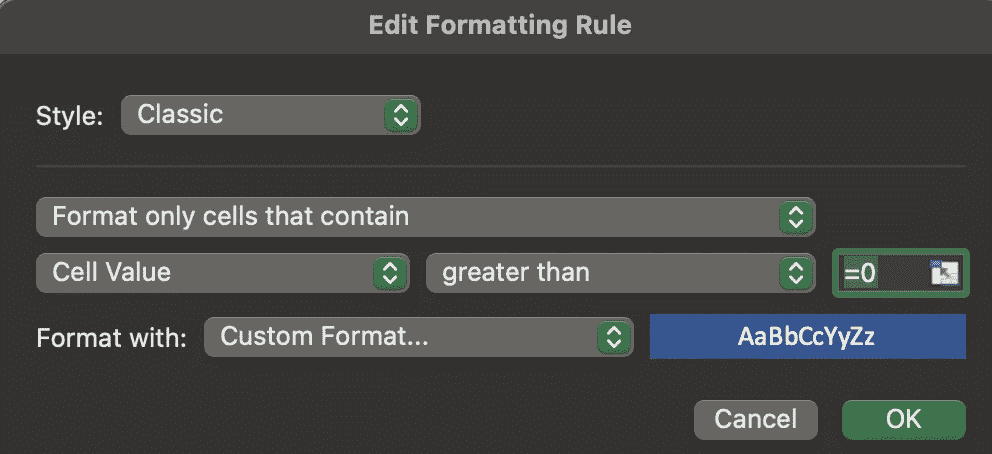

# 用 excel 进行项目估算

> 原文：<https://medium.com/geekculture/project-estimation-with-excel-b5d6a28950b1?source=collection_archive---------3----------------------->

Sample estimation sheet

## 使用分级资源执行成本和时间估计，无需复杂的宏

Excel 已经被证明是一个非常通用的工具，可以解决许多不同的用例。本文着重于使用 excel 对具有明确定义的活动的项目执行快速项目和成本估计，并且重点在于基于不同的团队模型估计交付成本，同时实现项目持续时间的最优分配。

上面显示的模板可以通过[下载](https://github.com/shekhar-jha/files/raw/master/ProjectEstimationTemplate.xlsx)获得。请注意，本文档不包含任何宏，并且是使用开箱即用功能创建的。本文的其余部分将重点介绍模板是如何工作的，这样您就可以从头开始创建一个模板，或者开发一个适合您的替代版本。

excel 表格包含以下表格

1.  *指南* —提供如何使用模板的基本指南
2.  *资源计划* —包含分配、成本估计和资源调配状态
3.  *REF* —具有资源计划使用的参考信息

# 参考数据

*参考*表包含以下细节

1.  可能适用于项目的活动列表
2.  包含团队成员姓名和相关人员级别的资源表
3.  级别表包含各种级别和相关的每小时成本

REF sheet of workbook

资源表中的*级别*列(上面的 F 列)具有引用级别列表(上面的 H 列)的数据验证设置，如下所示

Data Validation for Level in column F

# 资源计划

*ResourcePlan* 工作表用于获取两个区域中各种活动的成员分配，即活动区域(1)和分配区域(2)，如下所示

Resource Plan worksheet

最终用户通常会填写活动(1)、相关资源(1)和特定周(2)的分配百分比。所有其他列将自动填充适当的值。下半部分的彩色编码将显示在给定的一周内过度分配的任何资源。

## 数据验证

已在工作表上设置了以下数据

1.  *活动* ( *$B$2:$B$100* ) —数据验证是基于 *REF* 工作表 *REF！$B$2:$B$50*
2.  *资源*($ C $ 2:$ C $ 100)——数据验证是基于 *REF* 工作表( *REF！$E$2:$E$50*

## 类别格式

以下各列和各行已被专门设置了类别格式

1.  分配区域( *$J$2:$AK$100* )已被标识为带 0 位小数的百分比。

## 条件格式

条件格式允许快速识别符合特定条件的单元格。在工作表上设置了以下条件格式规则

1.  分配区域( *$J$2:$AK$100* )被设置为在单元格的值为> 0 时以特定颜色显示内容。这允许快速识别各种活动在项目持续期间是如何分布的。

Allocation area formatting rule

2.均衡区域( *$J$103:$AK$153* ) —有两个规则来标识红色背景的过度分配(值在 1.00001 和 1000 之间)单元格和不同背景的基本分配(值在 0.0001 和 1.0001 之间)单元格。

> 由于“”值(公式中包含空字符串的单元格)在条件规则评估期间被视为数值，因此需要引用精确值。

## 参考

*资源*域( *$C$103* )使用公式( *REF！E2:E50* )来自动填充单元格下那一列中 *REF* 选项卡中定义的所有资源。

> 这种**溢出效应**消除了在设置过程中明确选择资源的需要。

## 查找

查找(更具体地说是 VLookup)用于根据资源选择自动填充*级别*和*价格*

1.  *关卡* ($E$2:$E$100)使用公式作为 *IF(C2 < >" "，VLOOKUP(C2，REF！$E$2:$F$50，2，FALSE)，") *$E$2* 中的*使用跨 *$E$2:$F$50* 的 *REF* 工作表中的资源/级别表和第 2 列中的值(即*$ F $ 2:$ F $ 50)查找与在 *C2* 中选择的*资源*对应的*级别**
2.  *价格* ( *$F$2:$F$100* )使用公式作为 *IF(E2 < >" "，VLOOKUP(E2，REF！$H$2:$I$50，2，FALSE)，") *$F$2* 中的*使用跨越 *$H$2:$I$50* 的 *REF* 工作表中的级别/定价表以及第 2 列中的值(即 *$I$2:$I50)查找与 *E2* 中的*级别*值对应的*价格**

> 请注意，当公式在整个列中复制时，使用$来锁定不应更改的值。例如在公式 VLOOKUP(E2，REF！$H$2:$I$50，2，FALSE)，当单元格被复制粘贴到该列的其他单元格中时，只有 E2 会改变，因为所有其他单元格引用都已通过应用$被“锁定”
> 
> 请注意 IF 的使用，以确保在没有设置输入值的情况下，列不会自动填充错误值(#NA#、#VALUE#、0 等)。

## **计算**

成本是根据简单的公式*IF(F2<“，$ D2 * F2 * 5 * 8”“”*跨*计划成本*和*计算成本*来计算的

## 复杂的计算

*计算的工期*和资源调配为周，使用稍微复杂一点的公式进行计算

1.  计算的持续时间使用 *IF(SUMIF($J2:$AK2，"> 0") > 0，SUMIF($J2:$AK2，"> 0 ")，" ")*来识别所有值大于零的行单元格并对其求和。请注意，在将公式复制到整个列时，在列名前使用$而不是在数字前锁定列。
2.  资源调配区域使用公式*IF(sum product(($ C104 = $ C $ 2:$ C $ 100)* J $ 2:J $ 100)>0，sum product(($ C104 = $ C $ 2:C $ 100)* J $ 2:J $ 100)，" ")*将 J 列(第 1 周)中与所选资源名称( *$C$2:$C$100* )匹配的所有值相加这个过程允许我们总结给定周内资源的总分配(*$ C104*)(*J $ 2:J $ 100*)。

可以进行额外的更新和更改，以添加对项目评估通常需要的其他功能的支持，例如下面列举的几个

1.  确定计划分配和计算分配之间的差异
2.  支持更详细的活动分类，如简单、中等、复杂和相关时间
3.  支持附加参数，如旅行时间、利润计算等。
4.  复制工作表以开发多个评估模型

在前期规划/提案阶段，项目评估可能是一个巨大的挑战，但拥有一个简单的工具，如这里共享的工具，可以极大地帮助开发和评估模型，而不需要复杂的工具。