# 酒店使用 Python 通过数据科学提高客户满意度的项目指南

> 原文：<https://medium.com/geekculture/project-guide-for-hotels-to-improve-customer-satisfaction-through-data-science-using-python-9b992748e8a9?source=collection_archive---------5----------------------->

> 数据科学如何推动旅游业？


Image from unsplash.com

# **简介**

酒店无疑是旅游业中增长最快的行业之一。旅游业也是一个潜在的巨大就业机会，酒店是这一接待行业的主要组成部分。酒店业对国家的经济增长做出了积极的贡献。这种趋势预计将逐渐增长，并反过来促进或增加任何地方的旅游业的意义。

在这个项目中，我们将采取以下步骤来帮助酒店提高客人满意度:

1.  通过网页报废从“【Booking.com】T2”网站提取酒店评论。
2.  探索性数据分析，从数据中获得有意义的见解。
3.  情感分析，了解顾客对酒店的情感。
4.  主题建模，以了解导致客户负面情绪的主要因素。

# Web 报废

在这个项目中，我们将刮“酒店华美达卡拉维拉海滩度假村”位于印度果阿的评论，果阿是印度的顶级旅游目的地之一。这些评论摘自以下链接:

```
[https://www.booking.com/reviews/in/hotel/ramada-caravela-beach-resort.en-gb.html?page=1](https://www.booking.com/reviews/in/hotel/ramada-caravela-beach-resort.en-gb.html?page=1)
```

如果你想收集其他酒店的评论，只需用 booking.com 网站上列出的酒店名称替换“ramada-caravela-beach-resort”即可。

要开始 web scrapping 过程，请在转到上述链接后右键单击网页上的任意位置，然后选择“Inspect”选项，以找到与我们要从该网页中抓取的信息相关联的 HTML 标签，如下图所示。

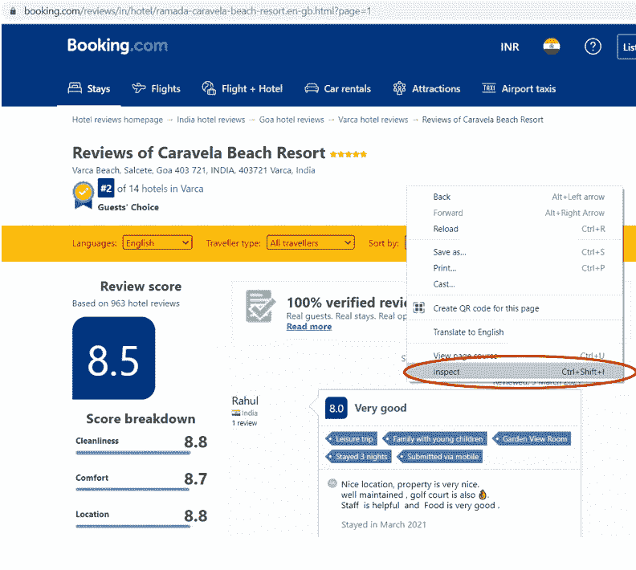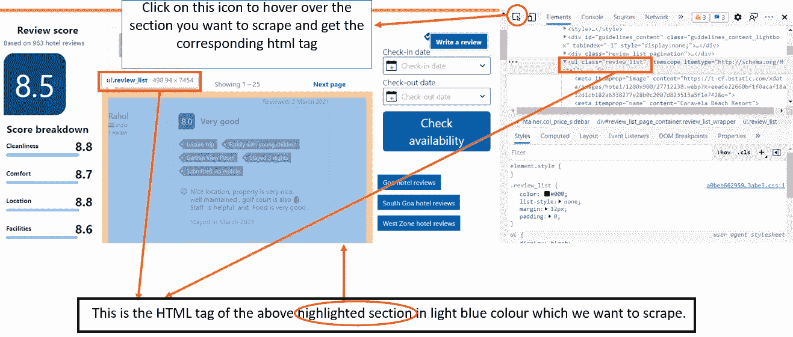

在这个标签“ul.review_list”下，我们收集了如下所示的各种信息以及相应 HTML 标签的截图:

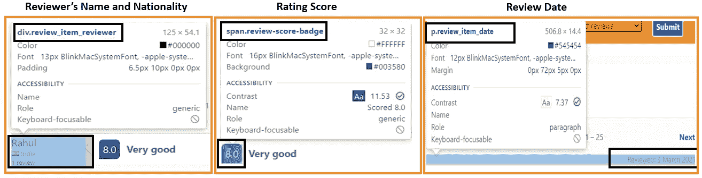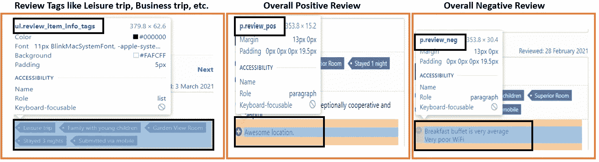

现在，既然我们已经得到了所有想要抓取的 HTML 标签，让我们开始编码吧！！

首先，我们将导入这个项目所需的所有必要的库。

```
# importing packages
import numpy as np
import pandas as pdimport seaborn as sns
import plotly.express as px
import matplotlib.pyplot as plt
%matplotlib inline
import refrom bs4 import BeautifulSoup as bs
import requestsimport string
import nltk
from nltk.stem import WordNetLemmatizer 
from nltk.corpus import stopwords,wordnet 
from wordcloud import WordCloudfrom textblob import TextBlob
from sklearn.feature_extraction.text import CountVectorizer, TfidfVectorizer
from sklearn.model_selection import GridSearchCV
from sklearn.decomposition import LatentDirichletAllocation
import pyLDAvis
import pyLDAvis.sklearn
pyLDAvis.enable_notebook()import warnings
warnings.filterwarnings(“ignore”)
```

现在，创建了一个名为“scrape_reviews”的函数，它有两个参数:

1.  hotel_linkname =在 booking.com 的链接中提到任何你想搜索的酒店的名字
2.  total_pages =提及您想要收集的评论页面总数。

让我们了解一下“scrape_reviews”这个功能的概况:

*   提及评论网页的 url。
*   从服务器检索数据。
*   在这个项目中，我们将使用漂亮的汤库来抓取 HTML 页面。
*   使用清除文本。strip()和。替换()方法
*   使用 While 循环来抓取所有页面。

该函数将以数据帧的形式给出以下 3 个输出:

*   **reviewer_info** :包含评审者基本信息的数据帧
*   pos_reviews :一个包含所有正面评价的数据框架
*   **负面评论**:包含所有负面评论的数据框架

```
def scrape_reviews(hotel_linkname,total_pages):
 #Create empty lists to put in reviewers’ information as well as all of the positive & negative reviews 
 info = []
 positive = []
 negative = []

 #bookings.com reviews link
 url = ‘[https://www.booking.com/reviews/in/hotel/’+](https://www.booking.com/reviews/in/hotel/'+) hotel_linkname +’.html?page=' 
 page_number = 1#Use a while loop to scrape all the pages 
 while page_number <= total_pages:page = requests.get(url + str(page_number)) #retrieve data from server
 soup = bs(page.text, “html.parser”) # initiate a beautifulsoup object using the html source and Python’s html.parser
 review_box = soup.find(‘ul’,{‘class’:’review_list’})#ratings
 ratings = [i.text.strip() for i in review_box.find_all(‘span’,{‘class’:’review-score-badge’})]

 #reviewer_info
 reviewer_info = [i.text.strip() for i in review_box.find_all(‘span’,{‘itemprop’:’name’})]
 reviewer_name = reviewer_info[0::3]
 reviewer_country = reviewer_info[1::3]
 general_review = reviewer_info[2::3]# reviewer_review_times
 review_times = [i.text.strip() for i in review_box.find_all(‘div’,{‘class’:’review_item_user_review_count’})]# review_date
 review_date = [i.text.strip().strip(‘Reviewed: ‘) for i in review_box.find_all(‘p’,{‘class’:’review_item_date’})]# reviewer_tag
 reviewer_tag = [i.text.strip().replace(‘\n\n\n’,’’).replace(‘•’,’,’).lstrip(‘, ‘) for i 
 in review_box.find_all(‘ul’,{‘class’:’review_item_info_tags’})]# positive_review
 positive_review = [i.text.strip(‘눇’).strip() for i in review_box.find_all(‘p’,{‘class’:’review_pos’})]# negative_review
 negative_review = [i.text.strip(‘눉’).strip() for i in review_box.find_all(‘p’,{‘class’:’review_neg’})]# append all reviewers’ info into one list
 for i in range(len(reviewer_name)):
 info.append([ratings[i],reviewer_name[i],reviewer_country[i],general_review[i], 
 review_times[i],review_date[i],reviewer_tag[i]])# build positive review list
 for i in range(len(positive_review)):
 positive.append(positive_review[i])# build negative review list
 for i in range(len(negative_review)):
 negative.append(negative_review[i])# page change
 page_number +=1#Reviewer_info df
 reviewer_info = pd.DataFrame(info,
 columns = [‘Rating’,’Name’,’Country’,’Overall_review’,’Review_times’,’Review_date’,’Review_tags’])
 reviewer_info[‘Rating’] = pd.to_numeric(reviewer_info[‘Rating’] )
 reviewer_info[‘Review_times’] = pd.to_numeric(reviewer_info[‘Review_times’].apply(lambda x:re.findall(“\d+”, x)[0]))
 reviewer_info[‘Review_date’] = pd.to_datetime(reviewer_info[‘Review_date’])

 #positive & negative reviews dfs
 pos_reviews = pd.DataFrame(positive,columns = [‘positive_reviews’])
 neg_reviews = pd.DataFrame(negative,columns = [‘negative_reviews’])

 return reviewer_info, pos_reviews, neg_reviews
```

下面的函数“show_data”将打印数据帧的长度、总缺失值以及数据帧的前五行。

```
def show_data(df):
 print(“The length of the dataframe is: {}”.format(len(df)))
 print(“Total NAs: {}”.format(reviewer_info.isnull().sum().sum()))
 return df.head()
```

现在创建函数后，我们将提到酒店的名称和我们想要抓取的总页数。但是，您可以根据自己的选择更改酒店名称，并提及相应的总评论页面。

```
reviewer_info, pos_reviews, neg_reviews = scrape_reviews(‘ramada-caravela-beach-resort’,total_pages = 13)
```

现在，通过使用“show_data”函数，我们将检查我们收集的数据输出

```
show_data(reviewer_info) #reviewers’ basic information
show_data(pos_reviews)   #Positive reviews
show_data(neg_reviews)   #Negative reviews
```

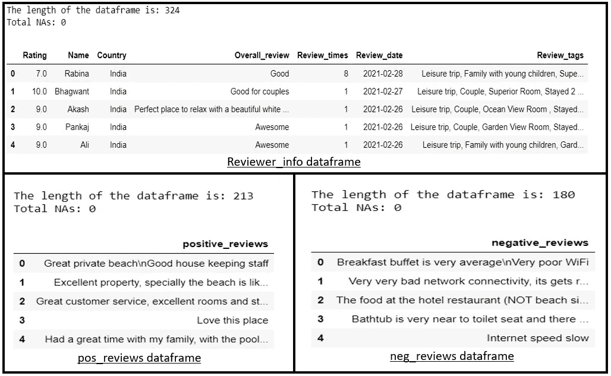

# **探索性数据分析(EDA)**

1.  **正反评论分布**

```
fig = plt.figure()
ax = fig.add_axes([0,0,1,1])
values = [len(pos_reviews), len(neg_reviews)]ax.pie(values, 
 labels = [‘Number of Positive Reviews’, ‘Number of Negative Reviews’],
 colors=[‘gold’, ‘lightcoral’],
 shadow=True,
 startangle=90, 
 autopct=’%1.2f%%’)
ax.axis(‘equal’)
plt.title(‘Positive Reviews Vs. Negative Reviews’);
```

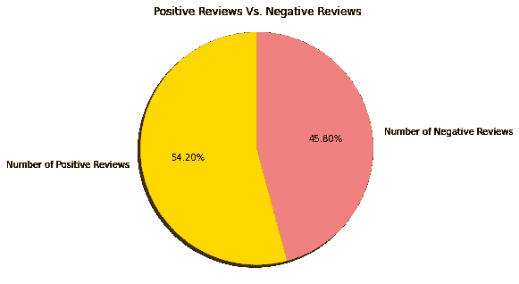

Positive Reviews are higher than Negative Reviews by almost 10%

**2。前 10 名评论者原籍国客户评分的小提琴图**

```
top10_list = top10_df[‘Country’].tolist()
top10 = reviewer_info[reviewer_info.Country.isin(top10_list)]fig, ax = plt.subplots()
fig.set_size_inches(20, 5)
ax = sns.violinplot(x = ‘Country’, 
 y = ‘Rating’,
 data = top10, 
 order = top10_list,
 linewidth = 2) 
plt.suptitle(‘Distribution of Ratings by Country’) 
plt.xticks(rotation=90);
```

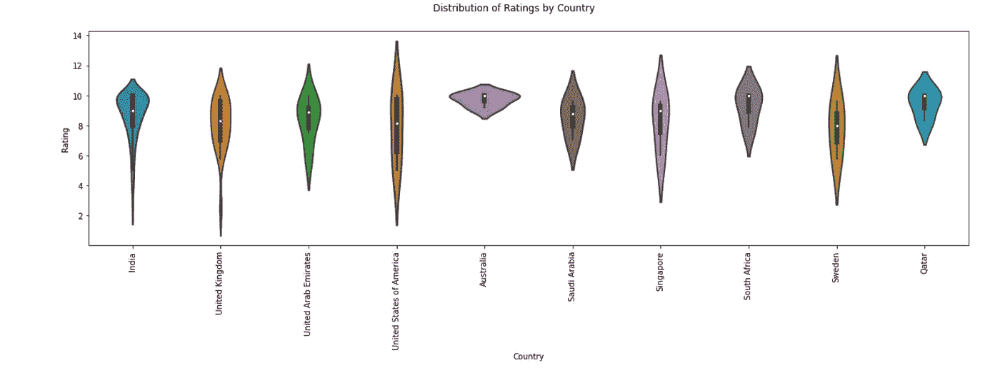

上面的图是按照每个国家的审查次数的顺序显示的。它显示了评级与评论者原籍国的关系。从方框图元素中，我们看到澳大利亚、南非和卡塔尔评审员给出的中值评级略高于其他国家的评审员，而英国、美国和瑞典评审员给出的中值评级最低。分布的大多数形状(两端窄，中间宽)表明评论者给出的评级权重高度集中在中位数周围，约为 8 到 9。然而，我们可能需要更多的数据来更好地了解这些分布。

**3。每种旅行类型的审核标签数量分布**

```
#Define tag list
tag_list = [‘Business’,’Leisure’,’Group’,’Couple’,’Family’,’friends’,’Solo’]#Count for each review tag
tag_counts = []
for tag in tag_list:
 counts = reviewer_info[‘Review_tags’].str.count(tag).sum()
 tag_counts.append(counts)#Convert to a dataframe
trip_type = pd.DataFrame({‘Trip Type’:tag_list,’Counts’:tag_counts}).sort_values(‘Counts’,ascending = False)#Visualize the trip type counts from Review_tags
fig = px.bar(trip_type, x=’Trip Type’, y=’Counts’, title=’Review Tags Counts for each Trip Type’)
fig.show()
```

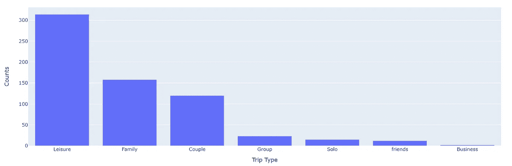

从上面的图中，我们可以看到，大多数人来印度果阿是为了休闲，要么是一家人，要么是一对夫妇。

# **单词记号的词汇化**

现在，我们已经进行了词汇化，这是一个将单词转换成其基本形式的过程。例如，单词“book”、“books”、“booked”将被转换为单个单词“book”。

```
# wordnet and treebank have different tagging systems
# Create a function to define a mapping between wordnet tags and POS tags 
def get_wordnet_pos(pos_tag):if pos_tag.startswith(‘J’):
 return wordnet.ADJelif pos_tag.startswith(‘V’):
 return wordnet.VERBelif pos_tag.startswith(‘N’):
 return wordnet.NOUNelif pos_tag.startswith(‘R’):
 return wordnet.ADV

 else:
 return wordnet.NOUN # default, return wordnet tag “NOUN”#Create a function to lemmatize tokens in the reviews
def lemmatized_tokens(text):
 text = text.lower()
 pattern = r’\b[a-zA-Z]{3,}\b’ 
 tokens = nltk.regexp_tokenize(text, pattern) # tokenize the text
 tagged_tokens = nltk.pos_tag(tokens) # a list of tuples (word, pos_tag)

 stop_words = stopwords.words(‘english’)
 new_stopwords = [“hotel”,”everything”,”anything”,”nothing”,”thing”,”need”,
 “good”,”great”,”excellent”,”perfect”,”much”,”even”,”really”] #customize extra stop_words
 stop_words.extend(new_stopwords)
 stop_words = set(stop_words)

 wordnet_lemmatizer = WordNetLemmatizer()
 # get lemmatized tokens #call function “get_wordnet_pos”
 lemmatized_words=[wordnet_lemmatizer.lemmatize(word, get_wordnet_pos(tag)) 
 # tagged_tokens is a list of tuples (word, tag)
 for (word, tag) in tagged_tokens \
 # remove stop words
 if word not in stop_words and \
 # remove punctuations
 word not in string.punctuation]return lemmatized_words
```

# **为正面评价创建词云&负面评价**

```
#Create a function to generate wordcloud
def wordcloud(review_df, review_colname, color, title):
 ‘’’ 
 INPUTS:
 reivew_df — dataframe, positive or negative reviews
 review_colname — column name, positive or negative review
 color — background color of worldcloud
 title — title of the wordcloud
 OUTPUT:
 Wordcloud visuazliation
 ‘’’ 
 text = review_df[review_colname].tolist()
 text_str = ‘ ‘.join(lemmatized_tokens(‘ ‘.join(text))) #call function “lemmatized_tokens”
 wordcloud = WordCloud(collocations = False,
 background_color = color,
 width=1600, 
 height=800, 
 margin=2,
 min_font_size=20).generate(text_str)plt.figure(figsize = (15, 10))
 plt.imshow(wordcloud, interpolation = ‘bilinear’)
 plt.axis(“off”)
 plt.figtext(.5,.8,title,fontsize = 20, ha=’center’)
 plt.show() 

# Wordcoulds for Positive Reviews
wordcloud(pos_reviews,’positive_reviews’, ‘white’,’Positive Reviews: ‘)# # WordCoulds for Negative Reviews
wordcloud(neg_reviews,’negative_reviews’, ‘black’, ‘Negative Reviews:’)
```

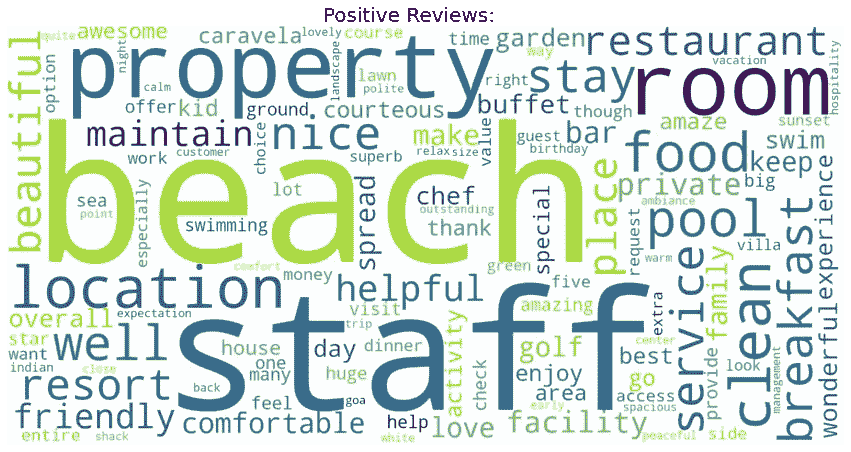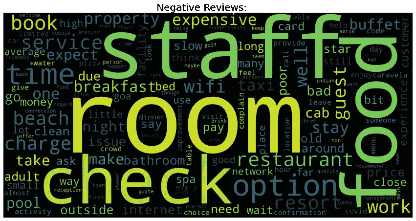

在积极的评论中，大多数人对酒店靠近海滩、员工友好的位置非常满意。

在负面评论中，我们也可以看到员工这个词，这意味着酒店中也有一些员工的行为不好，人们也对房间和食物不满意，这是企业应该重点解决的问题。

# **情感分析**

对名为“ **reviewer_info** ”的数据帧的“ **Overall_review** ”列进行情感分析

```
#Create a function to get the subjectivity
def subjectivity(text): 
 return TextBlob(text).sentiment.subjectivity#Create a function to get the polarity
def polarity(text): 
 return TextBlob(text).sentiment.polarity#Create two new columns
reviewer_info[‘Subjectivity’] = reviewer_info[‘Overall_review’].apply(subjectivity)
reviewer_info[‘Polarity’] = reviewer_info[‘Overall_review’].apply(polarity)
#################################################################################
#Create a function to compute the negative, neutral and positive analysis
def getAnalysis(score):
 if score <0:
 return ‘Negative’
 elif score == 0:
 return ‘Neutral’
 else:
 return ‘Positive’reviewer_info[‘Analysis’] = reviewer_info[‘Polarity’].apply(getAnalysis)
#################################################################################
# plot the polarity and subjectivity
fig = px.scatter(reviewer_info, 
 x=’Polarity’, 
 y=’Subjectivity’, 
 color = ‘Analysis’,
 size=’Subjectivity’)#add a vertical line at x=0 for Netural Reviews
fig.update_layout(title=’Sentiment Analysis’,
 shapes=[dict(type= ‘line’,
 yref= ‘paper’, y0= 0, y1= 1, 
 xref= ‘x’, x0= 0, x1= 0)])
fig.show()
```

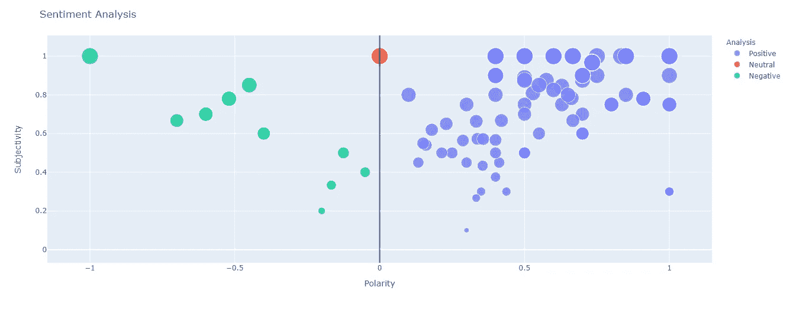

X 轴是极性，Y 轴是主观性。极性代表评论的积极、消极或中立程度，主观性是描述人们对特定主题或话题的感受的观点。所以主观性越高，就越能描述人们对一个主题的感受。更大的点表示更多的主观性。我们可以看到正面评论多于负面评论，但我们需要知道人们对酒店的负面情绪是什么主题，因此我们将进行 LDA 主题建模。

# **LDA 主题建模**

我们将应用 LDA 模型来发现主题的分布和每个主题中单词的高概率。这里，进行 LDA 主题建模的目的是查看负面评论，找出酒店应该关注哪些主题来提高客户满意度。

要更详细地了解 LDA 主题建模，请单击此[链接](https://www.kdnuggets.com/2019/09/overview-topics-extraction-python-latent-dirichlet-allocation.html)，它将详细解释这个概念。

执行 LDA 主题建模的步骤如下:

*   评论被转换成文档术语矩阵
*   使用网格搜索和参数调整找到最佳 LDA 模型
*   比较 LDA 模型性能得分

```
#Create a function to build the optimal LDA model
def optimal_lda_model(df_review, review_colname):
 ‘’’
 INPUTS:
 df_review — dataframe that contains the reviews
 review_colname: name of column that contains reviews

 OUTPUTS:
 lda_tfidf — Latent Dirichlet Allocation (LDA) model
 dtm_tfidf — document-term matrix in the tfidf format
 tfidf_vectorizer — word frequency in the reviews
 A graph comparing LDA Model Performance Scores with different params
 ‘’’
 docs_raw = df_review[review_colname].tolist()#************ Step 1: Convert to document-term matrix ************##Transform text to vector form using the vectorizer object 
 tf_vectorizer = CountVectorizer(strip_accents = ‘unicode’,
 stop_words = ‘english’,
 lowercase = True,
 token_pattern = r’\b[a-zA-Z]{3,}\b’, # num chars > 3 to avoid some meaningless words
 max_df = 0.9, # discard words that appear in > 90% of the reviews
 min_df = 10) # discard words that appear in < 10 reviews#apply transformation
 tfidf_vectorizer = TfidfVectorizer(**tf_vectorizer.get_params())#convert to document-term matrix
 dtm_tfidf = tfidf_vectorizer.fit_transform(docs_raw)print(“The shape of the tfidf is {}, meaning that there are {} {} and {} tokens made through the filtering process.”.\
 format(dtm_tfidf.shape,dtm_tfidf.shape[0], review_colname, dtm_tfidf.shape[1]))#******* Step 2: GridSearch & parameter tuning to find the optimal LDA model *******## Define Search Param
 search_params = {‘n_components’: [5, 10, 15, 20, 25, 30], 
 ‘learning_decay’: [.5, .7, .9]}# Init the Model
 lda = LatentDirichletAllocation()# Init Grid Search Class
 model = GridSearchCV(lda, param_grid=search_params)# Do the Grid Search
 model.fit(dtm_tfidf)#***** Step 3: Output the optimal lda model and its parameters *****## Best Model
 best_lda_model = model.best_estimator_# Model Parameters
 print(“Best Model’s Params: “, model.best_params_)# Log Likelihood Score: Higher the better
 print(“Model Log Likelihood Score: “, model.best_score_)# Perplexity: Lower the better. Perplexity = exp(-1\. * log-likelihood per word)
 print(“Model Perplexity: “, best_lda_model.perplexity(dtm_tfidf))#*********** Step 4: Compare LDA Model Performance Scores ***********##Get Log Likelyhoods from Grid Search Output
 gscore=model.fit(dtm_tfidf).cv_results_
 n_topics = [5, 10, 15, 20, 25, 30]log_likelyhoods_5 = [gscore[‘mean_test_score’][gscore[‘params’].index(v)] for v in gscore[‘params’] if v[‘learning_decay’]==0.5]
 log_likelyhoods_7 = [gscore[‘mean_test_score’][gscore[‘params’].index(v)] for v in gscore[‘params’] if v[‘learning_decay’]==0.7]
 log_likelyhoods_9 = [gscore[‘mean_test_score’][gscore[‘params’].index(v)] for v in gscore[‘params’] if v[‘learning_decay’]==0.9]# Show graph
 plt.figure(figsize=(12, 8))
 plt.plot(n_topics, log_likelyhoods_5, label=’0.5')
 plt.plot(n_topics, log_likelyhoods_7, label=’0.7')
 plt.plot(n_topics, log_likelyhoods_9, label=’0.9')
 plt.title(“Choosing Optimal LDA Model”)
 plt.xlabel(“Num Topics”)
 plt.ylabel(“Log Likelyhood Scores”)
 plt.legend(title=’Learning decay’, loc=’best’)
 plt.show()

 return best_lda_model, dtm_tfidf, tfidf_vectorizer

best_lda_model, dtm_tfidf, tfidf_vectorizer = optimal_lda_model(neg_reviews, ‘negative_reviews’)
```

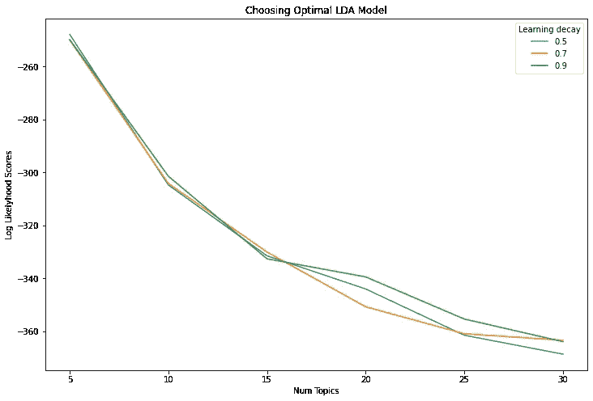

从图中，我们看到在 15 个主题之前选择不同的学习衰减几乎没有影响，然而，5 个主题将产生最佳模型。
现在，让我们输出刚刚创建的主题中的单词。

```
#Create a function to inspect the topics we created 
def display_topics(model, feature_names, n_top_words):
 ‘’’
 INPUTS:
 model — the model we created
 feature_names — tells us what word each column in the matric represents
 n_top_words — number of top words to display
 OUTPUTS:
 a dataframe that contains the topics we created and the weights of each token
 ‘’’
 topic_dict = {}
 for topic_idx, topic in enumerate(model.components_):
 topic_dict[“Topic %d words” % (topic_idx+1)]= [‘{}’.format(feature_names[i])
 for i in topic.argsort()[:-n_top_words — 1:-1]]
 topic_dict[“Topic %d weights” % (topic_idx+1)]= [‘{:.1f}’.format(topic[i])
 for i in topic.argsort()[:-n_top_words — 1:-1]]
 return pd.DataFrame(topic_dict)display_topics(best_lda_model, tfidf_vectorizer.get_feature_names(), n_top_words = 20)
```

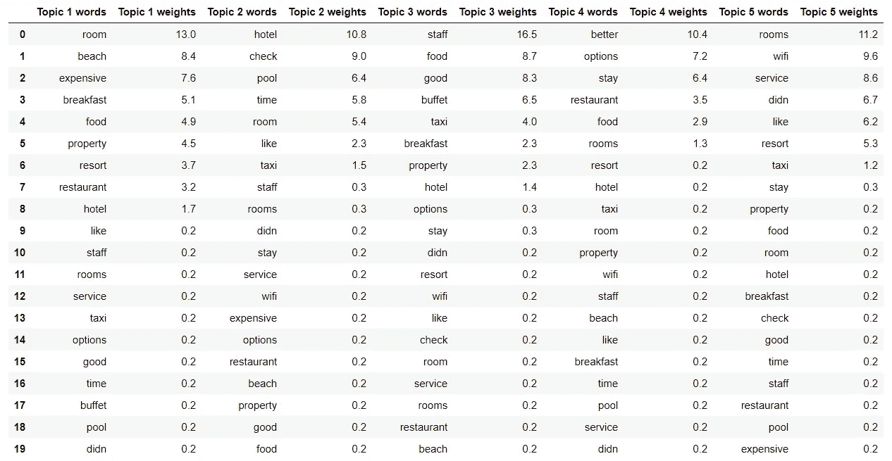

现在，让我们用 pyLDAVis 可视化来可视化主题！

```
# Topic Modelling Visualization for the Negative Reviews
pyLDAvis.sklearn.prepare(best_lda_model, dtm_tfidf, tfidf_vectorizer)
```

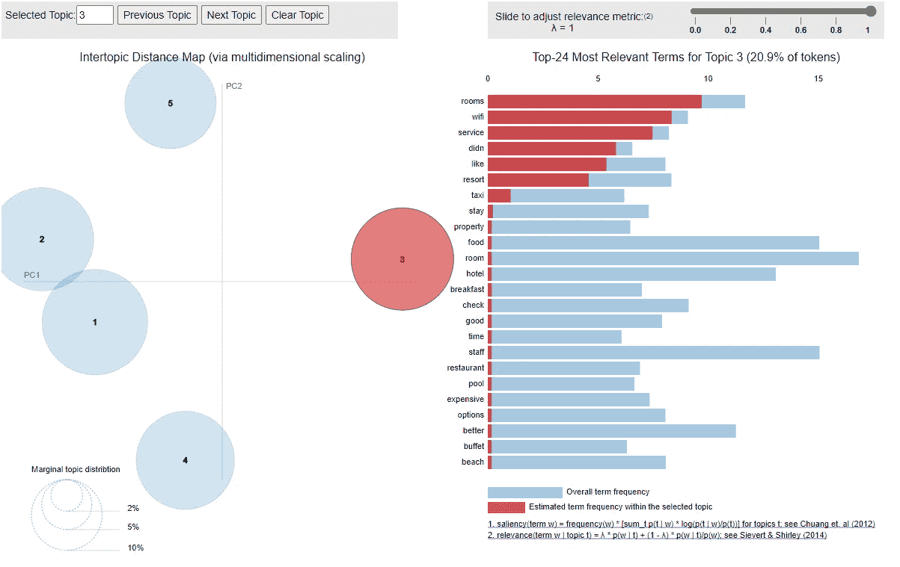

在可视化的左侧，每个主题由一个气泡表示。气泡越大，该主题越流行，其中数字 1 是最流行的主题，数字 5 是最不流行的主题。两个气泡之间的距离代表话题相似度。

右侧显示了与您在左侧选择的主题最相关的前 30 个术语。蓝色条表示总的术语频率，红色条表示所选主题内的估计术语频率。所以，如果你看到一个既有红色又有蓝色的条形，这意味着这个术语也会出现在其他主题中。您可以将鼠标悬停在该术语上，查看该术语也包含在哪个(些)主题中。

例如，在上面的输出中，我们可以看到主题 3 包含一个名为“wifi”的单词，因此企业应该专注于改善他们房间的 wifi 服务。

# **结尾备注:**

这个项目的结果可以帮助酒店管理层了解需要为游客采取什么行动，以增加更多游客来酒店，并提高游客满意度，因此任何酒店都可以实施这个项目来提高客人满意度。该项目也可用于洞察竞争对手的酒店，以了解客户对其竞争对手的看法。