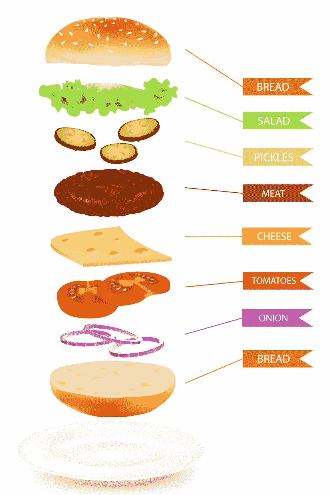
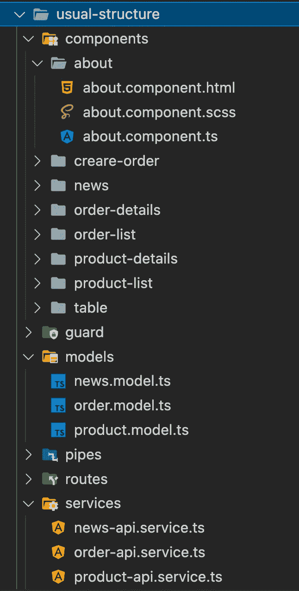
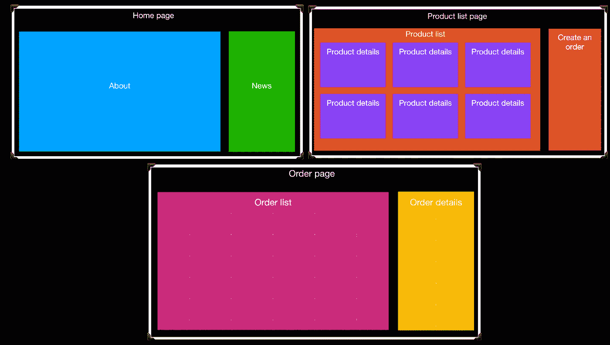
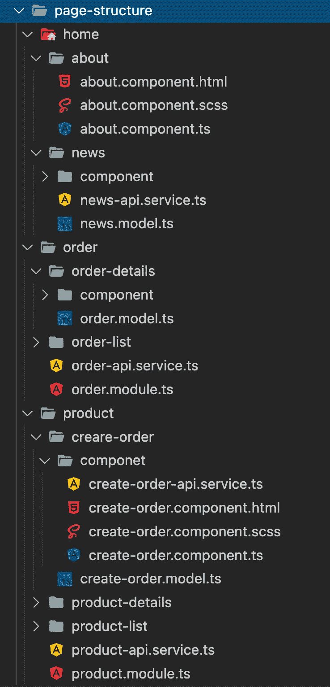
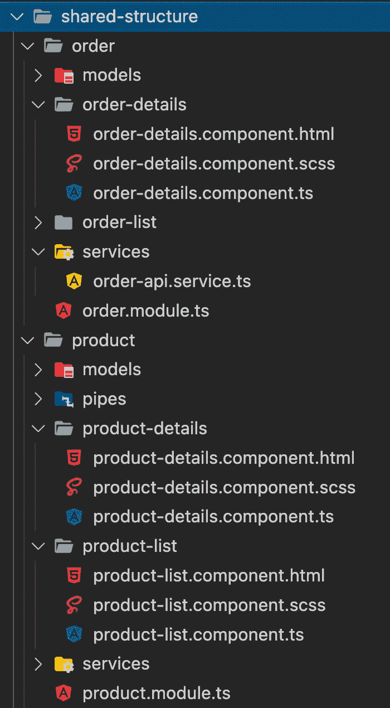

# 角度应用中的项目结构

> 原文：<https://medium.com/geekculture/project-structure-in-angular-application-33f31d25dcd6?source=collection_archive---------4----------------------->

## 文件结构

**常用结构**

我们都知道基本的文件结构。将我们的所有服务放入服务文件夹，然后将所有模型放入模型文件夹等。

当您有大约 30 个文件时，这种结构适用于小型项目。现在想象一个巨大的项目，里面有数百个文件。在正确的文件夹中找不到你需要的东西。

**页面结构**

每个 web 项目都已经有了一个结构。我们来分析一个小网站。

在每个页面上，我们使用不同的组件、服务等。我们可以在文件夹结构中使用页面结构。

这种方法的最大好处是页面结构和文件夹结构是一样的。这意味着我们已经知道一个组件的位置。

这个结构的关键部分是组件。我们围绕组件构建结构。大多数情况下，每个页面都使用独特的组件。每个组件都使用特定的服务、模型等。我们只需要把组件中用到的所有东西和组件放在一个文件夹中。

**共享结构**

如果我们需要在许多地方使用相同的服务或组件，我们应该把这个元素放在一个共享文件夹中。

共享文件夹中的结构应该围绕业务逻辑来构建。比如订单逻辑相关的东西都要放在订单文件夹里。在这个文件夹中，我们可以围绕页面结构中的组件进行构建。

*原载于 2022 年 5 月 9 日 http://tomorrowmeannever.wordpress.com**[*。*](https://tomorrowmeannever.wordpress.com/2022/05/09/project-structure-in-angular-application/)*