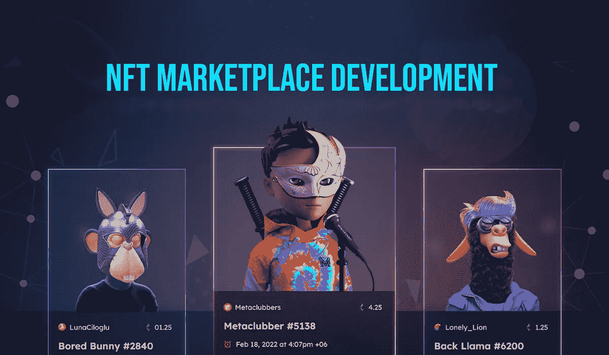

# 美国著名的 NFT 市场发展公司！

> 原文：<https://medium.com/geekculture/prominent-nft-marketplace-development-companies-in-the-usa-5f6daaac897?source=collection_archive---------15----------------------->

## 让我们看看在美国运营的一些最好的 NFT 市场提供商。

在过去的两年里，随着 NFT 世界的全球销量迅速突破 10 亿美元大关，它的发展已经超越了自身。虽然用户群体的规模有了明显的增长，但只有早期采用者才知道有多少企业在这段时间内变得突出。在这个不断发展的空间里，NFT 市场的数量在这段时间里惊人地增长。原因？或许，美国的 NFT 市场发展公司为各种规模和类型的企业实现他们的梦想提供卓越的服务。让我们看看在美国运营的一些最好的供应商。

# NFT 市场发展:现在处于什么位置？

当我写这篇博客的时候，已经是 2022 年底了，这是大多数 Web3 爱好者想要从记忆中抹去的一年。尽管如此，还是有许多有前途的 NFT 项目对整体空间产生了影响，比如比特币基地、Sudoswap、Magic Eden、LooksRare 和 X2Y2。

从这里开始的空间是为了在 2023 年达到另一个高峰，因为更多关注现实生活的非物质文化遗产已经开始接触公众。NFT 市场在策划另一轮繁荣中的作用是巨大的，因为加密市场可能会从这些平台的表现带来的混乱中恢复过来。

## [1。区块链 App 工厂](https://bit.ly/3uRgRK8)

作为一家在美国拥有全球业务的重要 NFT 市场开发公司，区块链应用工厂一直为其客户提供精致的服务。该公司已经创新了 500 多个项目，其中大部分是从零开始的 NFT 市场和预制解决方案。该公司的优秀可以从其团队的集体专业知识和他们使用的技术堆栈中看出。

## [2。像素复合](https://pixelplex.io/)

PixelPlex 是另一家总部位于美国的 NFT 市场开发公司，在全球范围内不断发展。该公司通过以客户为中心的方法和现代软件栈为客户提供尖端的解决方案。企业可以利用其市场创造来包含其他元素，如分散金融和 metaverses。该公司是希望进步的创新型网络 3 企业家的理想选择。

## [3。超链接信息系统](https://www.hyperlinkinfosystem.com/)

总部设在纽约的合资企业 Hyperlink InfoSystem 利用 Web2 的专业知识，将自己塑造成一家 NFT 市场开发公司。该公司在多个区块链网络上为其客户提供先进的 NFT 市场平台，包括以太坊和 Hyperledger。它的专业人员确保企业家可以在平台上拥有他们想要的所有新时代的功能，而不会损害他们辛苦获得的专业知识。

## [4。加燃料](https://fueled.com/)

Fueled 是美国一家受欢迎的 NFT 市场开发公司，为其客户提供功能丰富的平台。它的座右铭是为客户提供包含其业务需求的最佳解决方案，这提升了它在 Web3 业务领域的地位。Fueled 通过其符合最新数字趋势的解决方案，推动初创公司在 Web3 领域扩大规模。

## [5。CES](https://www.cryptocurrencyexchangescript.com/)

CES(也称为 Cryptocurrency Exchange Script)是另一家著名的 NFT 市场开发公司，总部位于美国。除了同名的专业知识，该公司探索 Web3 其他领域的好奇心使其跻身顶级公司行列。让它与众不同的是它所使用的可定制业务平台的质量。

## [6。兴趣点](https://interexy.com/)

作为一家总部位于佛罗里达州的 NFT 市场开发企业，Interexy 使用广泛的 Web3 元素提供现代化的解决方案，包括增强现实和虚拟现实。这种以元宇宙为中心的技术的使用使其能够服务于更广阔的商业空间，包括传统的 NFT 企业和元宇宙企业家。对于那些希望让自己的企业为未来做好准备，同时又不脱离现实的创业爱好者来说，这家企业可能是理想之选。

## [7。并发公司](https://www.concurrency.com/)

Concurrency Inc .是美国的另一家 NFT 市场开发公司，在使用区块链的数字模拟方面拥有额外的专业知识。各种规模的企业都可以信赖该公司，而不用担心成本，因为它的服务质量对于所有解决方案几乎都是一样的。该公司的专业人员充满活力，使项目能够迅速完成。

## [8。可靠组](https://www.reliablegroup.com/)

Reliable Group 是一家全球公认的 NFT 市场开发商公司，总部位于美国。该公司根据适合初创企业和品牌的各种类型，为 NFT 市场提供端到端的解决方案。它提供独特的解决方案，而不是采取一刀切的方法，这使得它在 Web3 业务鉴赏家中变得越来越重要。该公司还可以在众多区块链部署这些解决方案。

## [9。HData 系统](https://www.hdatasystems.com/)

HData Systems 以其在区块链和前端开发方面的专业知识构建 NFT 市场而闻名。该公司确保为其客户提供具有丰富功能的平台，以吸引大众。它还可以通过其经验丰富的 Web3 集成团队和新一代技术堆栈，帮助 marketplace ventures 从 Web2 转换到 Web3。

# 我应该选择美国哪家 NFT 市场发展公司？

如果你问我这个问题，我会什么也不说，只是一遍又一遍地检查上面的列表，然后做出决定。所有这些公司都提供世界级的开发服务，这也是他们最终入选本期美国顶级 NFT 市场开发公司的原因。不过，强烈建议与专业公司合作，因为如果没有适当的指导，这个过程有时会令人望而生畏。我希望这篇博客能为创建 NFT 市场提供一些有价值的见解，并祝你生意兴隆！