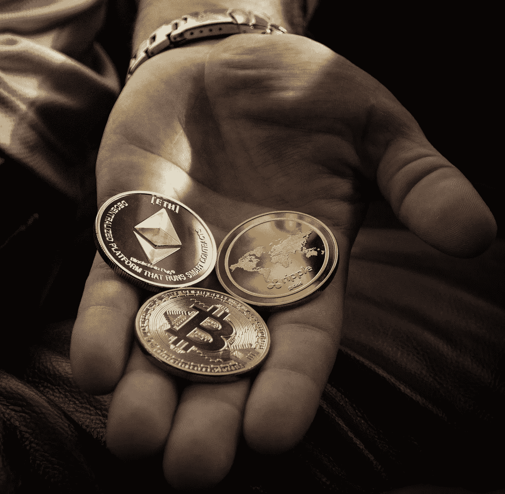

# 加密货币中的股份证明与工作证明

> 原文：<https://medium.com/geekculture/proof-of-stake-vs-proof-of-work-in-cryptocurrencies-f558dbbaec4d?source=collection_archive---------13----------------------->

## 两个区块链共识机制有什么区别？

Photo by [Worldspectrum](https://www.pexels.com/@worldspectrum?utm_content=attributionCopyText&utm_medium=referral&utm_source=pexels) from [Pexels](https://www.pexels.com/photo/closeup-photo-of-three-round-coins-in-person-s-palm-1097946/?utm_content=attributionCopyText&utm_medium=referral&utm_source=pexels)

随着比特币、以太坊、Dogecoin 和其他加密货币最近的一些价格记录，加密货币的积极和消极方面再次成为主要焦点。特别有争议的一个方面是巨大的…