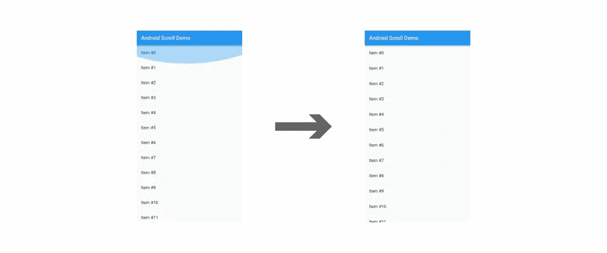

# 在 Flutter 中正确实现 Android 12 的过卷指示器

> 原文：<https://medium.com/geekculture/properly-implementing-android-12s-overscroll-indicator-in-flutter-a1f1a11ce249?source=collection_archive---------5----------------------->

## 为 Flutter 3+更新

前不久我发了一篇[文章](/geekculture/implementing-android-12s-overscroll-indicator-effect-in-flutter-b8e558d8566c)解释了如何在 Flutter 中实现 Android overscroll 以便在 Android 12 上运行的话使用 Android 12 的拉伸效果，在之前版本的 Android 上运行的话使用传统的发光效果。下面是那篇文章的介绍，解释了为什么我们必须实现…