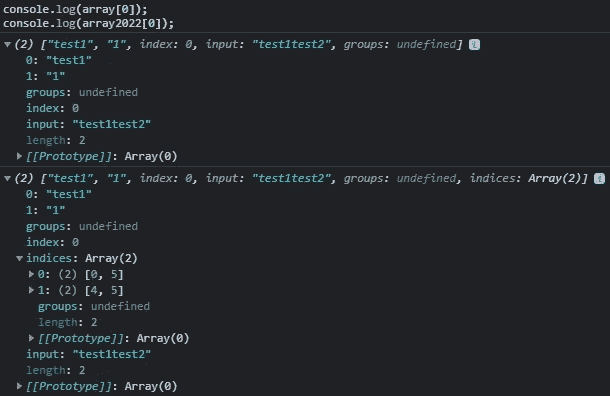

# 即将推出的 ECMAScript 2022 JavaScript 标准中包含的建议

> 原文：<https://medium.com/geekculture/proposals-included-in-the-incoming-ecmascript-2022-standard-for-javascript-6119a4518904?source=collection_archive---------1----------------------->


Photo by [Fahrul Razi](https://unsplash.com/@mfrazi?utm_source=medium&utm_medium=referral) on [Unsplash](https://unsplash.com?utm_source=medium&utm_medium=referral)

ES2021 或 ES12 于今年夏天早些时候发布，但许多人已经在思考未来，以及 ES2022 将带来哪些新功能。

在本文中，我将介绍和解释在规范的最新草案中已经被接受的建议。

每个功能提案都遵循一个流程，在该流程中，它将经历不同的阶段，直到第 4 阶段，这表明该新增功能已准备好包含在正式的 ECMAScript 标准中，并将包含在最快的实用标准修订版中。以下特性是已经完成的提案，处于第 4 阶段，并且已经添加到 [ECMAScript 最新草案](https://tc39.es/ecma262/)中。

# 类字段声明

到目前为止，在 ES 规范中，类字段的定义和初始化是在类的构造函数中完成的。但是有了新的类字段建议，类字段可以在类的顶层定义和初始化，如下所示:

```
class Post{
    title;
    content;
    shares = 0;
}
```

# 私有方法和字段

在这种定义类字段的新方法中，私有字段现在也可以用#前缀定义，如下例所示:

```
class User {
    name;
    #password;
}
```

这与类方法和访问器声明一致，因此私有方法和访问器可以用#前缀定义，如下所示:

```
class User {
    name;
    #password; get #password(){
        return #password;
    }
    #clear(){
        this.name = null;
        this.#password = null;
    }
}
```

# 静态公共方法和字段

这个提议在先前的[类字段](http://github.com/tc39/proposal-class-fields)和[私有方法](https://github.com/tc39/proposal-private-methods)提议的基础上，向 JavaScript 类添加了静态公共字段、静态私有方法字段和静态私有字段的特性。

创建这些功能是为了遵循类字段和私有方法建议的“静态”方面，如以下示例所示:

```
class Environment {
    name;
    port;
    static hostname = 'localhost';
    static get hostname(){
        return hostname;
    }
}
```

静态方法通常是实用函数，例如用于创建或克隆对象的函数，当您希望一个字段在每个类中只存在一次，而不是在您创建的每个类实例中存在时，静态字段非常有用。这对于缓存、固定配置或任何其他不需要跨实例复制的数据非常有用。

# 正则表达式匹配索引

这个提议提供了一个新的`/d`标志来获得关于输入字符串中每个匹配的开始和索引位置结束的附加信息。

下面的代码片段清楚地显示了 Regexp 匹配索引建议是如何工作的:

```
const regexp = /test(\d)/g; **//without the /d flag**
const regexp2022 = /test(\d)/dg; **//with the /d flag**const str = 'test1test2';const array = [...str.matchAll(regexp)];
const array2022 = [...str.matchAll(regexp2022)];console.log(array[0]);
console.log(array2022[0]);
```



```
console.log(array[1]);
console.log(array2022[1]);
```


# 顶级`await`

顶级 await 允许在异步函数之外使用 await 关键字。这个提议允许模块充当大型异步函数，因此这些 ECMAScript 模块可以等待资源，以便导入它们的其他模块在开始执行自己的代码之前必须等待它们。

请注意，下面的示例是在模块的顶层执行的:

```
import {getUser} from './data/user'

let user = await getUser();
// 
```

对于这个新提议，它将毫无问题地工作，但是对于旧的行为，它将输出`SyntaxError: await is only valid in async function`

# 针对私人领域的人体工程学品牌检查

当你试图访问一个未声明的公共字段时，你只是得到了`undefined`，同时访问私有字段会抛出一个异常。然后，我们可以通过测试在试图访问一个类时是否抛出异常来检查它是否有私有字段。但是这个提议引入了一个更有趣的解决方案，即使用`**in**` 操作符，如果指定的属性/字段在指定的对象/类中，则返回`true`，并使其与私有字段一起工作，如下面的示例代码所示:

```
class User {
    name;
    #password; get #password(){
        return #password;
    }
    #clear(){
        this.name = null;
        this.#password = null;
    } static hasPassword(obj){
        return #password in obj;
    }
}
```

# 所有内置可索引的新的`.at()`方法

这个提议是一个新的数组方法，通过一个给定的索引得到一个元素。当给定的索引为正时，这个新方法的行为与使用括号符号访问相同，但是当我们给定负整数索引时，它的工作方式类似于 python 的“负索引”，这意味着`at()`方法从数组的最后一项开始使用负整数进行索引。因此，该方法可作为`array.at(-1)`执行，其行为与`array[array.length-1]`相同，如下例所示:

```
const array = [0,1,2,3,4,5];console.log(array[array.length-1]); // 5
console.log(array.at(-1)); //5
//same behaviourconsole.log(array[array.lenght-2]); // 4
console.log(array.at(-2)); //4
//same behaviour
```

# 可访问的`Object.prototype.hasOwnProperty()`

有时候`Object.prototype`可以不可用，也可以重新定义。例如，`Object.create(null)`将创建一个不从`Object.prototype`继承的对象，使其方法不可访问。还有，你不能确定调用`.hasOwnProperty()`是否真的调用了内置方法，因为如果你没有直接拥有对象的每一个属性，它都有可能被覆盖。

为了避免这些问题，通常的做法是使用`**call()**`方法调用`hasOwnProperty()`，如下例所示:

```
const obj = { foo:'bar' }let hasFoo = Object.prototype.hasOwnProperty.call(obj, 'foo');console.log(hasFoo); //true
```

这个提议添加了一个与调用`Object.prototype.hasOwnProperty.call(object, property)`行为相同的`Object.hasOwn(object, property)`方法。这种新的`hasOwn(object, property)`方法提供了一种比以前的解决方案更方便的检查对象属性的方法，如下所示:

```
const obj = { foo:'bar' }let hasFoo = Object.hasOwn(obj, 'foo');console.log(hasFoo); //true
```

# ECMAScript 类静态初始化块

Class `static` blocks proposal 提供了一种优雅的方式来在类声明/定义期间评估静态初始化代码块，并访问类的私有字段。

> 当前关于静态字段和静态私有字段的提议提供了一种机制，用于在 ClassDefinitionEvaluation 期间执行类的静态端的每个字段的初始化，但是有些情况不容易涵盖。例如，如果您需要在初始化期间评估语句(如`try..catch`)，或者从一个值设置两个字段，您必须在类定义之外执行该逻辑。

这可以通过下面的例子来理解:

## 无静态块:

```
 class User {
    static roles;
    name;
    #password;
}

try { 
    User.roles = getRolesFromDb();
} catch { 
    User.roles = getRolesFromBackup();
}
```

**带静态块:**

```
class User {
    static roles;
    name;
    #password;
    static {
        try { 
            User.roles = getRolesFromDb();
        } catch { 
            User.roles = getRolesFromBackup();
        }
    }
}
```

正如您在这个例子中看到的，这两种解决方案之间没有太大的区别，因为静态块非常简单和小。然而，如果不使用静态块，随着代码块复杂性的增加，这类初始化会变得不那么优雅、清晰或可读。

这只是暂时的，如果你对这个主题有任何疑问或建议，请不要犹豫让我知道。

你好。

你可以点击下面的按钮来支持我:

[](https://www.buymeacoffee.com/brandres)

I will appreciate and remember it forever ❤

# **参考资料和更多信息:**

*   [https://github . com/tc39/proposals/blob/master/finished-proposals . MD](https://github.com/tc39/proposals/blob/master/finished-proposals.md)
*   [https://2ality.com/2021/09/class-static-block.html](https://2ality.com/2021/09/class-static-block.html)
*   [https://tc39.es/process-document/](https://tc39.es/process-document/)
*   [https://tc39.es/ecma262/](https://tc39.es/ecma262/)
*   [https://v8.dev/features/top-level-await](https://v8.dev/features/top-level-await)
*   [https://developer . Mozilla . org/en-US/docs/Web/JavaScript/Reference/Global _ Objects/String/match all](https://developer.mozilla.org/en-US/docs/Web/JavaScript/Reference/Global_Objects/String/matchAll)
*   [https://developer . Mozilla . org/en-US/docs/Web/JavaScript/Reference/Global _ Objects/Array/at](https://developer.mozilla.org/en-US/docs/Web/JavaScript/Reference/Global_Objects/Array/at)
*   [https://developer . Mozilla . org/en-US/docs/Web/JavaScript/Reference/Classes/static](https://developer.mozilla.org/en-US/docs/Web/JavaScript/Reference/Classes/static)