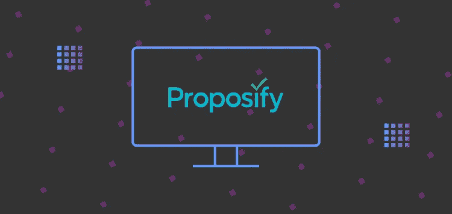
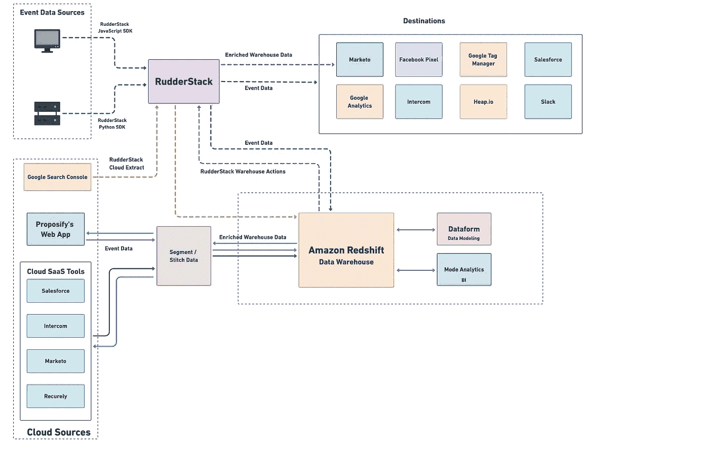

# Proposify 的数据堆栈解释道:利用 RudderStack 解决营销渠道分析和入站归因问题

> 原文：<https://medium.com/geekculture/proposifys-data-stack-explained-making-marketing-channel-analytics-and-inbound-attribution-a-66b5535cf831?source=collection_archive---------20----------------------->

这篇文章探索了 [Proposify 的](https://www.proposify.com/)客户数据堆栈。我们将向您展示他们如何利用来自实时客户活动的数据及其云 SaaS 工具来执行有效的集客营销。

# 什么是命题化？

Proposify 是一款在线求婚软件。它帮助您建立一个可预测、可扩展的结束流程。它让您能够完全控制成交流程—从内容和模板标准化到工作流定义，再到 CRM 集成等等。使用 Proposify，您可以消除销售文档中的信息传递、定价、审批和工作流程中的任何不一致，并避免可能危及交易的代价高昂的错误。

# Proposify 如何使用他们的数据

在 Proposify，有两个主要的数据消费者:

*   **数据运营** **团队** —管理他们的数据管道
*   **业务团队** —使用下游工具，这些工具利用数据运营提供的数据

Proposify 的数据团队将其营销自动化、CRM、客户支持和支付数据镜像到他们的数据仓库中。然后对这些数据进行处理、建模和转换，以准确洞察各种业务流程和单位，如销售、营销、支持和客户成功团队。

# Proposify 的客户数据堆栈

*   **数据收集和同步**
    方向舵堆栈 SDK、方向舵堆栈事件流、方向舵堆栈仓库操作、方向舵堆栈云提取、拼接数据、分段
*   **数据仓库**
    亚马逊红移
*   **数据转换**
*   数据形式
*   **商业智能**
    模式分析
*   **用于激活的云工具集用例**
    Marketo、Google Analytics、脸书 Pixel、Intercom、Google Tag Manager、Heap.io、Salesforce、Slack

# 数据如何在它们的堆栈中流动

Proposify 数据堆栈中数据流的可视化表示如下所示:

**Proposify’s Data Stack**

# 数据收集

Proposify 的数据团队处理两类数据:**事件**和**目录**数据。他们的事件数据是正常的跨平台跟踪数据，这些数据跟踪与帐户创建、登录、订阅等相关的用户活动。他们还捕获目录数据——从不同来源获得的数据，用于他们的数据处理、ETL 和下游分发系统。

# 事件流

Proposify 利用 ruder stack**事件流**收集实时事件数据。为了从他们的 web 应用程序中跟踪和捕获事件，他们使用了 [RudderStack JavaScript SDK](https://docs.rudderstack.com/rudderstack-sdk-integration-guides/rudderstack-javascript-sdk) 。对于服务器端捕获，他们使用了[的方向舵堆栈 Python SDK](https://docs.rudderstack.com/rudderstack-sdk-integration-guides/rudderstack-python-sdk) 。RudderStack 将其事件数据路由到各种下游目的地，用于各种用例，例如:

*   谷歌分析和谷歌标签管理器(分析和标签管理)
*   脸书 Pixel，Heap.io(营销)
*   销售队伍(客户关系管理)
*   对讲机(客户支持)
*   松弛(消息传递)

> *“在 RudderStack 之前，营销网站的新‘目的地’需要 Google Tag Manager 或实际代码部署，因此我们加倍努力。现在，我们可以在 RudderStack 中添加目的地，跳过所有手动部署。”
> -****Max Werner****，数据运营经理，提议*

# 来自 SaaS 平台和云工具的数据

Proposify 利用 rudder stack**Cloud Extract**从谷歌搜索控制台收集他们的网站流量和性能数据，并为他们的数据仓库建立高效的云 ELT 管道。

Proposify 的数据团队还从各种云资源中提取不同类型的数据，包括:

*   来自营销网络应用的活动数据
*   来自 **Marketo** 的营销数据
*   来自 **Salesforce** 的 CRM 数据
*   来自**的订阅和计费数据重现**，以及
*   来自**对讲机**的客户支持和信息数据

为了收集这些数据，Pachyderm 使用分段和缝合数据。这些数据然后被发送到亚马逊红移的数据仓库，在那里他们统一并处理这些数据，以整合全面的客户资料。

# 数据转换和商业智能

为了转换他们的数据，Proposify 的数据团队使用了 [Dataform](https://dataform.co/) ，这是一种在他们的数据仓库上运行的数据建模工具，没有任何基础设施管理。它允许他们运行 SQL 查询并对其原始数据进行建模，以使其在整个组织中可供分析和发现。一旦他们转换了数据，他们就把它物化回他们的数据仓库。

然后，通过利用 RudderStack **仓库操作**，将他们仓库中转换后的数据发送到 Marketo 等下游营销平台。他们还通过细分市场将这些丰富的数据发送到他们的营销 web 应用和其他云工具，用于各种激活用例。

对于商业智能，他们使用[模式分析](https://mode.com/)。这款协作工具结合了数据查询和可视化分析的强大功能，可以更深入地了解他们的产品和用户。

> *“因为我们有大量的目录数据——不仅仅是事件数据——我们做一些数据建模来提取 MRR 和通常的 SaaS 指标。然后，我们使用仓库操作来确保这些指标在我们可以使用它的工具中同步。”
> -****Max Werner****，数据运营经理，提议*

# 数据激活用例:营销渠道分析

Proposify 使用其仓库中统一和转换的数据进行有效的营销渠道分析和入站归因。通过利用来自仓库数据的丰富见解，Proposify 的产品和营销团队可以:

*   确定推动最多销售线索的营销渠道，
*   跟踪这些渠道对收入的影响，以及
*   更好地了解用户如何与他们的营销网站和 web 应用程序交互。

他们利用这些见解进行改进，从而推动更多的注册和转化。

# 跨客户数据堆栈标准化数据同步

在实施 RudderStack 作为其客户数据堆栈的一部分之前，Proposify 面临着为其 web 和移动应用程序检测事件跟踪的许多问题。应用程序拦截器也被证明是一个障碍。所以他们不得不主要依靠服务器端的流媒体。因此，如果没有大量的手动编码，他们几乎不可能将网站事件数据与应用程序中的已知用户事件联系起来。

此外，他们的仓库中的数据和他们的下游工具之间的差异影响了几乎每个团队。他们将不得不推迟营销、销售和产品计划，因为相同数据的不同版本存在于各种系统中，并且不得不手动复查或通过手动 CSV 上传从仓库重新导入。这使得产品团队对做出准确的数据驱动的决策缺乏信心。

借助 RudderStack，Proposify 的数据团队能够:

*   跨客户数据堆栈标准化数据同步
*   在几分钟内探测新的目的地
*   确保及时可靠地收集事件和目录数据，并将其交付给数据仓库和下游工具
*   利用他们仓库中的转换数据来跟踪和优化他们的销售漏斗，并建立有效的营销活动

> "*有了方向舵堆栈，漏斗顶端洞察力现在是一个可解决的问题*"*-****Max Werner****，数据运营经理，Proposify*

# 免费注册并开始发送数据

测试我们的事件流、ELT 和反向 ETL 管道。使用我们的 HTTP 源在不到 5 分钟的时间内发送数据，或者在您的网站或应用程序中安装我们 12 个 SDK 中的一个。[入门](https://app.rudderlabs.com/signup?type=freetrial)。

本博客最初发布于:
[https://rudder stack . com/blog/proposifys-data-stack-explained-making-marketing-channel-analytics-and-inbound-attribution-a-solable-problem-with-rudder stack](https://rudderstack.com/blog/proposifys-data-stack-explained-making-marketing-channel-analytics-and-inbound-attribution-a-solvable-problem-with-rudderstack)