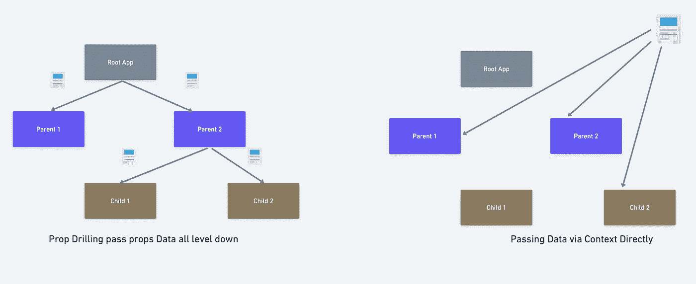

# 道具演练 v/s 上下文 API 哪个最好

> 原文：<https://medium.com/geekculture/props-drilling-v-s-context-api-which-one-is-the-best-75c503d21a65?source=collection_archive---------1----------------------->

## 快捷方式即上下文 API 是最好的吗？



Prop drilling vs Context API, How the data is passed

eact 最初于 2013 年发布，到目前为止没有改变的一点是在嵌套层中使用道具传递数据的方式。但好消息是，数据可以通过其他方式从父母传递给孩子。当您有多层嵌套子元素时，上下文 API 尤其有用。

让我们从基础开始，以获得更多的想法。

# 什么是道具？

React 是一个库，它帮助我们将 UI 分成小的可重用部分，我们称之为组件。为了在组件之间传递数据，我们使用了 Props。在 props 的帮助下，数据被传递给组件。
因此，道具帮助我们将数据从一个组件传递到另一个组件。

现在，props 中的数据是只读的，这意味着使用这些数据的孩子不能更改这些数据。因此，这是一个单向流动。(从父母到孩子的单向)。然而，我们可以利用 props 传递数据的函数将数据从孩子传递给父母。

# 什么是道具钻？

Prop drilling 是指将数据从父节点传递到 React 树中所有嵌套的子节点。让我们看看上面的图表，看看数据是如何从父母传递给孩子的。

# 什么时候支柱钻孔会引起问题？

**1。更新数据格式**

```
<Profile user="Harsh">
```

让我们假设我们现在需要传递一个对象，因为我们还需要传递配置文件状态，无论它是否过期。这是组件的样子

```
<Profile user={"name": "Harsh", "status": "Expired"}
```

在这种情况下，您必须更改它们各自访问的数据格式。

**2。重命名属性** 假设在应用程序的后期，当你删除一些数据或传递更多数据时，需要重命名属性。它必须在层级结构中的所有位置进行更改。

让我们看看如何利用 React 上下文来解决这个问题。

# 反应上下文

上下文为通过组件树传递数据提供了一种极好的方式，而不必在应用程序的每一层手动传递属性。


# 上下文有 3 个主要部分:

## 上下文对象

如果愿意，可以在单独的文件中定义上下文对象，或者在组件文件中紧挨着组件定义。组件中有多个上下文也是可能的。因此，您可以在上下文对象中存储任何您想要的数据，这些数据将在您的应用程序中被全局访问。

## 上下文提供者

提供者提供应用程序中需要访问该上下文对象的所有组件的值。

## 上下文消费者

在下面的例子中， ***上下文*** 只不过是上下文对象的值。我们在创建上下文对象期间定义的所有值都可以在这里轻松访问。是啊，就这么简单！

# 上下文 API 什么时候会导致问题？

应用程序中不必要的重新渲染

> 每次上下文状态改变时，所有消耗上下文的东西都会重新呈现。

尽管 context API 看起来是一个令人惊奇的特性，但过度使用它可能会导致应用程序中不必要的重新呈现，无论提供者的状态何时改变，它都会重新呈现所有它的子元素，不管他们是否自定义了提供者的数据。

**结论**

*   当存储的数据没有像暗/亮模式(主题)、个人资料图片细节、账户细节等频繁更新时，Context API 总是一个不错的选择。
*   React 已经很快了，不需要很多优化，大多数情况下 prop drilling 也是一个不错的选择，因为从实现的角度来看它很容易
*   尽量保持应用程序的状态接近渲染组件。
*   对于是否应该使用适当的钻探或上下文 API，没有适当的指导，只是根据必要性验证您的代码，无论是否需要这样做，然后继续进行。

快乐学习。