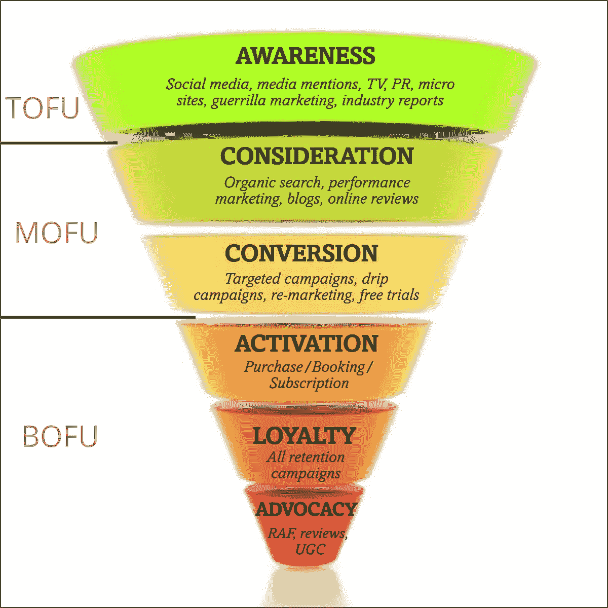

# 使用电子邮件别名保护自己

> 原文：<https://medium.com/geekculture/protect-yourself-with-email-alias-f10ce787cae?source=collection_archive---------8----------------------->

## 在线注册服务的私人方式

Photo by [Onlineprinters](https://unsplash.com/@onlineprinters?utm_source=medium&utm_medium=referral) on [Unsplash](https://unsplash.com?utm_source=medium&utm_medium=referral)

你是否厌倦了点击互联网服务的退订按钮，但它仍继续向你发送电子邮件？也许你想把你的电子邮件送给别人，但是你害怕他们会把你的邮件发给其他人？如果是你，你应该尝试使用电子邮件别名。

## 什么是电子邮件别名？

通常情况下，你使用电子邮件进行各种服务，如银行、购物、上学和工作。这很好，直到其中一个功能受到损害。也许你的学校泄露了你的电子邮件地址。所以现在你会收到尼日利亚王子的电子邮件，要求你贷款。为了解决这个问题，电子邮件别名的概念被创造出来。电子邮件别名充当您真实电子邮件地址的代理。你把这个代理给你注册的每个服务。因此，如果电子邮件代理地址泄露出去，不会有任何问题。虽然您可以使用大多数电子邮件客户端阻止来自某个电子邮件地址的电子邮件。问题是你的电子邮件地址仍然是暴露的。

## 为什么企业想要你的真实电子邮件地址？

如果你上过网上营销课程，那么你可能知道收集电子邮件地址是你能做的最重要的第一件事。跟信任有关。如果您的组织能够在潜在客户登陆网页时获得电子邮件地址。那么客户购买你的产品的可能性就会增加。

然后，一旦你有了这些电子邮件地址，你就可以通过把它用于有针对性的广告来进一步赚钱。脸书和谷歌有这些奇特的工具，可以让你寻找相似的受众来扩大你的影响范围。同时向现有客户发送促销信息以留住他们。或者要求忠诚的顾客/推销者继续简单介绍产品以获得独家优惠的广告。但是你必须向这些平台付费才能使用他们的服务。这就是脸书和谷歌如何赚取大部分收入，同时继续赢得客户的原因。这样你就可以继续消费。

## 那么解决办法是什么呢？

互联网上有多种电子邮件别名解决方案，如 SimpleLogin。

 [## 简单登录|开源匿名电子邮件服务

### 电子邮件子地址，也称为加号(+)技巧，由 Gmail 推广，并得到一些电子邮件服务的支持…

simplelogin.io](https://simplelogin.io/) 

它是一种开源技术。他们的服务允许你创建一个电子邮件别名，你可以打开和关闭来控制电子邮件的流量。他们提供[云服务](https://simplelogin.io/)和[自托管服务](https://github.com/simple-login/app)。

## 有什么不好的地方吗？

云服务的缺点是电子邮件仍然要经过云服务数据中心。他们可以记录通过这项服务的每一封电子邮件，并通过出售给其他数据经纪人来赚钱。

这可以通过下载应用程序的自托管版本来解决。也就是说，你需要知道如何配置服务器、保护服务器以及部署应用程序。这需要系统管理员的知识。您还必须遵循 GitHub 自述文件上的说明。

## 如何添加域和子域？

默认情况下，该服务附带其公共和高级域。这些电子邮件可以定制为临时电子邮件地址。如果您购买了域名电子邮件地址，您也可以添加。如果一个组织有不同的部门，子域会很有用。

## 还可以添加更多邮箱？

在邮箱选项卡下，您可以设置将不同电子邮件别名路由到不同邮箱的规则。如果您想要创建不同的邮箱供其他人访问，但是您不希望他们访问来自不同流的所有电子邮件，这是非常有用的。

## 如何创建电子邮件别名？

SimpleLogin 有一个特性，允许您动态地自动创建电子邮件别名。如果你想写一封电子邮件给某人，而不需要回到应用程序中创建一个帐户，这是非常有用的。

在别名选项卡中，您可以手动为邮箱创建新的别名。

## 如何阻止邮件的进出？

你可以按下每个别名卡上的切换按钮来阻止电子邮件进入。你也可以按暂停和播放键来阻止邮件发出。

## 如何删除别名？

在“更多”选项卡下，您可以删除别名卡。

## 如何删除自己的账号？

如果您不想继续使用该服务，以下是您必须做的事情。你必须进入网络应用程序删除账户。在设置的底部，有删除你的帐户的选项。手机应用程序不允许您删除帐户。

## 这里有一个很酷的技巧

比方说，你运行你的博客，但你有一个不专业的电子邮件地址，如

> yourname@protonmail.com

您可以在域名上创建一个别名，例如

> hi@yourname.tld

并将其指向您的个人电子邮件地址，这样发送到该地址的每封电子邮件都将发送到您的个人电子邮件地址。

因此，你不必自己建立一个完整的电子邮件服务来拥有一个品牌电子邮件。你也不需要为诸如 GoDaddy 和微软 365 这样的服务付费。

如果你想学习建立电子邮件服务背后的技术，我建议你配置你的电子邮件服务器。这是关于去谷歌化的完整指南。在这里，您将学习如何创建您的服务，如谷歌应用程序和微软 365。如果你厌倦了为 Spotify 和网飞付费，你可以遵循我的另一个指南，如何[停止为网飞和 Spotify](/@stemtalk/how-to-build-your-own-illegal-streaming-service-ff353ef70cd0) 付费。

## 最后

你可以通过远离谷歌和微软来减少网上匿名。然而，你需要记住，其他服务很可能依赖于这些科技巨头提供的服务。为了保护你自己，你必须确保你提供的信息不能与你的身份相关联。