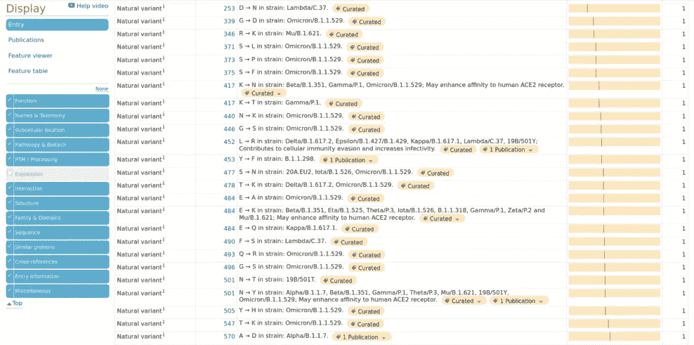
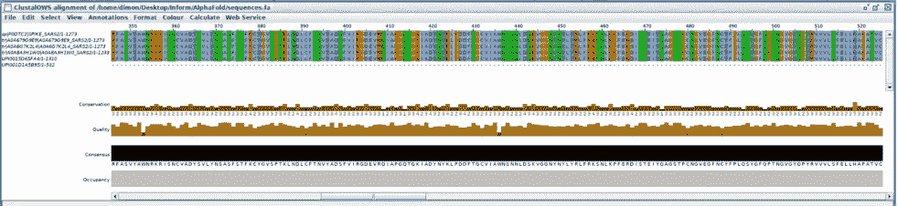
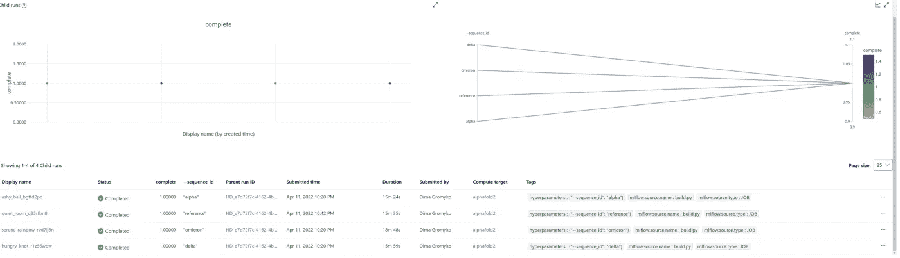
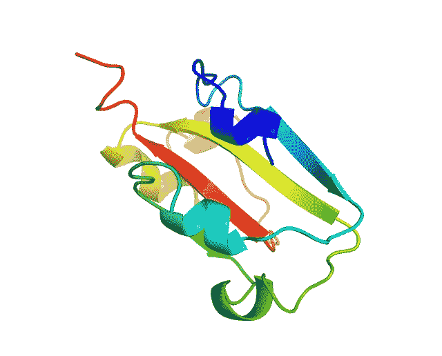

# 使用 AlphaFold2 进行蛋白质结构预测

> 原文：<https://medium.com/geekculture/protein-structure-prediction-using-alphafold2-f3c17b7e2a7e?source=collection_archive---------11----------------------->

## 大家好！我的名字是马頔，在这里我想分享我的小项目。是关于深度学习工具在蛋白质结构预测中的实现。尽情享受吧！

> ***这篇近科技的小文章要从我第一次实习*** 的小故事说起

2021 年 12 月下旬，我幸运地找到了生物信息学领域的在线实习。这是来自 LLBio-IT 学校的 NyBerMan 优点实习，主要焦点是，令人惊讶的是(不是)，Covid 调查。经过一些技术面试和激烈的竞争(近 1000 人竞争 20 个名额)，我开始计划接下来几周的学习和实践。

整个实习分为 5 个不同的部分:

*   文献综述
*   蛋白质结构分析
*   经典建模器结果与 AlphaFold 的比较
*   码头
*   写报告

不幸的是，由于我们实习的时间限制，我们的导师跳过了这一部分，但我太兴奋了，不能简单地删除管道的一部分。因此，我专注于互联网搜索，并找到一些教程来执行我的分析。

> ***互联网搜索及结果***

首先，我找到的是[deep mind/alpha fold](https://github.com/deepmind/alphafold)github 资源库，Readme 中有下载和使用程序的说明。但实际上我没有足够的内存来下载所有的必需品，所以我决定尝试谷歌更多。

DeepMind logo

最后，我找到了有用的媒介[文章](https://colbyford.medium.com/protein-structure-prediction-of-b-1-1-529-sars-cov-2-spike-variant-with-alphafold2-39c5bf9cf9ed)有类似的任务:预测冠状病毒刺突蛋白。这是简单的胜利，因为一切都很清楚我该做什么和怎么做。在类似研究的 GitHub [repo](https://github.com/colbyford/SARS-CoV-2_B.1.1.529_Spike-RBD_Predictions) 和简单的 [Azure-ML](https://github.com/Azure/MachineLearningNotebooks) 教程的帮助下，我开始做我的个人调查。

> 管道阶段

首先，我必须收集数据来构建模型。这是至关重要的一步，因为输入数据会影响任何项目的整个未来步骤。我发现了病毒不同 stamms 的刺突蛋白的多态性数据，后来我发现的是，输入数据不应该提取整个蛋白序列，因为只有结合区的突变才有意义。这就是为什么我在蛋白质中发现了关于区域的信息，对应于这种结合。来自博茨瓦纳哈佛艾滋病毒参考实验室(登录号:EPI_ISL_6752027)的研究人员描述了“巨型突变”变体:B.1.1.529。它包含来自参考基因组的 60 个氨基酸突变，其中 37 个位于刺突蛋白中。此外，刺突蛋白的受体结合结构域(RBD)大约位于残基 335 至 525 上。

Proteins from Uniprot

然后收集包含多态性的多个序列，并以 fasta 格式保存。因此，我们有一个包含 4 个新型冠状病毒受体结合域氨基酸序列的`sequences.fasta`文件。

Coronavirus glycoprotein polymorpisms

> 开始

我用 Jupyter notebook 编写脚本，用 Azure Machine Learning 编写程序。基本上你需要安装这两个职员，这就是为什么我让这里的[一个](https://jupyter.org/install)和[两个](https://docs.microsoft.com/en-us/azure/machine-learning/quickstart-create-resources)。

> *Pro 提示:您可以从下面参考资料中列出的 GitHub repo 中克隆我的完整笔记本，并在 JupyterLab 中打开它。*

首先，加载工作区配置。

> 【config.json 文件必须安装在 Azure 工作区的工作目录中。

下一步是编写我们的运行脚本。在这一部分，我没有重新发明自行车，只是简单地复制了科尔比·福特[朱庇特笔记本](https://github.com/colbyford/azureml-alphafold2/blob/main/AzureML_AlphaFold2_HyperDrive.ipynb)的脚本。

在此步骤中，我们可以进入下一阶段，即构建集群和定义脚本运行配置。在 Azure workspace 的任何 ML 实验中，这些部分都是默认的，所以我使用了笔记本[中的代码示例。](https://github.com/Azure/MachineLearningNotebooks/blob/master/tutorials/create-first-ml-experiment/tutorial-1st-experiment-sdk-train.ipynb)

每个实验都使用特殊的工具、库等。在这种情况下，我们必须定义这种依赖性。我只是简单地复制了他们的 Docker 图像，并没有重新发明任何新的东西。

下一步是为实验构建正确的配置。这很重要，因为参数定义了速度、正确性和兼容性。只有有了合适的参数，整个实验才会成功，否则你会遇到问题。

在剧本经历了几次失败后，我有了使用超空间引擎的想法。其实超空间驱动是一个很好的设置特殊 ML 模型的解决方案。

> *超驱动配置包括关于超参数空间采样、终止策略、主要度量、从配置恢复、估计器和执行实验运行的计算目标的信息。*

最后，运行实验。提交这部分代码后，azure 日志和指标会出现在 notebook 的 tap 中。

Child runs

实验完成后，我们可以下载结果。在结果中有多种格式的输出，但是与我的研究最相关的是。pdb 大分子。好主意是将这些蛋白质可视化，这正是我所做的。

> *在以下代码的帮助下，可以在 python 中启动 3Dmol visualizer。*

Omicron protein structure

> *结论*

深度学习工具在蛋白质结构预测领域影响巨大。像 AlphaFold2 这样的算法可以帮助理解和可视化蛋白质结构，这些结构在蛋白质数据库中是不存在的。此外，这种充分的方法允许以相对较小的成本生成大量新数据。

微软 Azure 机器学习等云计算服务让实验提交变得更加简单快捷。简而言之，这项服务为研究人员提供了强有力的工具来执行非常复杂的任务，如蛋白质结构预测。

总的来说，我的实验给我的实习带来了令人满意的结果。这项工作可用于类似的进一步研究和开发。

> *参考和资源*

*   这篇文章的所有代码都可以在 GitHub[https://github.com/colbyford/azureml-alphafold2](https://github.com/gromdimon/AlphaFold_Glycoprotein)上找到
*   ColabFold GitHub 回购:[https://github.com/sokrypton/ColabFold](https://github.com/sokrypton/ColabFold)
*   Colby T. Ford 的启发:[https://medium . com/@ colbyford/how-to-predict-many-protein-structures-with-alpha fold 2-at-scale-in-azure-machine-learning-C1 E0 ECE 4 e 99 f](/@colbyford/how-to-predict-many-protein-structures-with-alphafold2-at-scale-in-azure-machine-learning-c1e0ece4e99f)
*   Azure 机器学习 SDK 笔记本:[https://github.com/Azure/MachineLearningNotebooks](https://github.com/Azure/MachineLearningNotebooks)
*   我的实习:[https://www.llbschool.org/nyberman](https://www.llbschool.org/nyberman)

🔔喜欢这篇文章&想要更多？
📩欢迎[关注](/@gromdimon/about)和[订阅我的简讯](/@gromdimon/subscribe)。

🔍新媒体？
📌[加入](/@gromdimon/membership)最大的社区！

🔍对科学和生物信息学特别感兴趣？
📌[查看](/@gromdimon)我的其他文章。

❓有问题吗？
✅随时可以联系我:
🔘 [Linkedin](https://www.linkedin.com/in/gromdimon/)
🔘[推特](https://twitter.com/grom_dimon)