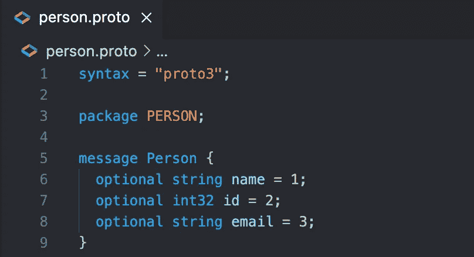
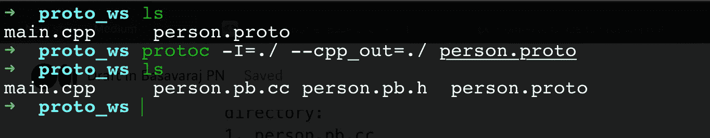
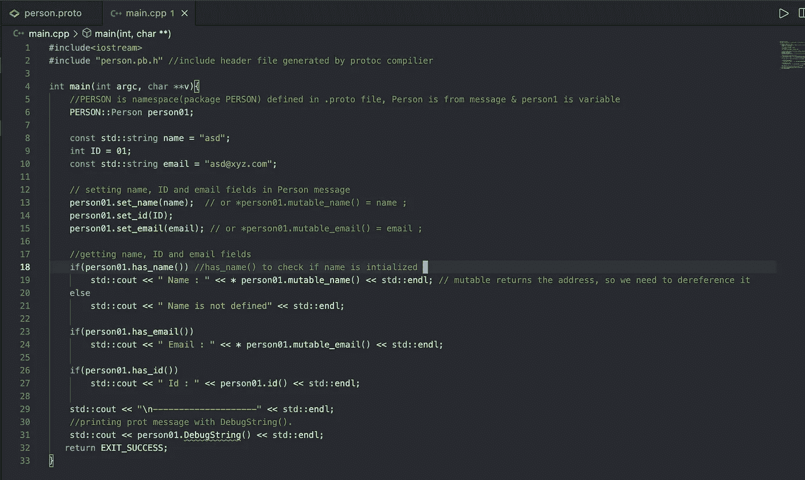
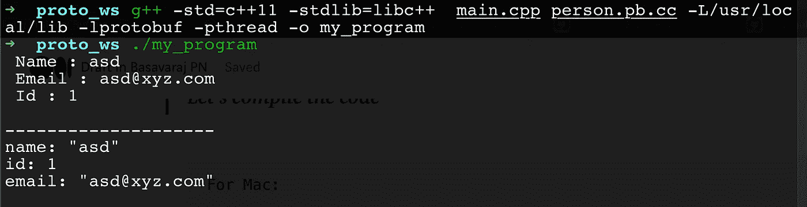
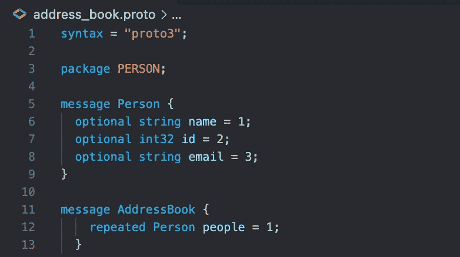
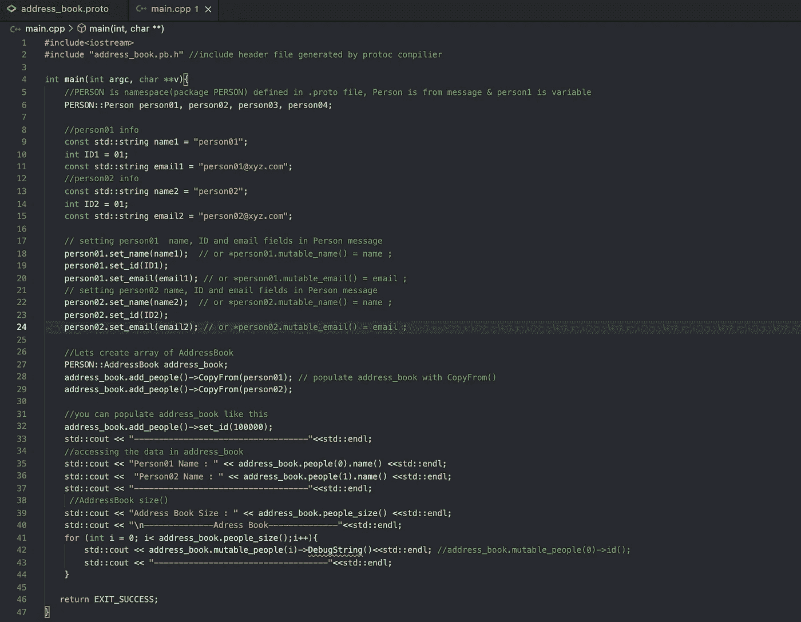
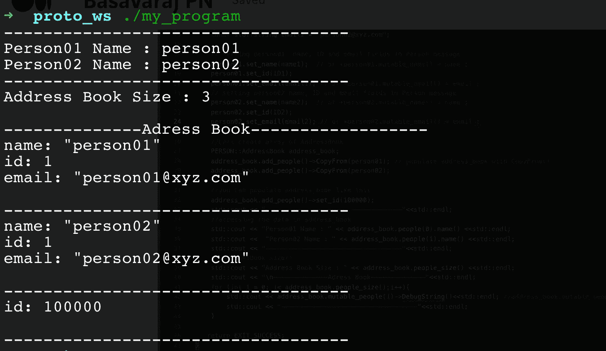
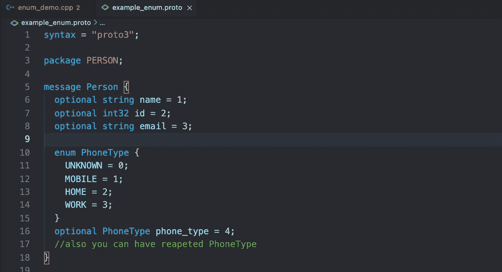
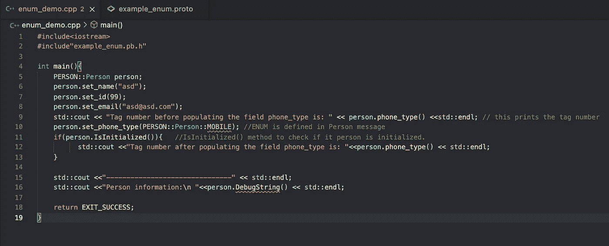
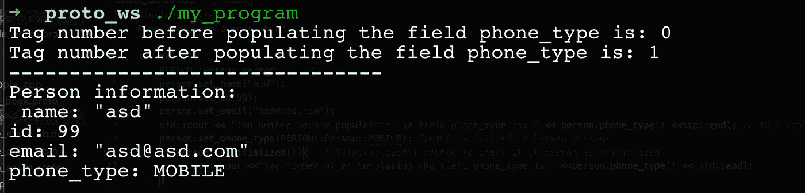

# C++中的协议缓冲区

> 原文：<https://medium.com/geekculture/protocol-buffers-in-c-d60865ae7782?source=collection_archive---------0----------------------->

我写这篇文章主要是因为我在网上找不到关于这个话题的好资源。Google 官方关于协议缓冲区(c++)的文档对于初学者来说不够直观。

> **好吧(！)、** [**什么是协议缓冲区**](https://developers.google.com/protocol-buffers) **s**

协议缓冲区是 Google 的语言中立、平台中立、可扩展的机制，用于序列化结构化数据——想想 XML，但是更小、更快、更简单。一旦定义了数据的结构化方式，就可以使用专门生成的源代码，使用各种语言轻松地将结构化数据写入各种数据流或从中读取。

协议缓冲区由文件**定义。proto** 文本文件，我们可以像人类一样轻松地阅读和理解它。

协议缓冲区相对于 JSON/XML 的优势。

1.  数据是完全类型化的。
2.  数据会自动压缩，因此 CPU 占用率较低。
3.  文档/注释可以嵌入到模式中(。原型文件)
4.  数据可以跨任何语言读取(Python、Java、Go、C++、RUBY)
5.  比 XML 小 3-10 倍，快 20-100 倍。
6.  **协议**是一个**。proto** 编译器，它自动生成代码供我们使用。

协议的缺点。

1.  缺乏资源。
2.  较小的社区。
3.  无法在文本编辑器中打开序列化数据。

> [**定义协议格式(报文)**](http://he .proto file starts with a package declaration, which helps to prevent naming conflicts between different projects. In C++, your generated classes will be placed in a namespace matching the package name.)

要创建您的`person`应用程序/消息，您需要从一个`.proto`文件开始。一个`.proto`文件中的定义很简单:为每个想要序列化的数据结构添加一个*消息*，然后为消息中的每个字段指定名称和类型。这里是定义你的信息的`.proto`文件，`person.proto.`



文件以一个包声明开始(这里是`PERSON`)，这有助于防止不同项目之间的命名冲突。在 C++中，您生成的类将被放在一个与包名匹配的名称空间(`PERSON`)中。

接下来，我们有我们的消息定义。消息只是包含一组类型化字段的集合。许多标准的简单数据类型可以作为字段类型，包括`bool`、`int32`、`float`、`double`和`string`。

每个字段必须用下列修饰符之一进行注释:

1.  `optional`:该字段可以设置，也可以不设置。如果未设置可选字段值，则使用默认值(零表示数值类型，空字符串表示字符串，false 表示布尔值)。
2.  `repeated`:将重复的字段视为动态大小的数组(或 std::vector)

**标签**

对于 protobuff 来说，重要的元素是**标签(`person.proto`中的**`name=**1**`，`id=**2**, email=**3**`，这些数字是标签**)，**最小的标签是 1 &最大的是 2 ⁹-1，我们不能使用 19000–19999，因为这些是 Google 保留的。

> **安装协议编译器**

Mac: `brew install protobuf`

Ubuntu : `sudo apt install protobuf-compiler`

> 检查它是否工作

```
$ protoc --version
libprotoc 3.17.1
```

> 让我们编译 person.proto

```
protoc -I=$SRC_DIR --cpp_out=$DST_DIR $SRC_DIR/person.proto //if you are in the SRC_DIR or working directory, you can execute with fallowing cmd.
protoc -I=./ --cpp_out=./ person.protoThis generates the following files in your specified destination directory:
1\. person.pb.cc
2\. person.pb.h
```



on my machine

> **协议缓冲 API**

如果您查看`person.pb.h`，您可以看到您在`person.proto.`中指定的每个消息都有一个类

这些是下面的 API，我们可以在我们定义的`person.proto`文件的定义字段上调用。

```
// string name
  inline bool has_name() const; //to see if name exit or initialised 
  inline void clear_name();     // to clear name from person message
  inline const ::std::string& name() const; // to get name
  inline void set_name(const ::std::string& value); // to set name
  inline void set_name(const char* value);
  inline ::std::string* mutable_name();  //returns the pointer to set/get name

  // int id
  inline bool has_id() const;
  inline void clear_id();
  inline int32_t id() const;
  inline void set_id(int32_t value);

  // string email
  inline bool has_email() const;
  inline void clear_email();
  inline const ::std::string& email() const;
  inline void set_email(const ::std::string& value);
  inline void set_email(const char* value);
  inline ::std::string* mutable_email();
```

> **让我们看看一些代码()**

只需浏览代码中的注释，并将代码与。原型文件和 API



> 让我们编译代码

```
For Mac:g++ -std=c++11 -stdlib=libc++  main.cpp person.pb.cc -L/usr/local/lib -lprotobuf -pthread -o my_programFor Ubuntu: change **username** accordingly g++ -std=c++11 -I /home/**username**/local/include -L /home/**username**/local/lib main.cpp person.pb.cc -lprotobuf -pthread  -o my_program
```

> 让我们运行可执行文件(my_program)



不错！我们刚刚填充了 **person.proto** 消息，我们还可以在终端上打印带有`DebugString()`的消息。

> **重复字段(数组或列表)**

重复修饰符允许我们创建动态大小的数组或列表。

让我们创建 **address_book.proto** 来存储地址簿消息中的个人信息。

编译 address_book.proto: `protoc -I=./ — cpp_out=./ address_book.proto`



**协议缓冲区在重复字段上的 API。**

```
// repeated Person peopleint people_size() const;
void clear_people();
PERSON::Person* mutable_people(int index);PROTOBUF_NAMESPACE_ID::RepeatedPtrField<::PERSON::Person>*mutable_people();const ::PERSON::Person& people(int index) const;PERSON::Person* add_people();const::PROTOBUF_NAMESPACE_ID::RepeatedPtrField<::PERSON::Person>&people() const;
```

让我们看一些代码来更好地理解 API



**Comments explain everything.**



**Output**

> [**ENUM**](https://developers.google.com/protocol-buffers/docs/proto3#enum)**。**

1.  如果我们知道一个字段可以取的所有值，我们可以使用枚举。
2.  枚举必须以标签`0`开始。
3.  枚举的第一个值是默认值(**标签 0** )，即使我们没有初始化枚举字段默认值(**标签 0** )也会被初始化。



ENUM example

**显示设置枚举字段的示例。**



1.  编译消息`example_enum.proto`
2.  在主代码中包含必要的头。
3.  编译源代码并运行可执行文件。



> 包装

在 proto 消息中定义包很重要(就像前面例子中的`**package PERSON**` ),以避免不同消息之间的名称冲突。

让我们创建日期包

```
// *date_pkg.proto*syntax = "proto3";package my.date.module;   //date.pkg is the package namemessage Date{
     int32 year=1;
     int32 month=2;
     int32 day=3;
}
```

现在让我们看看如何将它导入到 `person.proto`消息中

```
// *person.proto*syntax = "proto3";
import ***"date_pkg.proto";*** // fully qualified path of .proto message message Person{ 
        **my.date.module.Date** Birthday=1; //**!!!!!**
        int32 age=2;
        int32 id=3;
}
```

上面的例子给出了一个关于如何使用包的想法。

> **接下来是什么？**

[阅读官方文档](https://developers.google.com/protocol-buffers/docs/overview)

## 谢谢你，T21