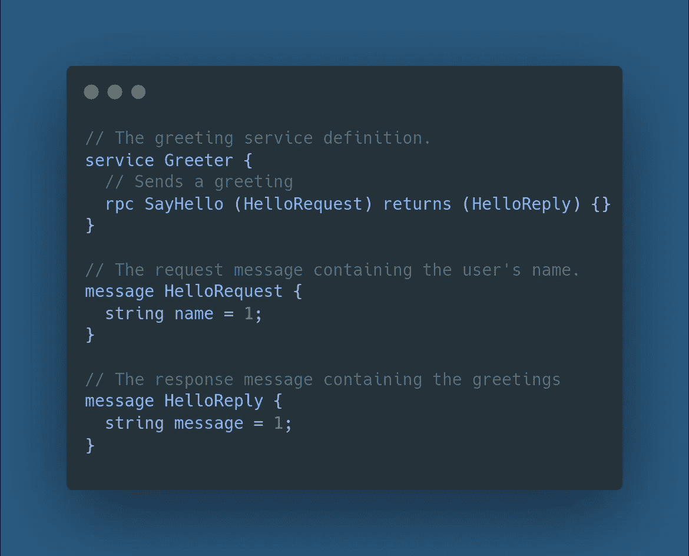
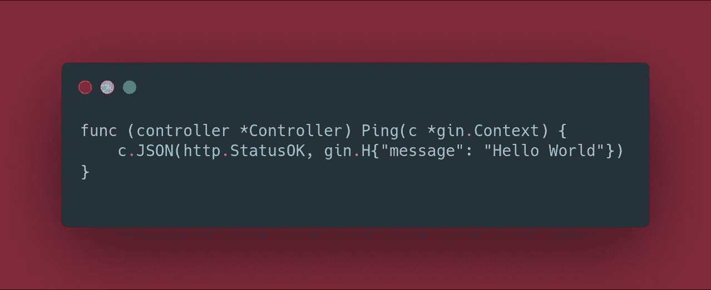
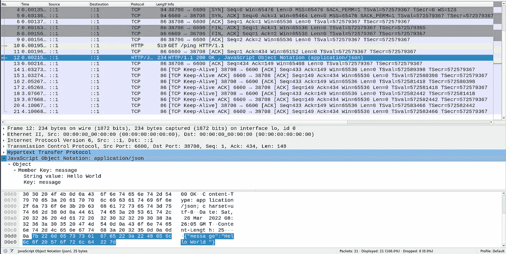
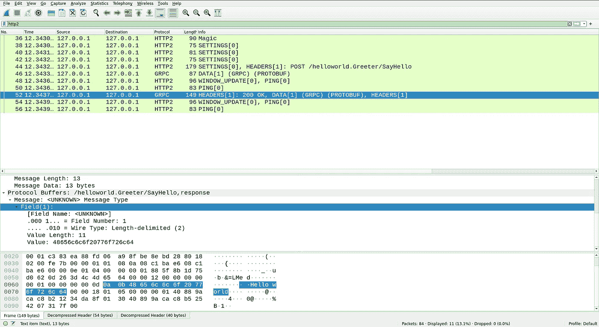

# 协议缓冲区 vs JSON |一个采访轶事

> 原文：<https://medium.com/geekculture/protocol-buffers-vs-json-an-interview-anecdote-265aff95c3f1?source=collection_archive---------1----------------------->

协议缓冲区(也称为 protobuf)和 JSON 都是序列化结构化数据的机制，它们将数据编码成字节序列，以便数据可以在遵循特定协议的分布式系统中传递

这是我们已经知道的基本介绍，如果您想了解更多关于这两种编码模式的信息，我会在下面的参考资料部分插入链接[【1】](https://tools.ietf.org/id/draft-ietf-json-rfc4627bis-09.html)[【2】](https://developers.google.com/protocol-buffers/docs/encoding)。

## TL；速度三角形定位法(dead reckoning)

在这个特殊的例子中，我们发现了与 JSON 相比，协议缓冲区在传输数据时如何节省了 **~50%** 的空间。使用的 RPC 本质上是一元的，具有不重复的模式。

# 面试👋

就这个博客而言，请允许我带你进行一次小范围的采访。我正在面试一家非常著名的初创公司，我认为这是一个 LLD + HLD 回合，在讨论的最初几分钟，他想衡量我对我的项目和我过去的工作的掌控，由于我对 gRPC-go 包的贡献，谈话就深入到那个方向。

> “太棒了，gRPC 使用协议缓冲区对数据进行编码，正如你所说，它比 JSON 更紧凑。能告诉我怎么比 JSON 更紧凑吗？”

这个问题当场难倒了我！一般情况下，如果你不知道答案，不如让他们知道你不知道，这比在黑暗中放箭要好得多。
**猜猜我做了什么？:) 😅**

> “为了在服务器和存根(客户端)之间传递消息，两个实体都需要一个固定的模式文件(在此上下文中为 proto 文件), gRPC 层使用该文件对数据进行编码，并通过网络发送数据，我现在不记得是什么数学了，但可能在修订后我可以解释”

在我看来，这是最幸运的瞎猜！面试官决定继续前进，按计划进行低层次和高层次设计。

# 快进到今天🏃

经过多次推荐，我最近购买了 O'Reilly 的《设计数据密集型应用程序》,结果发现这是一座金矿！

在这本书的四个章节中，我再次遇到了编码的话题，并回想起了这次采访和**为什么协议缓冲编码比 JSON 的二进制编码更紧凑。** (PS:比较 JSON 的二进制编码而不是文本编码才公平，因为 Protobuf 本身本质上就是二进制的)

为了说明这一点，请允许我举一个定制的例子，您可以很容易地理解和模仿！

# 个案研究📑

假设您有一个 gRPC **Greeter** 服务，它具有函数 **SayHello** ，该函数返回一个字符串`"hello + <name>"`(标准 gRPC 示例在它们的存储库[【3】](https://github.com/grpc/grpc-go/tree/master/examples)中给出)。这将是一个**一元 RPC** 而不是一个流 RPC

在调用这个函数时，序列化层将使用下面定义的协议缓冲区定义。

如果您不熟悉“原型”文件，它基本上是服务、函数和数据类型的预定义模式，客户端和服务器将被允许在序列化和代码生成期间使用。这里，将在服务器中注册一个欢迎服务，该服务将有一个 **SayHello** 函数，该函数接受 **HelloRequest** 类型对象并返回 **HelloReply。**

同时，让我们制作一个返回类似消息的标准 HTTP/1.1 GET API。让我们保持这一个静态到`Hello World`保持大小比较公平。下面给出的是这个 API 的服务层的函数定义。

PS:我使用 Gin 框架来祝贺这个 GET API 的快速原型。

现在，让我们试着一个一个地击中他们。我将使用 Wireshark 来查找通过协议层发送的编码数据包，以及**的大小**，这项研究的重点是**当数据通过线路发送时，协议缓冲区的大小是如何压缩的**？

# 线上的 JSON📪

Wireshark snapshot of JSON Response

上面的图片是客户端从我们的 **HTTP GET** API 收到的响应的 Wireshark 快照，正如您所看到的，数据`{"message":"Hello World"}`通过网络编码为 **25 字节**(字符串`7b 22 6d....22 7d`是数据通过网络编码的方式)

你可以得出的一个结论是`"{"`被编码成`“7b”`等等。在同一数据包中，其他元数据也存在，如实际响应字节之前的 **"Content-Length: 25"** 。

# 网络上的协议缓冲📫

Wireshark snapshot of Protocol Buffer Response

aaaaand 你猜对了！这是我们的**欢迎客户端**调用的 RPC over HTTP2 的快照。在这些噪音中，请允许我把你们的注意力集中在 GRPC 的数据包上。

注意它是如何表示`“Hello World”`的，但是不知何故它的大小减少到只有 **13 字节！**

请允许我向您介绍一下这 13 个字节的分布，第一个字节存储的是**字段编号**(注意在 proto 文件中，字段“消息”是如何被设置为 **1** 的，在编码中，它被称为`0a`)，第二个字节是`0b`，它表示的是什么**数据类型**的值？在这个例子中，它是一个字符串

剩下的 11 个字节实际上只是值字节，你可以把它们和字母对应起来。为了更深入地了解协议缓冲区是如何编码它们的数据的，我建议你看看这个资源[2]

# 洞察力🍵

因此，简而言之，我们注意到协议缓冲区节省的**空间大约是 50%** ！

## 但是是什么让这成为可能呢？

您一定已经注意到，在协议缓冲区的编码中，我们不需要对消息旁边的整个字段名进行编码。**相反，它存储的只是字段编号和字段类型，**不像在 JSON 中，对整个字段名“message”进行编码，它占用了 9 个字节，比前者多了 7 个字节。

这就是协议缓冲区的**优势**，客户端和服务器共享同一个`.proto`文件，因此都知道模式和字段，因此知道如何以更节省空间的方式解码和编码值。尽管如此，这也有其自身的复杂性。

*   维护客户机和服务器应用程序之间的向后兼容性变得更加复杂。
*   服务器和客户机都需要有共同原型模式，否则，通信将无法进行。这是 JSON 明显获胜的一个地方！它不要求任何一个元素知道什么是将要到来的键，除非您明确地解组某个模式。

因此，我们发现了为什么协议缓冲区的大小更紧凑！

# 资源和链接🔧

*   [1]: [JSON UTF-8 编码规则](https://tools.ietf.org/id/draft-ietf-json-rfc4627bis-09.html)
*   [2]: [协议缓冲编码规则](https://developers.google.com/protocol-buffers/docs/encoding)
*   [3]: [gRPC 围棋实例](https://github.com/grpc/grpc-go/tree/master/examples)