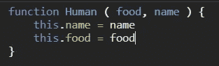
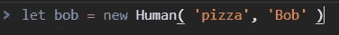
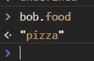
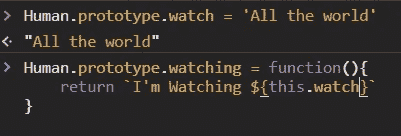
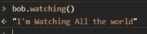
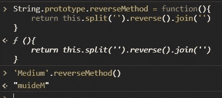
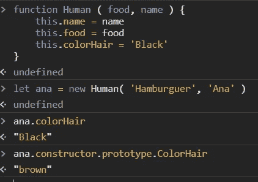
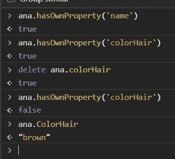

# JavaScript 中的原型属性

> 原文：<https://medium.com/geekculture/prototype-property-in-javascript-7152d5dec323?source=collection_archive---------0----------------------->

JavaScript 中的 Prototype 属性是什么？

函数对象有属性，这个原型属性包含一个对象，我们可以使用这个原型添加更多的属性和方法。让我们来看例子吧！！！！

假设我们有一个名为 Human 的函数，参数是食物和名字。

Creating Human function

然后我们创造了我们的新人类，叫做鲍勃

creating bob

bob pizza

很好，我们有了人类 bob，然后我将使用我们的原型属性来添加观察属性和观察方法

Adding method with prototype property

那么鲍勃会怎么样呢？他能看遍全世界吗？

Example method

是的，他可以，所有新人类可以观看整个世界，因为 prototype 与所有新创建的人类共享所有属性和方法，请小心，因为如果你修改属性，所有新人类实例的属性都会改变。

Adding methods with prototype property

我们可以将它们与其他内置对象一起使用，比如 string，并创建我们的新方法，让我们来看看这个。

我使用 prototype 属性向 string 对象添加了一个名为 reverseMethod 的方法，然后我们可以在本例中的每个 string 对象或 String 中使用它。

Using the String object to add another object with prototype property

prototype 中有趣的一点是，如果我们有与 this.name 和 prototype.name 相同的属性，它将显示 this.name 属性(称为 own 属性),然后显示 prototype 属性，如果 this.name 不存在，则在 prototype 属性上搜索！

Example of the own property vs prototype property

我们可以用 hasOwnProperty 来检查差异

Example **hasOwnPropertyName**

# 结论

这个原型属性在某些情况下很有用，你可以看到我们可以向其他对象添加方法和属性，但要注意，在某些情况下，这个对象会添加越来越多的属性和方法，但使用这个属性真的很棒。

# 来源

## [这本书太棒了](https://www.amazon.com/Object-Oriented-JavaScript-high-quality-applications-libraries/dp/1847194141)